# 第一部分 28：回归问题演示 🧪

在本节课中，我们将学习一个简单的线性回归问题演示。我们将通过生成合成数据、训练模型、评估模型性能并进行可视化，来理解机器学习中回归问题的基本流程。

---

上一节我们介绍了回归问题的基本概念，本节中我们来看看如何通过代码实现一个简单的线性回归模型。

## 安装必要的库

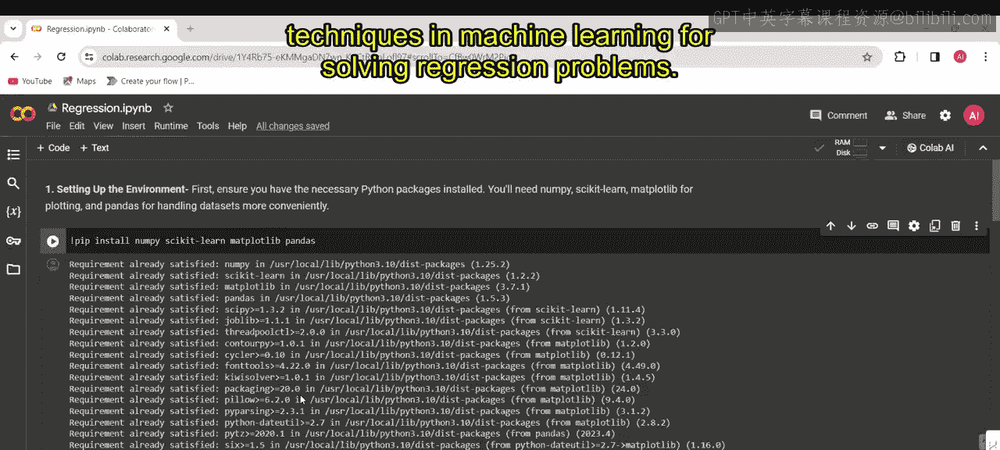

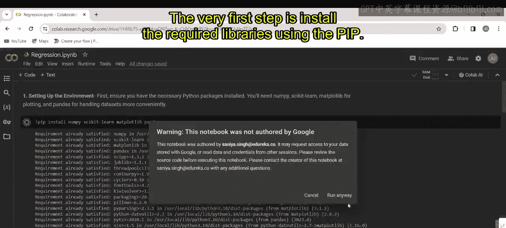

首先，我们需要安装并导入必要的Python库。这些库用于数据处理、可视化和机器学习任务。

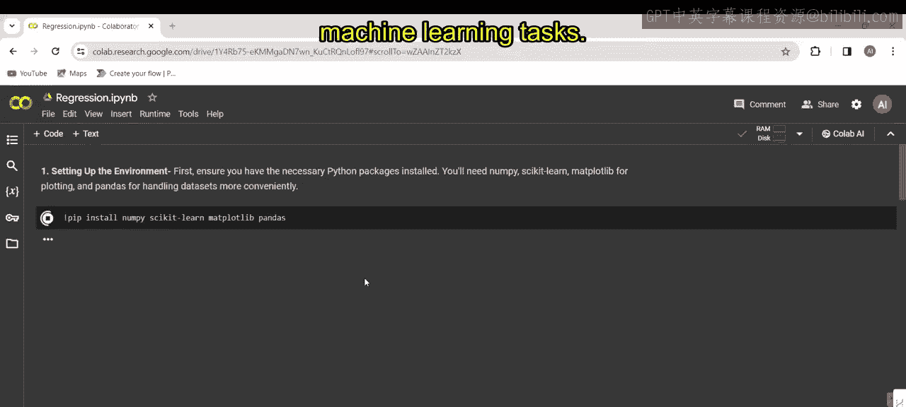

以下是需要导入的库：
```python
import numpy as np
import pandas as pd
import matplotlib.pyplot as plt
from sklearn.model_selection import train_test_split
from sklearn.linear_model import LinearRegression
from sklearn.metrics import mean_squared_error, r2_score
```

## 生成合成数据

接下来，我们生成一个用于回归问题的合成数据集。数据集中，输入变量 `X` 和目标变量 `Y` 之间存在线性关系，但我们会添加一些噪声来模拟现实世界数据的不完美性。

以下是生成数据的代码：
```python
np.random.seed(42)  # 确保结果可复现
X = 2 * np.random.rand(100, 1)
y = 4 + 3 * X + np.random.randn(100, 1)
```

## 数据可视化

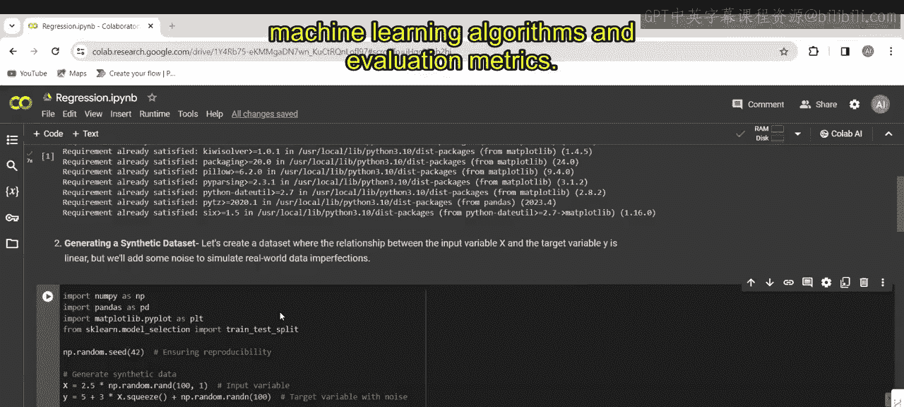

在训练模型之前，我们先可视化生成的数据，以观察其分布和线性趋势。

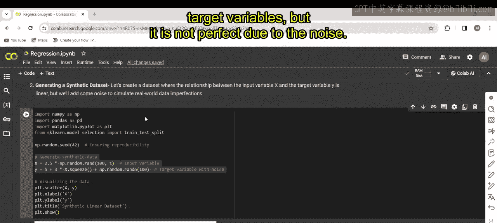

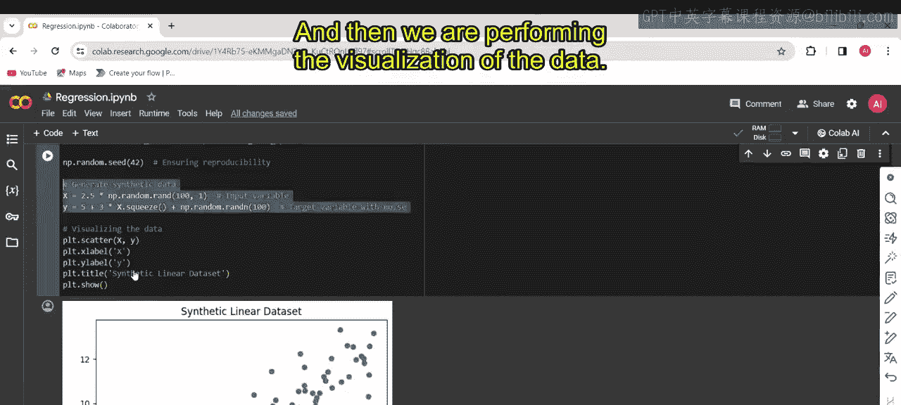

以下是绘制散点图的代码：
```python
plt.scatter(X, y)
plt.xlabel('输入变量 X')
plt.ylabel('目标变量 y')
plt.title('合成数据散点图')
plt.show()
```

## 划分训练集和测试集

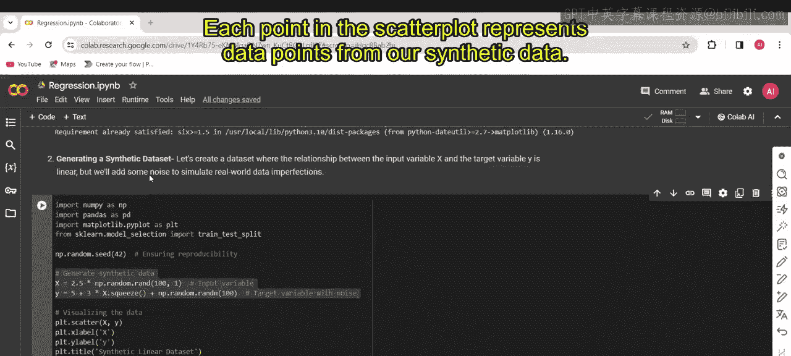

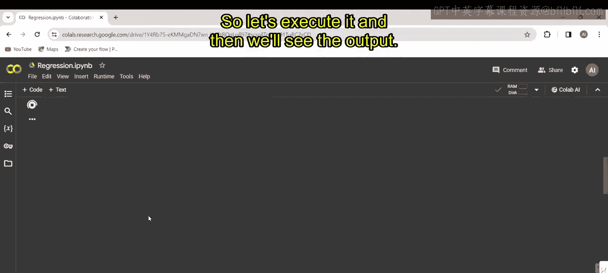

为了评估模型的泛化能力，我们需要将数据划分为训练集和测试集。

以下是划分数据的代码：
```python
X_train, X_test, y_train, y_test = train_test_split(X, y, test_size=0.2, random_state=42)
```

## 初始化并训练线性回归模型

现在，我们初始化一个线性回归模型，并使用训练数据对其进行拟合。

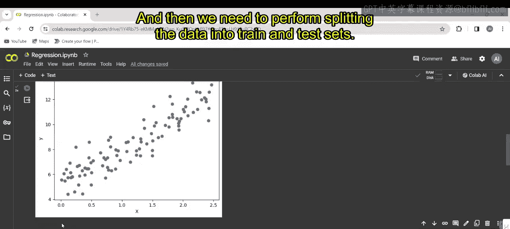

以下是训练模型的代码：
```python
model = LinearRegression()
model.fit(X_train, y_train)
```

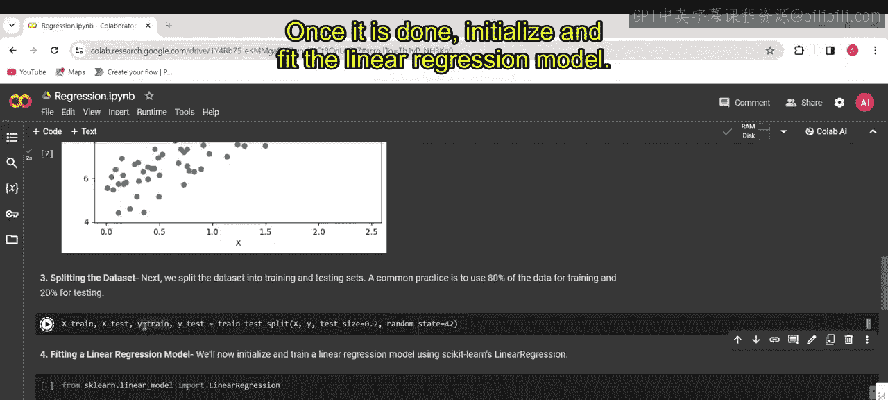

训练完成后，我们可以查看模型的系数（斜率）和截距。

以下是打印系数的代码：
```python
print(f'模型系数（斜率）: {model.coef_[0][0]}')
print(f'模型截距: {model.intercept_[0]}')
```

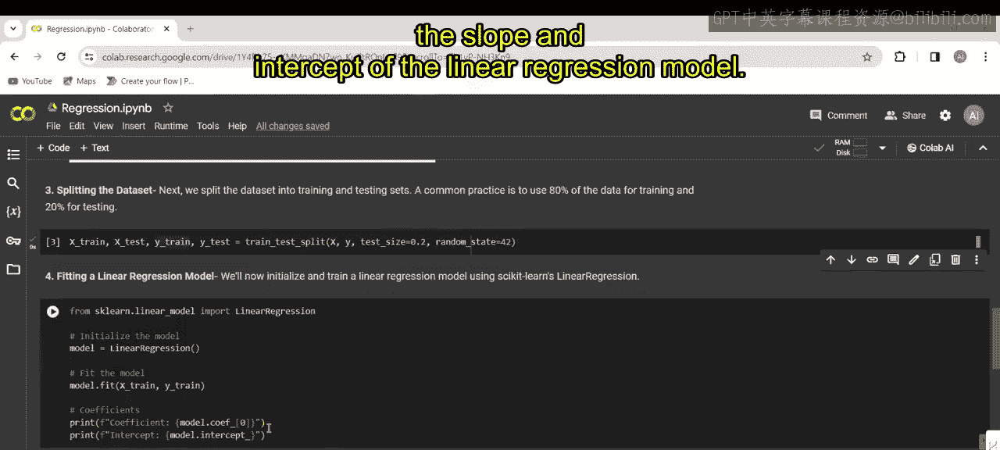

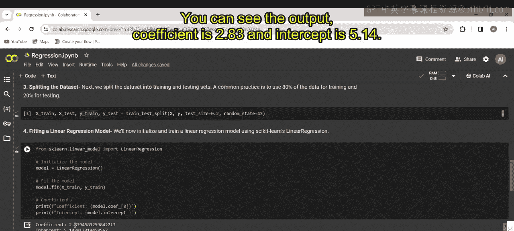

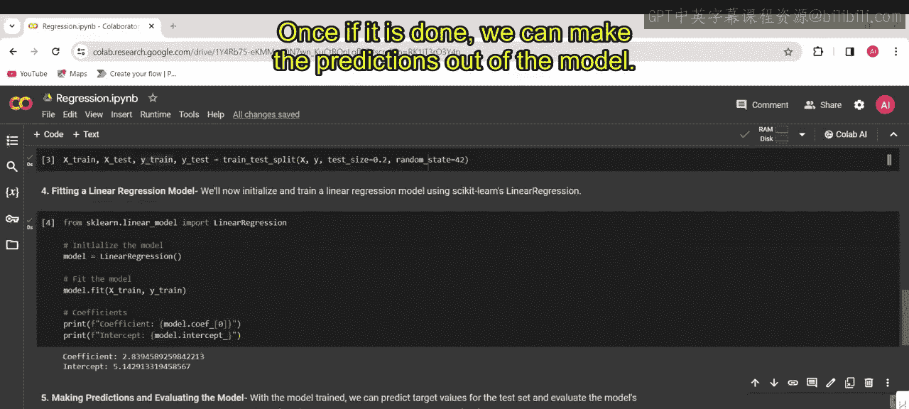

## 进行预测并评估模型

模型训练好后，我们使用测试集进行预测，并计算评估指标来衡量模型性能。

以下是进行预测和评估的代码：
```python
y_pred = model.predict(X_test)

mse = mean_squared_error(y_test, y_pred)
r2 = r2_score(y_test, y_pred)

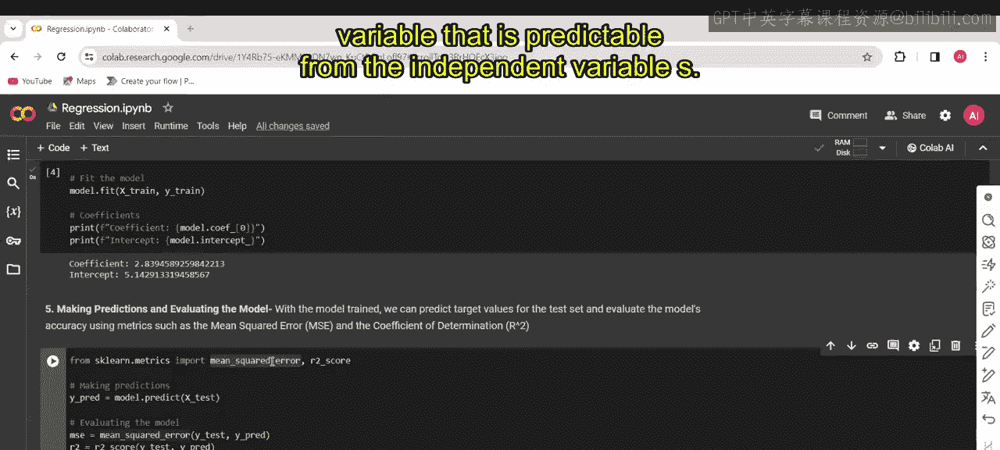

print(f'均方误差 (MSE): {mse}')
print(f'R平方分数 (R²): {r2}')
```

**均方误差 (MSE)** 的计算公式为：
`MSE = (1/n) * Σ(实际值 - 预测值)²`
其中 `n` 是样本数量。

**R平方分数 (R²)** 的计算公式为：
`R² = 1 - (SS_res / SS_tot)`
其中 `SS_res` 是残差平方和，`SS_tot` 是总平方和。

## 可视化模型结果

最后，我们通过图表来直观展示模型的拟合效果和预测情况。

以下是可视化代码：
```python
plt.figure(figsize=(12, 4))

# 第一部分 子图1：原始数据与回归线
plt.subplot(1, 2, 1)
plt.scatter(X, y, label='原始数据')
plt.plot(X, model.predict(X), color='red', label='回归线')
plt.xlabel('X')
plt.ylabel('y')
plt.title('线性回归拟合')
plt.legend()

# 第一部分 子图2：实际值与预测值对比
plt.subplot(1, 2, 2)
plt.scatter(y_test, y_pred)
plt.plot([y_test.min(), y_test.max()], [y_test.min(), y_test.max()], 'k--', lw=2)
plt.xlabel('实际值')
plt.ylabel('预测值')
plt.title('实际值 vs. 预测值')

plt.tight_layout()
plt.show()
```

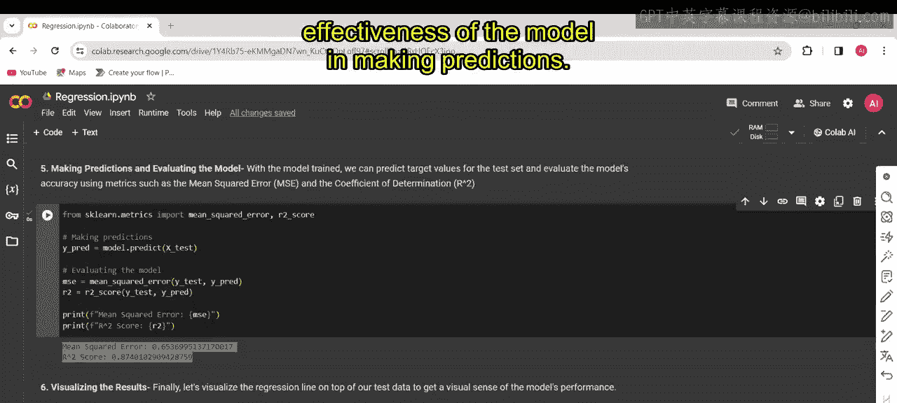

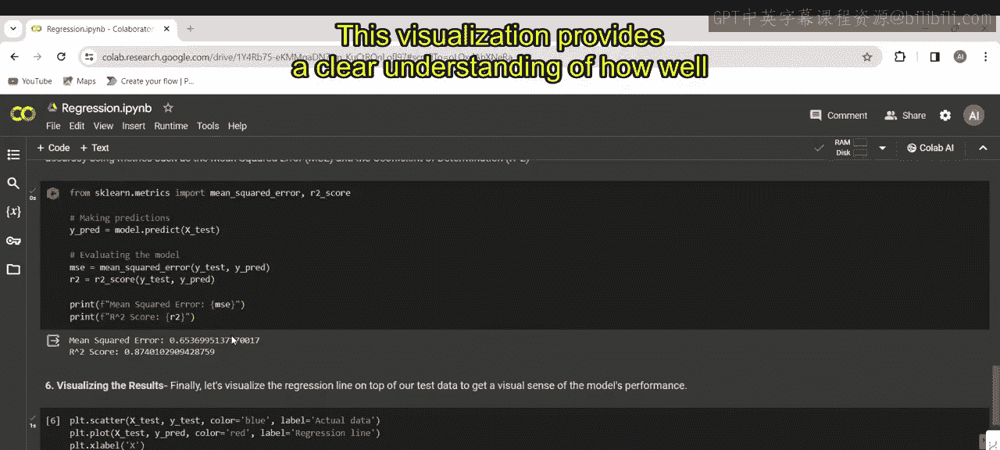

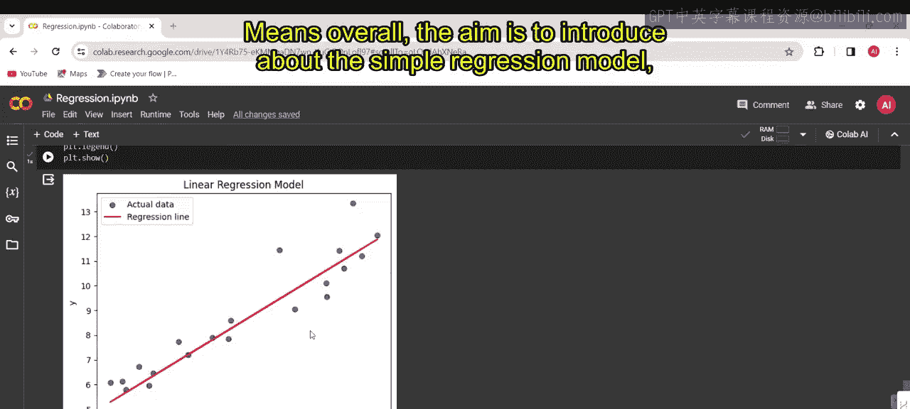

---

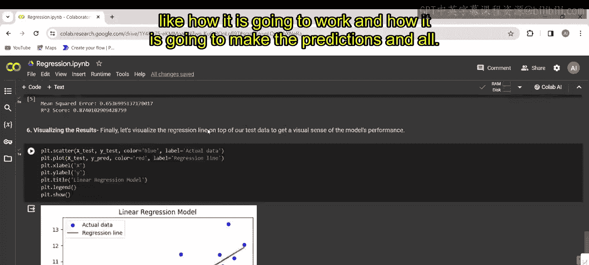

本节课中我们一起学习了如何构建和评估一个简单的线性回归模型。我们完成了从数据生成、可视化、数据划分、模型训练、预测到最终评估和结果可视化的完整流程。通过均方误差和R平方分数这两个核心指标，我们能够量化模型的预测性能。这个演示是理解机器学习中回归问题的基础。