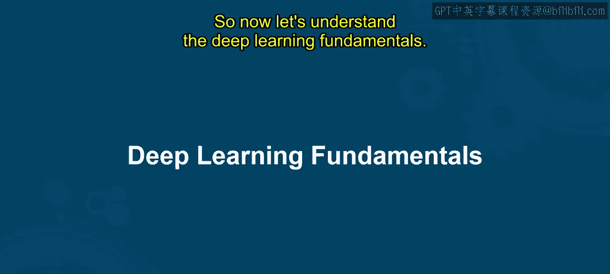
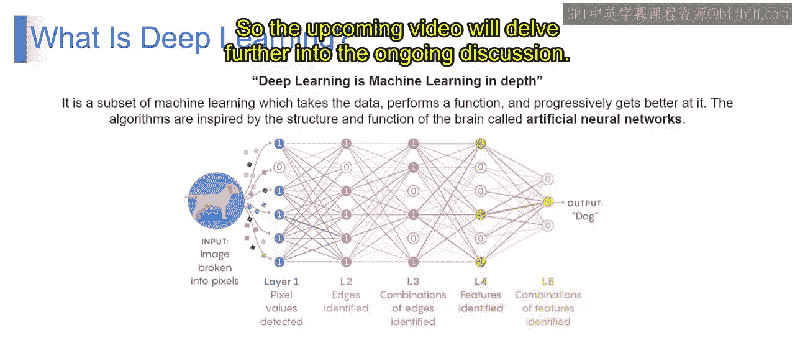

# 第一部分 29：深度学习基础 🧠

在本节课中，我们将一起学习深度学习的基础知识。我们将了解深度学习的定义，并探讨它与传统机器学习的主要区别。通过本节内容，你将能够理解并分析深度学习的核心概念，并掌握深度学习与机器学习的不同之处。

---

## 什么是深度学习？

深度学习是机器学习的一个子集。它受到人脑结构和功能的启发，使用人工神经网络从大量数据中学习。深度学习在处理图像识别、语音识别、自然语言处理和决策制定等复杂任务时特别强大。

例如，假设你想构建一个识别手写数字的系统。在深度学习中，你会使用一个包含大量手写数字图像及其对应标签（即所代表的数字）的数据集来训练一个神经网络。该神经网络会学习识别图像中的模式，例如构成每个数字的形状和曲线。经过训练后，网络就能准确地识别出新的、未见过的图像中的手写数字。

从技术上讲，深度学习涉及训练具有许多层（因此称为“深度”）的神经网络，以自动学习数据在多个抽象层次上的表示。这些网络使用反向传播和梯度下降等技术，迭代地调整其参数（权重和偏置），直到能够准确地执行给定任务。

---

## 深度学习的关键特点

上一节我们介绍了深度学习的定义，本节中我们来看看它的几个关键特点，这些特点使其区别于传统机器学习。

以下是深度学习的三个主要优势：

1.  **无需手动特征工程**
    在传统机器学习中，工程师通常需要花费大量时间从原始数据中手动设计和提取特征，以便算法能够理解。深度学习通过在训练过程中自动从数据中学习相关特征，消除了大部分这种手动工作。例如，在图像识别任务中，深度学习模型无需明确指令即可自动检测边缘、形状和纹理。

2.  **处理海量数据的能力**
    深度学习模型能够高效处理海量数据。随着大数据时代的到来，数据通常规模巨大且复杂，深度学习因其可扩展性而表现出色。它可以从大型数据集中提取有意义的见解，而这些数据集可能会让传统机器学习方法或算法不堪重负。

3.  **高性能与高准确度**
    深度学习模型以其在复杂任务（如图像识别、自然语言处理和语音识别）中实现高性能和高准确度的能力而闻名。这些模型能够捕捉数据中复杂的模式和关系，从而获得优于传统方法的性能。例如，假设你正在构建一个用于分析客户评论情感的系统，深度学习模型可以自动从文本数据中学习情感相关的单词和短语等特征，从而比传统机器学习模型中手动设计的特征获得更准确的预测结果。

---

## 深度学习的工作原理：一个直观示例

我们已经了解了深度学习的定义和特点，现在让我们通过一个具体的例子，直观地看看它是如何工作的。

深度学习是机器学习的一个子集，它接收数据、执行功能，并在此过程中不断改进。其算法灵感来源于被称为人工神经网络的大脑结构和功能。

下图展示了一个图像识别的简化过程：

1.  **像素化**：计算机首先将图片分解为称为像素的微小点（如图中狗的图片所示）。
2.  **识别基础形状**：在第一层，网络寻找简单的事物，如线条和曲线。
3.  **构建复杂性**：随着信息通过更多层，它将这些线条和曲线组合起来，找到边缘和形状，进而识别特征。网络越深，它开始识别的部分就越大，比如眼睛甚至耳朵。
4.  **整体识别**：一旦完成上述步骤，它将所有部分组合在一起，从而判断出它看到的是一只狗。

因此，深度学习通过将图片分解为更简单的部分，然后将它们组合起来以理解所看到的内容，从而逐渐学会理解图像。

---

## 总结

本节课中，我们一起学习了深度学习的基础知识。我们首先明确了深度学习的定义，即一种使用多层神经网络从数据中自动学习特征的机器学习子集。接着，我们探讨了深度学习的三个关键优势：无需手动特征工程、强大的海量数据处理能力以及出色的性能与准确度。最后，我们通过一个图像识别的例子，直观地了解了深度学习的工作原理。下一节视频将继续深入探讨相关话题。