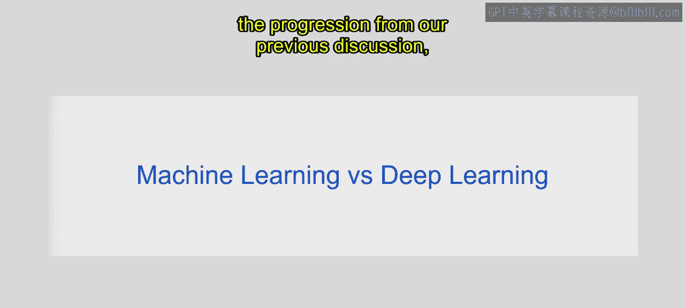
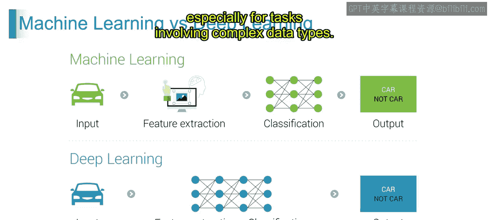
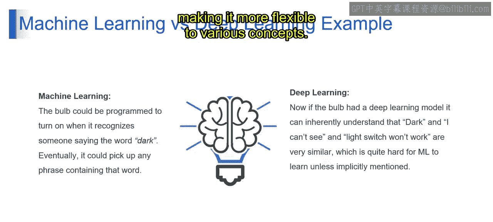
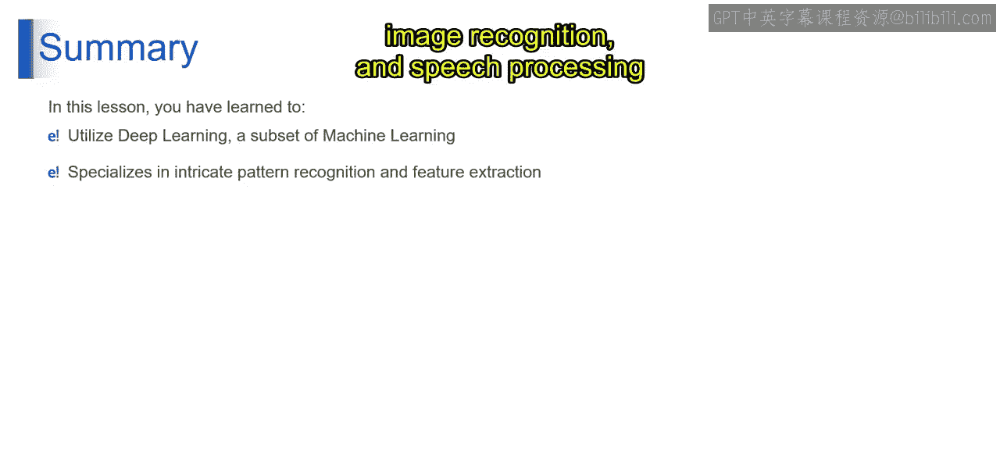

# 第一部分 30：机器学习 vs 深度学习 🧠

在本节课中，我们将探讨从机器学习到深度学习的演进过程，理解两者在特征处理、模型复杂度和适用场景上的核心区别。

上一节我们介绍了机器学习的基本概念，本节中我们来看看它与深度学习的对比。机器学习通常依赖于手工设计的特征和较简单的模型，适用于数据集较小且特征定义明确的任务。而深度学习则利用具有多层结构的神经网络，自动从数据中学习层次化的特征表示，擅长处理大规模数据集和涉及非结构化数据（如图像、文本）的复杂任务。

现在，让我们通过一个例子来理解这一点。

## 机器学习流程示例 🚗

在传统机器学习中，流程通常分为特征提取和分类两个独立阶段。

以下是其典型步骤：

1.  **输入**：输入数据，例如汽车的图像。
2.  **特征提取**：工程师手动选择或设计他们认为与任务相关的特征。例如，在识别汽车图像的任务中，这些特征可能包括车轮、车窗的存在以及特定的形状。
3.  **分类**：一旦特征被提取出来，机器学习算法（如**逻辑回归**、**支持向量机**或**决策树**）会使用这些特征将输入数据分类到预定义的类别中，例如“是汽车”或“不是汽车”。
4.  **输出**：机器学习模型的最终输出是基于提取特征对输入数据的预测或分类。例如，如果从图像中提取的特征表明存在车轮、车窗和类似汽车的形状，模型就会将其分类为汽车。

## 深度学习流程示例 🤖

深度学习将特征提取和分类过程整合为一个端到端的自动化学习流程。

以下是其典型步骤：

1.  **输入**：与机器学习类似，深度学习也从输入数据（如汽车图像）开始。
2.  **特征提取与分类结合**：在深度学习中，特征提取和分类被结合成一个步骤。模型在训练过程中直接从原始数据中自动学习相关特征，无需手动进行特征工程。
3.  **输出**：模型训练完成后，可以直接基于学习到的特征提供预测或分类。

虽然机器学习和深度学习都旨在从数据中进行预测或分类，但深度学习的区别在于它能自动从数据中学习特征，这使其更加灵活，在处理复杂数据类型时通常也更强大。

## 核心区别：规则与泛化能力 💡

为了更清晰地展示区别，我们可以通过一个控制灯泡的比喻来说明。

**机器学习**需要明确的规则和特征编程。例如，要让灯泡在听到“dark”这个词时亮起，ML系统需要被明确编程以识别这个特定的单词或短语。虽然它可以学会识别“dark”这个确切的短语，但如果没有额外的明确编程，它可能难以泛化到类似的短语，比如“I cannot see”。本质上，机器学习依赖于预定义的规则和特征来做决策。

**深度学习**则从数据中学习特征和模式。通过深度学习模型，灯泡可以学会将各种短语与“黑暗”关联起来，而无需明确编程。例如，深度学习模型可以理解“I cannot see”或“light switch won‘t work”这类短语传达了与“dark”相似的含义。深度学习擅长捕捉复杂的关系，并能很好地泛化到未见过的输入数据变体。本质上，深度学习可以直接从数据中学习隐含的关系和模式，使其对各种概念更加灵活。

## 总结 📝

本节课中，我们一起学习了深度学习作为机器学习的一个子集，如何在复杂的模式识别和特征提取方面表现出色。它无需显式编程就能理解数据中的复杂关系。通过利用深度学习，你可以解锁处理自然语言理解、图像识别和语音处理等复杂任务的能力，并获得更高的效率和准确性。