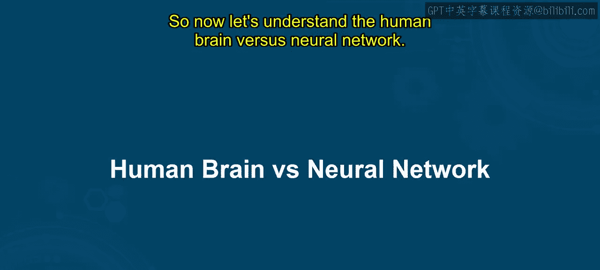
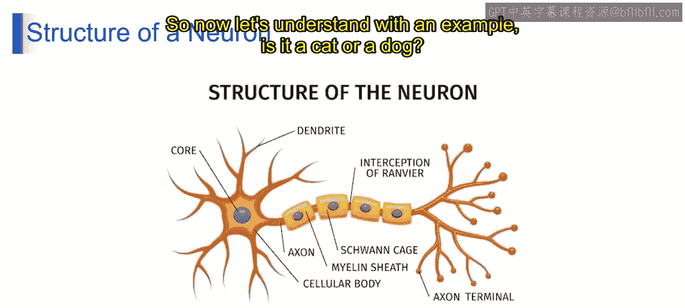

# 第一部分 31：人脑与神经网络 🧠

在本节课中，我们将要学习人脑与人工神经网络之间的核心关系。我们将从人脑的基本结构和工作原理出发，逐步过渡到人工神经网络的架构，并理解神经网络如何帮助计算机识别图像。

---

## 人脑如何工作

想象一下，你正在学习识别不同类型的水果。你的大脑会分析颜色、纹理和形状等各种特征，以区分苹果、香蕉和橙子。类似地，一个受大脑结构启发的神经网络，可以通过训练来识别图像中的模式。

从技术上讲，人脑是一个复杂的器官，它通过相互连接的神经元处理信息，形成复杂的网络，从而实现感知、记忆和决策等功能。类似地，深度学习中的神经网络由组织成多层的人工神经元互连而成。这些网络通过一个称为**反向传播**的过程从数据中学习，调整权重以最小化误差，从而有效地执行分类、回归和模式识别等任务。

虽然人脑和人工神经网络在结构和功能上有相似之处，但它们在规模和原理上有所不同。神经网络旨在模仿大脑在计算任务中的能力。

---

## 神经元的结构

上一节我们介绍了人脑与神经网络的整体类比，本节中我们来看看单个神经元的具体结构。它主要由以下几个部分组成：

以下是神经元各组成部分及其在深度学习中的对应类比：

*   **细胞核**：神经元的遗传物质，类似于深度学习模型中的**参数**，影响其功能和行为。
*   **树突**：类似于深度学习中的**输入层**，树突接收并处理初始信号，启动信息处理。
*   **细胞体**：细胞体内的信号整合，类似于深度学习模型中**隐藏层**进行的计算，特征在此被组合和处理。
*   **轴突**：将信号传递给下游系统，类似于深度学习中的**输出层**，传递最终的预测或分类结果。
*   **髓鞘**：类似于深度学习中的**优化技术**，髓鞘优化信号传输，提高效率和速度。
*   **施万细胞**：提供支持和保护，类似于深度学习中的**正则化方法**，确保模型的稳定性和鲁棒性。
*   **郎飞结**：促进快速信号传输的间隙，类似于深度学习中的**激活函数**，引入非线性以实现复杂计算。
*   **轴突末梢**：释放神经递质，类似于深度学习模型**交付最终输出**，提供有意义的预测或分类。

---

## 一个实例：识别猫与狗 🐱🐶

理解了神经元的结构后，我们来看一个具体的应用场景：图像识别。

在传统机器学习中，当需要判断一张图片包含的是猫还是狗时，由于可能相关的特征数量极其庞大，传统方法会遇到困难。从海量的可能性中手动选择这些特征变得不切实际，导致图像分类的准确性面临挑战。

而深度学习则能在此处大放异彩。深度学习模型可以自动从图像数据中学习和提取关键特征，无需手动进行特征工程。通过分析不同抽象层次的模式，深度学习能够更有效地区分猫和狗，获得更高的准确率，从而克服传统机器学习方法面临的局限性。

---

## 总结

本节课中我们一起学习了人脑与人工神经网络的核心联系。我们从人脑处理信息的方式出发，类比了生物神经元与人工神经网络的各个组成部分。最后，通过“识别猫狗”的实例，我们看到了深度学习在自动特征提取和复杂模式识别方面的优势，这为后续深入理解神经网络的工作原理奠定了基础。