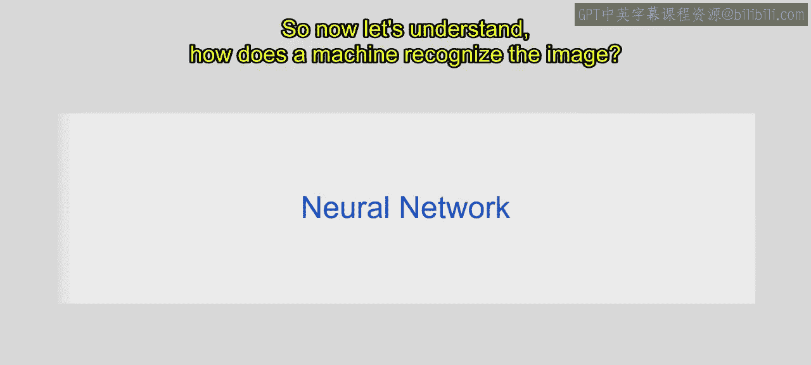
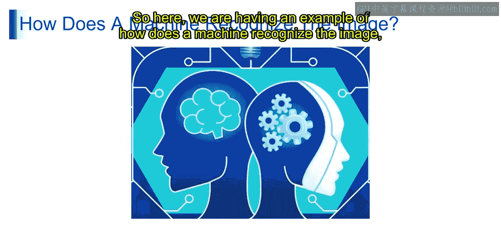
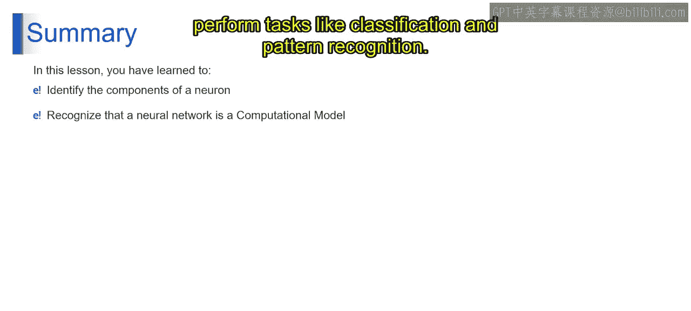

# 第一部分 32：神经网络介绍 🧠


在本节课中，我们将要学习神经网络的基本概念。我们将从上一节讨论的神经元结构出发，探索如何将生物神经元的灵感转化为计算机能够理解和执行任务的数学模型。神经网络是深度学习和现代人工智能的核心，理解它是学习生成式人工智能的重要一步。

---

## 从神经元到神经网络

上一节我们介绍了生物神经元的结构与功能。本节中我们来看看如何将这种灵感转化为计算模型。

想象你正在尝试教计算机识别手写数字。你向它展示大量带有标签的手写数字图像。例如，一张图片上写着数字“7”，其标签就是“7”。通过展示许多这样的图像，你希望计算机能自己学会如何识别这些数字。

神经网络就像一个被训练来完成此任务的虚拟大脑。网络中的每个神经元都像一个小小的决策者。随着计算机看到更多示例，它会调整这些决策者，从而在识别数字方面做得更好。

从技术上讲，神经网络是一种受人类大脑结构和功能启发的计算模型。它由称为神经元的互连节点组成，这些节点被组织成层。每个神经元接收输入信号，执行计算，并生成输出信号。

具有多层的神经网络通过一个称为**反向传播**的过程，学习从原始数据中提取特征，并进行预测或分类。在训练过程中，神经网络迭代地调整其参数（即**权重**和**偏置**），以最小化预测误差并提高性能。



---

## 机器如何识别图像？ 🖼️

理解了神经网络的基本构成后，我们来看看它在具体任务——如图像识别——中是如何工作的。

机器通过使用分析图像数据中像素值和模式的算法来识别图像。它将图像分解为更小的组成部分，并将其与已知的特征或模式进行比较。借助深度学习，机器可以自动从图像中学习并提取有意义的特征，从而能够基于学习到的表示进行准确的预测或分类。



让我们通过一个例子来理解这个过程。以下是机器如何识别图像中的动物（如狗、猫、鸡、兔子等）的步骤：

以下是图像识别过程的主要步骤：

1.  **训练阶段**：使用数千张带有标签的动物图像训练一个神经网络，使其学会根据特征对动物进行分类。
2.  **输入**：将一张未标记的图像（例如一张狗的照片）输入到预训练好的网络中。
3.  **第一层处理**：第一层的神经元检测图像中存在的基本形状或边缘。
4.  **中间层处理**：更深层的神经元识别由边缘和形状组合形成的更复杂结构。
5.  **顶层处理**：顶层的神经元代表高度抽象的概念，例如在训练期间学到的特定动物特征。
6.  **输出**：网络综合所有层（第一层、中间层、顶层）的信息，预测图像中的物体，例如根据整个训练过程学到的特征将其识别为“猫”或“狗”。

这就是神经网络工作的基本原理。

---

## 核心概念总结

本节课中我们一起学习了以下核心内容：

*   **神经网络的本质**：它是一种受生物大脑启发的**计算模型**，由分层的、互连的神经元（节点）组成。
*   **学习过程**：神经网络通过**反向传播**算法进行学习，不断调整内部的**权重（w）** 和**偏置（b）** 参数，公式化地表示为优化一个损失函数以最小化误差。
*   **图像识别流程**：这是一个从具体到抽象的层次化特征提取过程。代码逻辑上类似于一个前向传播函数：
    ```python
    # 概念性伪代码
    def forward_pass(image):
        features_layer1 = detect_edges(image)          # 第一层：检测边缘
        features_layer2 = combine_shapes(features_layer1) # 中间层：组合形状
        features_top = abstract_concepts(features_layer2) # 顶层：抽象概念
        prediction = classify(features_top)            # 输出层：分类预测
        return prediction
    ```



总结来说，你已掌握了神经元的组成部分，并理解了神经网络作为受人脑启发的计算模型，如何通过互连的节点模拟神经元行为来执行分类和模式识别等任务。这是通往更复杂人工智能模型的重要基石。