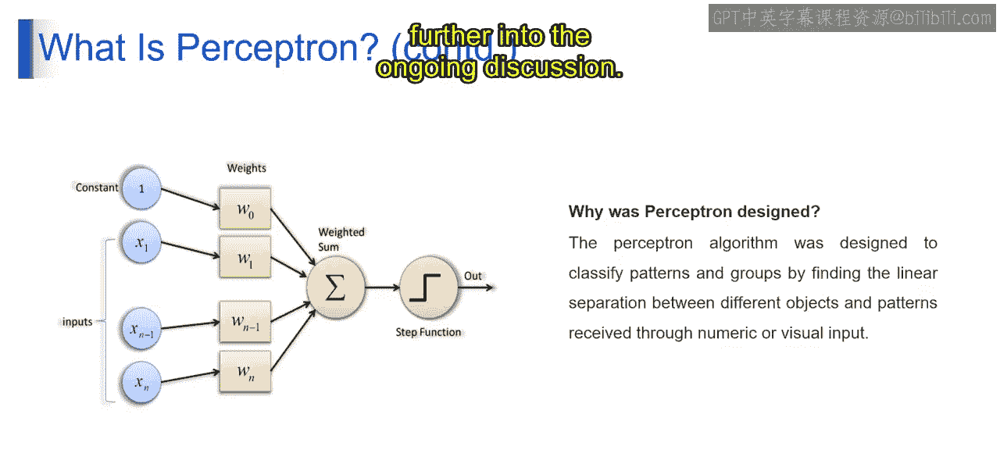

# 第一部分 33：感知器

在本节课中，我们将学习机器学习中的一个基础概念——感知器。我们将了解感知器的定义、核心组件及其工作原理，为后续学习更复杂的神经网络模型打下基础。


## 概述


感知器是神经网络中最简单的形式，可以看作是一个模拟生物神经元进行决策的数学模型。它能够根据输入信息，通过加权计算和阈值判断，做出二分类决策。理解感知器是理解深度学习的第一步。

## 感知器是什么？

想象一下，你的朋友要根据天气情况决定是否去散步。他观察到晴天更可能去，雨天则更可能待在家里。感知器的作用与此类似，它接收输入（例如天气状况），并输出一个决策（例如去或不去）。

从技术上讲，感知器是最简单的神经网络形式，由多个输入节点和一个输出节点构成。每个输入节点都关联着一个**权重**，代表该输入的重要性。感知器计算输入的加权和，并应用一个**阈值函数**来产生输出。

在训练过程中，感知器会根据其预测输出与真实输出之间的误差，通过如**梯度下降**等技术来调整权重。这使得它能够学习线性的决策边界，并执行二分类任务。

简而言之，感知器既可作为生物神经元在人工神经网络中的简化模型，也是一种用于监督学习二分类器的早期算法名称。

## 感知器如何工作？

上一节我们介绍了感知器的基本概念，本节中我们来看看它的具体工作流程。感知器算法的图示通常包含以下几个部分：输入、权重、加权和、阶跃函数以及最终输出。

以下是感知器工作流程的核心组件：

1.  **输入**
    输入是数据的特征或属性。在图中，它们通常表示为节点或圆圈，每个节点对应一个特定的特征。

2.  **偏置**
    偏置项是一个常数值，会被加到输入的加权和上。它允许感知器捕捉那些不经过特征空间原点的模式。在图中，它通常表示为一个固定值为1的节点。

3.  **权重**
    每个输入都关联着一个权重，决定了该输入在决策过程中的重要性。权重会与对应的输入相乘。

4.  **加权和**
    加权和是每个输入与其权重相乘后求和的结果。这个计算代表了所有输入对感知器决策的综合影响。公式表示为：
    `加权和 = (输入1 * 权重1) + (输入2 * 权重2) + ... + 偏置`

5.  **阶跃函数**
    感知器的输出通过对加权和应用一个阶跃函数来决定。如果加权和超过某个阈值，感知器输出一个类别（例如1）；否则，输出另一个类别（例如0）。这可以用一个简单的条件判断表示：
    ```python
    if 加权和 > 阈值:
        输出 = 1
    else:
        输出 = 0
    ```

整体的图示展示了感知器如何将输入特征与相应权重结合，计算加权和，并应用阶跃函数来产生一个二分类的输出。

## 总结



本节课中我们一起学习了感知器的基础知识。我们了解到感知器是一个简单的二分类模型，其核心在于通过**权重**和**偏置**计算输入的加权和，并利用**阶跃函数**做出决策。它是理解更复杂神经网络的重要基石。在接下来的内容中，我们将继续深入探讨相关概念。