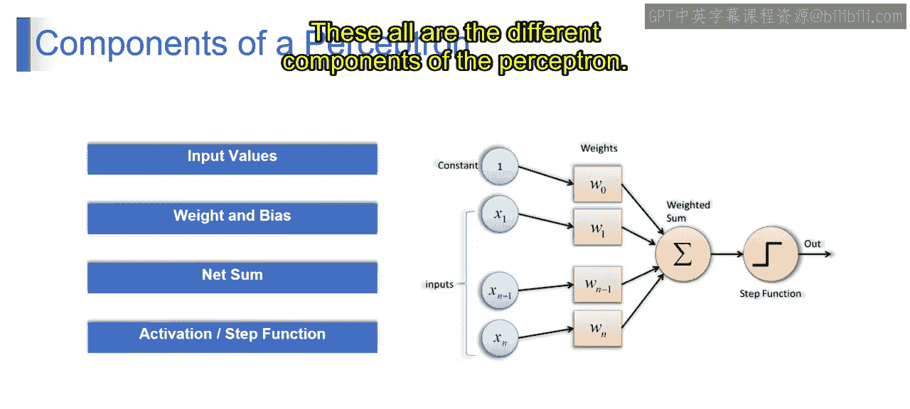
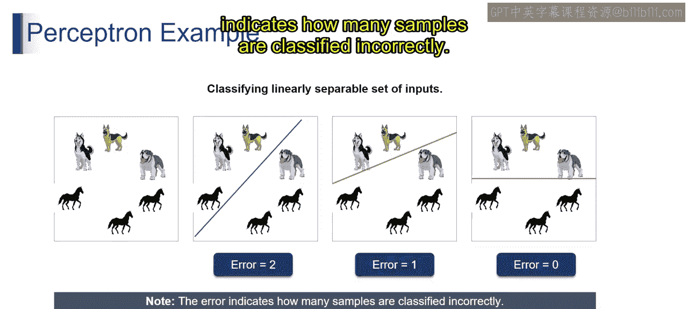
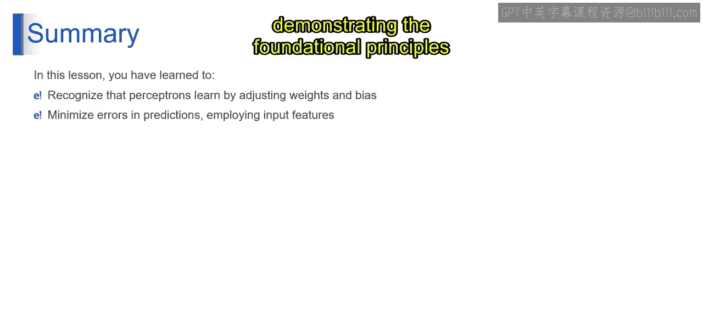

# 第一部分 34：感知器的组成部分

## 概述
在本节中，我们将学习感知器的核心组成部分。感知器是神经网络的基本单元，理解其构成是掌握后续复杂模型的基础。我们将逐一解析输入、权重、偏置、净和以及激活函数，并通过一个线性分类的例子来直观理解其工作原理。

---

## 感知器的核心组件
上一节我们介绍了感知器的基本概念，本节中我们来看看它的具体构成。一个典型的感知器包含以下几个关键部分：

以下是感知器的各个组成部分及其作用：

1.  **输入变量**
    *   输入值代表被感知器处理的数据的特征或属性。

2.  **权重与偏置**
    *   **权重** 代表每个输入的重要性。
    *   **偏置** 允许感知器捕获不经过原点的模式。

3.  **净和**
    *   净和是输入的加权总和加上偏置，代表了输入对感知器决策的综合影响。其公式可表示为：
        **`净和 = (权重1 * 输入1) + (权重2 * 输入2) + ... + 偏置`**

4.  **激活函数（或阶跃函数）**
    *   激活函数或阶跃函数根据净和的值决定感知器的输出。

激活函数通常基于预设的阈值产生一个二元分类结果（例如0或1）。

---

## 线性可分示例：分类狗与马
了解了组件后，我们通过一个例子来看感知器如何工作。下图展示了机器学习中的线性可分概念，数据点代表狗和马，可以用一条直线进行分类。

以下是分类过程的逐步分析：

*   **第一张图**：展示了狗和马的数据点表示。
*   **第二张图**：尝试用一条直线进行线性分离，但出现了两个错误分类（一匹马和一只狗）。此时的错误数为2。
*   **第三张图**：调整了直线，错误数减少为1（一只狗被错误分类）。
*   **第四张图**：经过清晰的线性分离后，所有的马和狗都被正确分类，错误数为0。

这个例子演示了一种简化的分类方法。需要注意的是，**错误项** 指示了有多少样本被错误分类。

然而，人类的感知是一个多方面的过程，涉及将感官输入与过去的经验、情感相结合来理解世界，其复杂程度远超简单的线性边界。

---

## 总结
本节课中，我们一起学习了感知器的核心组成部分：输入、权重、偏置、净和与激活函数。我们了解到，感知器通过调整权重和偏置来学习，从而最小化错误，做出准确预测。通过考虑输入特征并迭代优化模式，感知器提升了其分类数据的能力，这展示了神经网络训练的基本原理。

