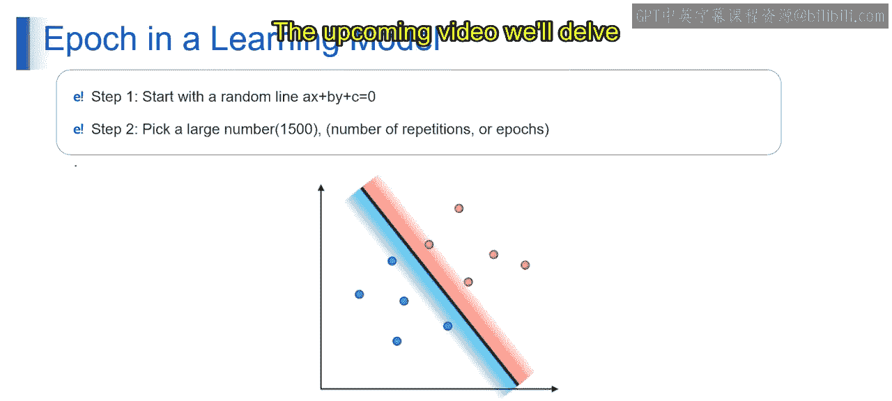

# 第一部分 37：轮数

在本节课中，我们将要学习机器学习中的一个核心概念——轮数。我们将了解轮数的定义、它在模型训练中的重要性，以及它是如何工作的。

## 概述：什么是轮数？

轮数是机器学习模型训练过程中的一个基本概念。简单来说，一个轮数代表模型**完整地学习一遍整个训练数据集**。这个过程对于模型从数据中学习并改进其预测能力至关重要。

上一节我们介绍了机器学习的基本框架，本节中我们来看看训练过程中的一个关键循环单元——轮数。

## 理解轮数：一个简单的例子

为了更好地理解轮数，让我们从一个简单的例子开始。

想象你正在教一台计算机识别不同类型的水果，比如苹果、橙子和香蕉。为此，你需要向计算机展示大量水果图片，并告诉它每张图片是什么水果。你希望计算机随着时间的推移，能越来越擅长识别这些水果。

这就是轮数发挥作用的地方。在深度学习中，一个轮数就像**一轮练习**。在每个轮数中，计算机查看你提供的所有水果图片，尝试识别它们，并从错误中学习。因此，一个轮数就相当于将所有水果图片完整地过一遍。

## 轮数与批次

现在，让我们深入一点。在深度学习中，数据通常被分成更小的批次进行训练。

这是因为一次性处理所有数据对计算机来说可能负担过重。所以，计算机不是一次性看完所有水果图片，而是每次看一小批，比如200张。这个数字可以根据你的设置而变化，它被称为**批次大小**。

将数据分成更小的组进行训练，这就是批次大小的概念。

## 轮数的工作流程

现在，让我们把以上概念整合起来。

1.  你有一堆水果图片。
2.  你将图片分成批次，比如每批200张。
3.  你将每个批次展示给计算机，它尝试识别这些图片中的水果。
4.  当计算机看完了所有批次，这就完成了一个轮数。

为了提升计算机识别水果的能力，你可能会多次重复这个过程，即进行多个轮数。随着每个轮数的进行，计算机会从错误中学习，并不断优化它对苹果、橙子等特征的理解，从而变得越来越好。

**总结来说**：深度学习中的一个轮数就像一轮练习，计算机通过一组数据（即一个批次）进行学习，以提升其对当前任务（无论是识别水果还是其他任务）的理解。通过多个轮数重复这个过程，计算机在该任务上的表现会越来越好。

## 轮数的技术定义

在机器学习中，**轮数**指的是在模型训练阶段，**完整遍历一次整个训练数据集**的过程。

在一个轮数中，模型会遍历数据集中的所有样本，执行前向传播和反向传播以计算损失和梯度，并使用优化算法（如梯度下降）来更新模型参数。

轮数标志着整个数据集被呈现给模型进行训练的次数。它允许模型多次从整个数据集中学习，从而提升其泛化能力和做出准确预测的能力。

## 轮数在模型学习中的应用

以下是轮数在模型学习中的一个应用步骤示例：

1.  **初始化模型参数**：从一个随机线开始，例如方程 `a*x + b*y + c = 0`，其中 `a`、`b`、`c` 是随机选择的系数。这条线代表优化或学习过程的初始猜测或起点。
2.  **设定轮数**：选择一个较大的数字作为重复次数或轮数，例如1500。这个数字通常基于收敛行为、计算资源和任务复杂性等因素来确定。

这些步骤描述了一个迭代过程：从一个初始的线表示开始，然后重复一定次数（轮数），在每次迭代中可能涉及对线参数的调整或优化。这个过程的具体细节和目的取决于其使用的上下文。

## 总结

本节课中我们一起学习了机器学习中的**轮数**概念。

我们了解到：
*   一个**轮数**代表模型完整学习一遍整个训练数据。
*   数据通常被分成**批次**进行训练，以减轻计算负担。
*   通过多个轮数的迭代，模型能够从错误中持续学习，不断优化其参数，从而逐步提升预测的准确性。

理解轮数是掌握模型训练动态的基础。在接下来的课程中，我们将继续探讨其他影响模型性能的关键因素。