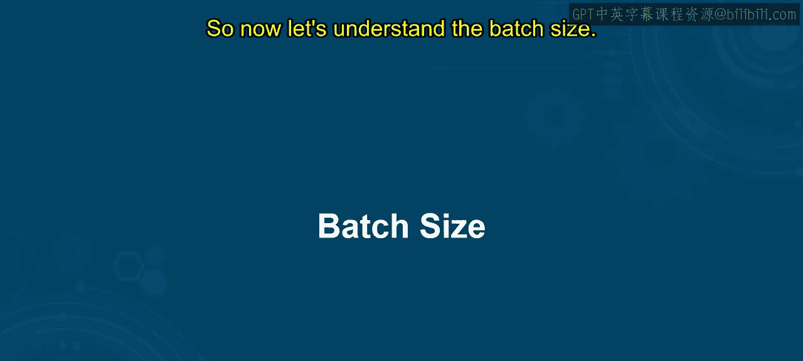
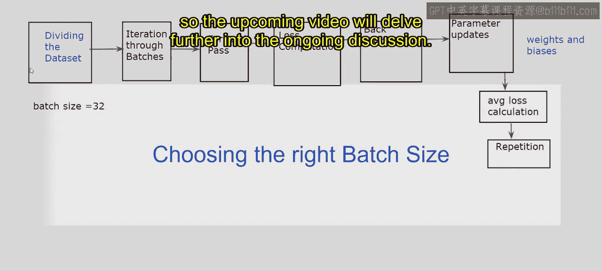

# 第一部分 39：批量大小

## 概述
在本节课中，我们将要学习深度学习中的一个核心概念——**批量大小**。我们将了解它的定义、如何选择合适的批量大小，以及它对模型训练过程的具体影响。理解批量大小是掌握高效模型训练的关键一步。

---

## 什么是批量大小？🍪
上一节我们介绍了训练迭代的基本概念，本节中我们来看看一个决定每次迭代处理多少数据的关键参数：批量大小。

想象一下你正在烘焙饼干。你有一个可以制作100块饼干的食谱。你不会选择一次性烘焙所有100块饼干，而是决定分成更小的批次来烘焙。例如，你可以选择每次只烘焙10块饼干。这样做可以让你更高效地管理烘焙过程，并确保结果的一致性。

类似地，在机器学习中，**批量大小**指的是每次训练迭代所处理的样本数量。与其在处理完每一个训练样本后就更新模型参数（这在计算上非常昂贵），不如将训练数据划分为更小的批次（例如，将100个样本分成10批）。这些批次随后被输入模型，模型的参数会根据每个批次计算出的平均损失进行更新。

*   每一批饼干对应着一批训练数据。
*   每次烘焙10块饼干，类似于每次训练迭代处理批量大小为10的样本。

通过将任务分解成更小的批次，训练过程变得更易于管理和高效，就像将饼干食谱分成小批次能让烘焙过程更可控一样。这就是批量大小的核心含义。

从技术上讲，批量大小是**每次迭代训练的样本数量**（无论是10个、20个、30个，甚至1个），它指导模型根据这些数据子集产生的误差来调整权重。

---

## 批量大小的工作流程 ⚙️
在了解如何选择正确的批量大小之前，让我们先深入理解它的具体工作步骤。

以下是训练过程中涉及批量大小的关键步骤：

1.  **划分数据集**：数据被划分为称为“批次”的较小子集，每个批次包含由批量大小决定的固定数量的样本。
2.  **遍历批次**：在每次训练迭代中，模型一次处理一个批次的数据。例如，如果批量大小设置为32，那么模型在每次迭代中处理32个样本。
3.  **前向传播**：在每次迭代中，当前批次的输入数据被送入模型。模型根据其当前的参数（权重和偏置）计算输入样本的预测值。
4.  **损失计算**：前向传播之后，模型计算预测输出与该批次样本真实标签之间的损失（或误差）。常见的损失函数包括用于分类任务的交叉熵和用于回归任务的均方误差。
5.  **反向传播**：反向传播涉及计算损失函数相对于模型参数的梯度。这些梯度代表了为最小化损失所需调整的方向和幅度。
6.  **参数更新**：模型参数（即权重和偏置）使用优化算法（如随机梯度下降或其变体，如Adam或RMSProp）进行更新。更新规则基于反向传播期间计算的梯度，并按学习率进行缩放。
7.  **平均损失计算**：由于模型参数是基于每个批次计算的损失进行更新的，因此通常会计算该批次内所有样本的平均损失。这个平均损失衡量了模型在当前批次数据上的表现。
8.  **重复**：对数据集中的每个批次重复步骤2到7，直到所有批次都被处理完毕。完成一次完整数据集遍历所需的迭代次数由批量大小决定。

通过遵循这些步骤，批量大小影响了训练更新的粒度，在计算效率与学习动态之间取得平衡。调整批量大小会影响模型在计算资源、收敛速度和泛化性能之间的权衡。

---

## 如何选择合适的批量大小？🎯
基于对上述工作流程的理解，我们现在可以探讨如何选择合适的批量大小。选择时通常需要考虑以下几个关键因素：

以下是选择批量大小时的主要考量点：

*   **计算资源**：较大的批量大小通常能更充分地利用GPU/TPU的并行计算能力，提高训练速度，但需要更多的显存。
*   **收敛速度与稳定性**：较小的批量大小（如32、64）能提供更频繁的权重更新，可能有助于模型更快地收敛，但更新方向可能更嘈杂。较大的批量大小（如256、512）能提供更稳定、噪声更少的梯度估计，但每次更新的次数变少。
*   **泛化性能**：经验表明，使用较小的批量大小训练的模型有时能获得更好的泛化能力（在未见数据上表现更好），这可能是因为噪声引入了正则化效果，防止过拟合。
*   **学习率互动**：批量大小与学习率紧密相关。通常，增大批量大小时，可能需要相应地增大学习率，以保持相似的收敛特性。

在实践中，常见的做法是从一个中等大小的批量（如32或64）开始，然后根据你的硬件条件和模型表现进行调整。对于非常大的数据集，可能会使用较大的批量大小以加速训练。

---

## 总结
本节课中，我们一起学习了**批量大小**这一重要概念。我们通过烘焙饼干的类比理解了它的基本定义，详细剖析了它在模型训练工作流程中的角色，并探讨了选择合适批量大小时需要考虑的因素，包括计算资源、收敛速度、泛化性能以及与学习率的互动。理解并合理设置批量大小，是进行高效、稳定深度学习模型训练的基础。在接下来的课程中，我们将继续探索其他影响模型训练的关键超参数。