# 第一部分 40：选择合适的批量大小 📊

在本节课中，我们将要学习如何为深度学习模型选择合适的批量大小。批量大小是模型训练中的一个关键超参数，它直接影响训练效率、内存使用以及最终模型的性能。我们将探讨选择批量大小时需要考虑的各个因素，并理解其如何影响整个训练过程。

---

## 从理论到实践

上一节我们讨论了训练的基本概念，本节中我们来看看如何将理论应用于实践，具体到选择批量大小这一步。

选择合适的批量大小对于有效训练深度学习模型至关重要。以下是选择时需要考虑的几个核心方面。

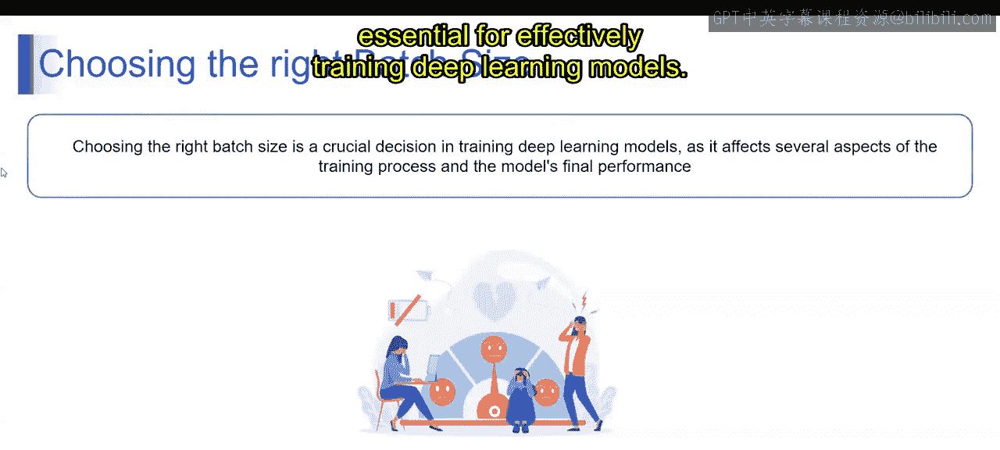

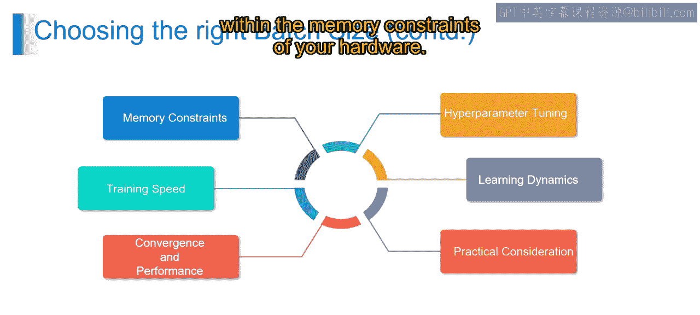

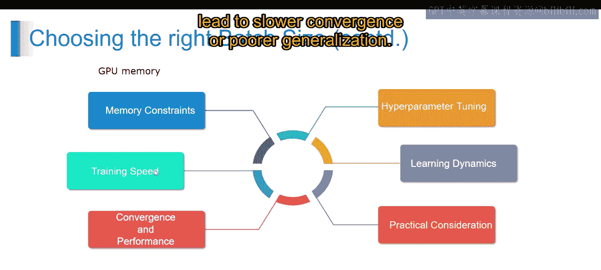

### 硬件内存限制

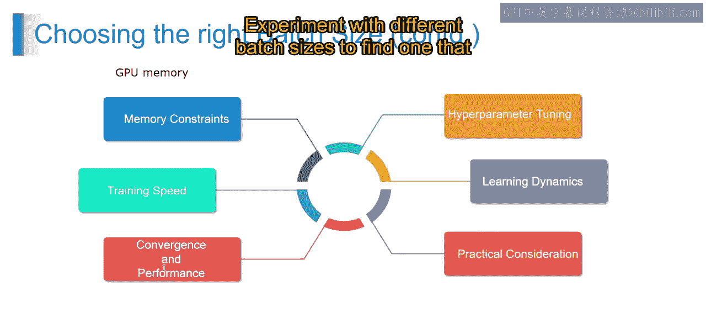

选择批量大小的首要考虑因素是硬件（例如GPU）的内存限制。较大的批量大小在反向传播过程中需要更多内存来存储中间激活值和梯度。

**公式表示**：假设单个样本的内存占用为 `M_sample`，批量大小为 `B`，则一批数据的内存需求约为 `B * M_sample`。必须确保该值不超过可用显存。

### 训练速度

较大的批量大小通常能带来更快的训练速度，因为它能更好地利用并行处理和内存。然而，过大的批量大小可能导致收敛变慢或模型泛化能力变差。

### 收敛与性能

需要通过实验来确定能带来最快收敛和最佳性能的批量大小。较小的批量大小可能导致更新更“嘈杂”，但有时能带来更好的泛化能力。

### 实际考量

对于大型数据集，考虑到计算资源和时间限制，可能更倾向于选择较小的批量大小，以确保更快的迭代和模型评估速度。

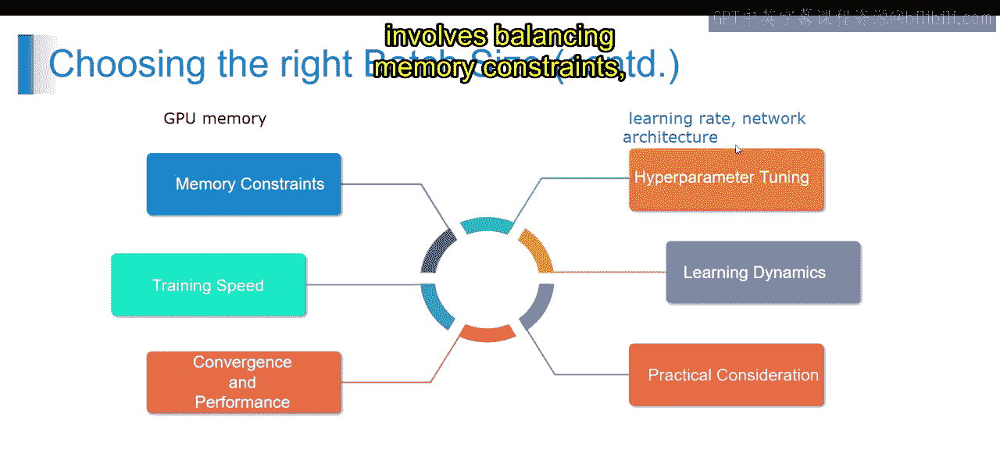

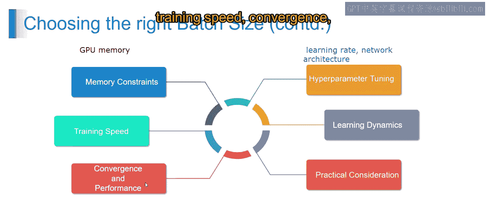

### 学习动态

批量大小影响模型的学习动态，即模型学习和适应数据的速度。较小的批量大小能更频繁地更新模型参数，从而带来更快的学习动态，但也可能导致参数更新的方差更高。

### 超参数调优

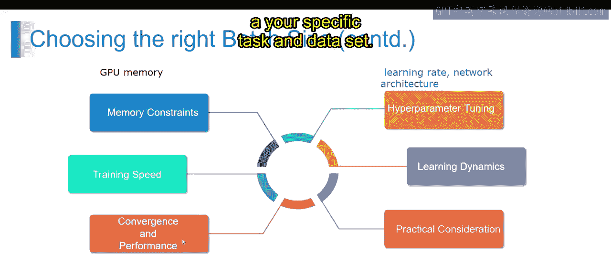

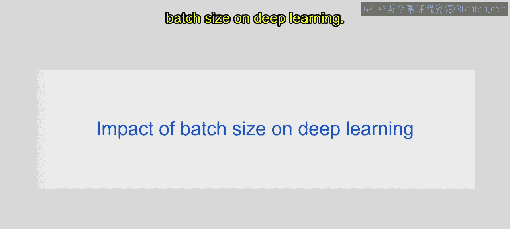

批量大小是一个重要的超参数，应与其他超参数（如学习率、网络架构）一同进行调优，以优化模型性能。需要进行系统性的实验，用不同的批量大小训练模型，并在验证集上评估性能指标。

**总结来说**，选择合适的批量大小需要在内存限制、训练速度、收敛性、实际考量以及模型学习动态之间取得平衡。必须通过实验来仔细评估不同批量大小对模型性能的影响，从而为特定任务和数据集找到最优解。

---

## 批量大小对深度学习的影响

理解了如何选择后，我们进一步探讨批量大小具体如何影响深度学习训练的各个方面。

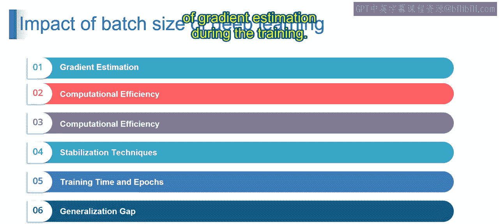

### 梯度估计

批量大小影响训练期间梯度估计的质量。较大的批量大小能提供更真实的梯度估计，导致更平滑的优化轨迹。而较小的批量大小会给梯度估计引入更多噪声，但可能带来更好的泛化能力。

### 计算效率

较大的批量大小通常能通过利用并行处理和优化内存使用来提高计算效率。使用大批量进行训练可以减少数据加载和处理相关的开销，从而缩短每个训练周期的时间。

**核心概念**：计算效率是指在给定硬件资源下完成计算的速度。使用大批量可以更充分地利用GPU等资源。

### 稳定化技术

批量归一化等技术可以减轻批量大小对训练动态的影响。批量归一化对每个小批次内的激活值进行归一化，减少了模型对批量大小的依赖，提高了训练稳定性。

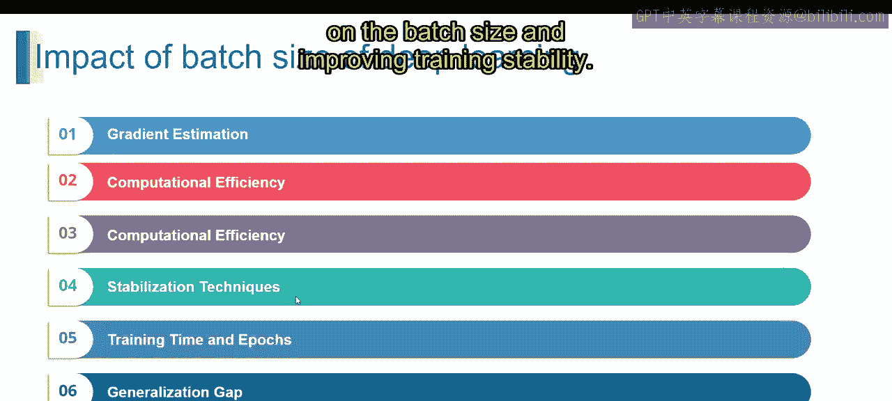

### 训练时间与周期数

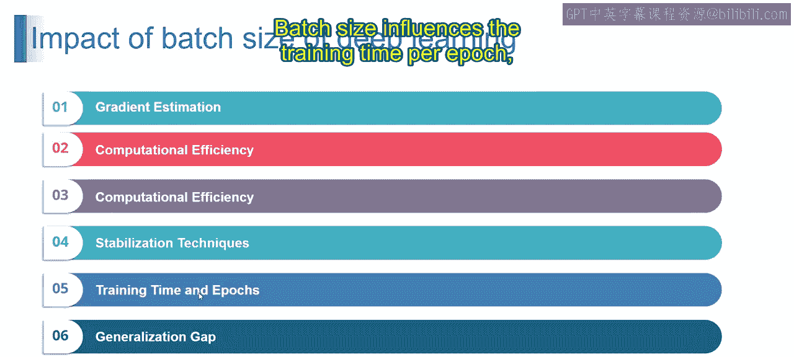

批量大小影响每个周期的训练时间，较大的批量通常意味着更快的训练。然而，达到收敛所需的周期数可能因批量大小而异，较小的批量可能需要更多迭代才能收敛。

### 泛化差距

批量大小的选择会影响模型的泛化性能。较小的批量大小可能给优化过程引入更多噪声，导致训练集与验证集/测试集性能之间的泛化差距变大。

### 自适应方法

自适应批量大小策略（如学习率调度和批量大小调整）可以在训练过程中动态调整批量大小。这些自适应方法有助于平衡计算效率和优化稳定性，从而提升模型性能。

**总而言之**，深度学习中的批量大小选择影响着梯度估计、计算效率、稳定化技术、训练时间、泛化性能和自适应方法。仔细考虑这些因素对于优化模型训练和在目标任务上取得高性能至关重要。

---

## 总结

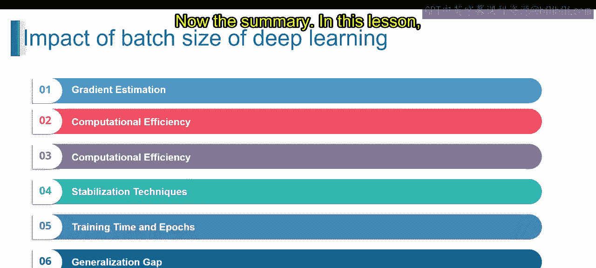

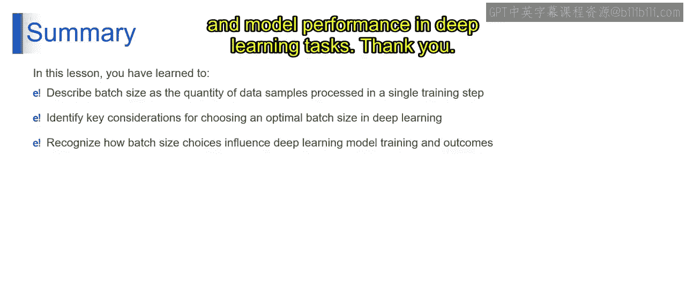

本节课中，我们一起学习了批量大小的核心概念，理解了它是指在单个训练步骤中处理的数据样本数量。我们识别了影响其选择的关键因素，并认识到批量大小的选择对模型训练过程和结果有深远影响。掌握这些知识后，你将能够优化深度学习任务的训练效率并提升模型性能。