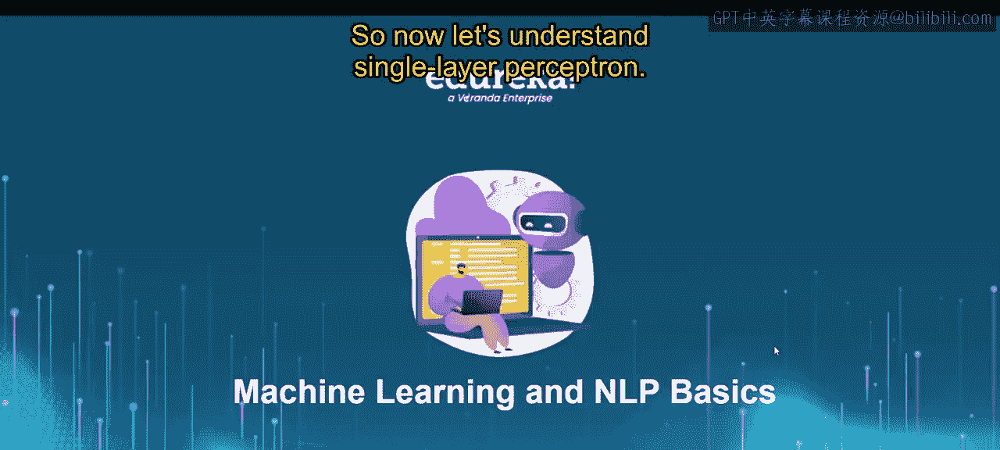
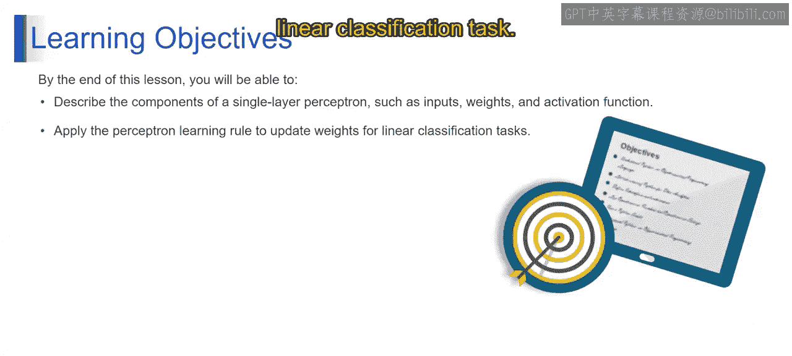
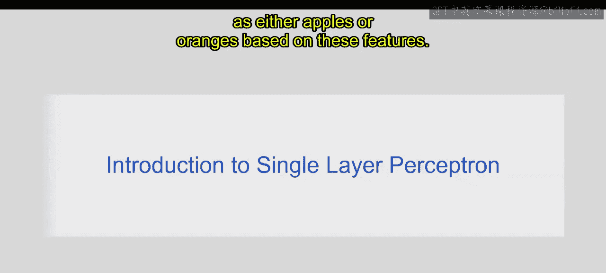
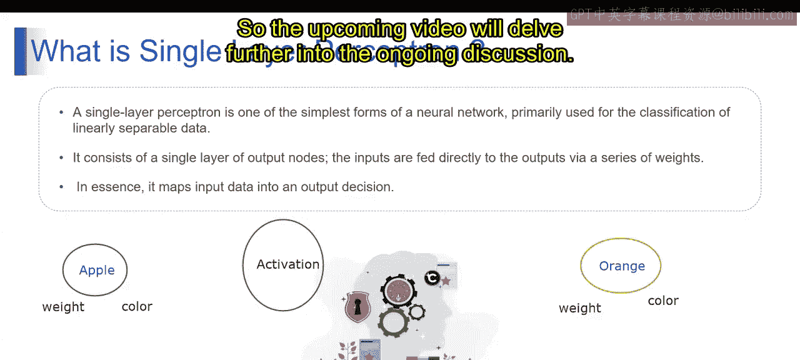

# 第一部分 41：单层感知器 🧠

在本节课中，我们将要学习单层感知器。这是一种最基础的神经网络模型，主要用于线性可分数据的分类任务。我们将介绍其基本构成和工作原理，并学习如何应用感知器学习规则来更新权重。

## 单层感知器简介

上一节我们介绍了本课程的目标，本节中我们来看看什么是单层感知器。首先，让我们通过一个例子来理解它。

想象你正在尝试根据水果的重量和颜色来预测它是苹果还是橙子。你有一个数据集，其中包含水果的重量、颜色以及表明它们是苹果还是橙子的标签。现在，你需要构建一个简单的模型，能够根据这些特征学习如何将新水果分类为苹果或橙子。

从技术上讲，单层感知器是最简单的前馈神经网络形式，只包含一层神经元。单层感知器中的每个神经元接收输入，输入会与对应的权重相乘并求和。这个加权和随后被传递到一个激活函数，激活函数的输出决定了最终的分类或预测。

在我们的水果分类例子中，单层感知器将有两个输入神经元，分别代表水果的重量和颜色。每个输入会乘以一个对应的权重，该权重代表了该特征对于分类的重要性。输入的加权和随后被传递到激活函数，对于二分类任务可以是阶跃函数，对于概率分类可以是Sigmoid函数。基于激活函数的输出，单层感知器预测水果是苹果还是橙子。

单层感知器是二分类任务的基本模型，其中输入被加权并通过激活函数来做出预测。其简单性使其易于理解和实现，成为神经网络架构中的一个基础概念。

现在让我们从技术层面理解。单层感知器是最简单的神经网络形式，主要用于线性可分数据的分类。它之所以称为“单层”，是因为它只包含一层输出节点。输入通过一系列权重直接连接到输出。本质上，它将输入数据映射到输出决策。

单层感知器是一种基本的神经网络架构，以其简单性和线性结构为特征。它仅由一层神经元组成，直接将输入数据映射到输出决策。

以下是其主要特点：
*   **简单性**：结构简单，易于理解。
*   **线性可分**：只能解决线性可分的问题。
*   **直接映射**：输入直接通过权重连接到输出。
*   **加权和**：计算输入的加权总和。
*   **激活函数**：使用激活函数（如阶跃函数）产生输出。

## 单层感知器的工作原理

上一节我们介绍了单层感知器的基本概念和特点，本节中我们来看看它是如何工作的。理解其工作原理对于掌握后续更复杂的模型至关重要。

单层感知器的工作流程可以概括为几个核心步骤。首先，它接收多个输入信号。每个输入信号都与一个特定的权重相关联，权重代表了该输入对于最终决策的重要性。模型计算所有输入与其对应权重的乘积之和，即加权和。这个加权和随后被送入一个激活函数。激活函数根据加权和的值产生一个输出，这个输出就是模型的预测结果。如果预测错误，模型会根据感知器学习规则调整权重，以减少未来的错误。

以下是单层感知器工作的详细步骤：

1.  **输入与权重**：模型接收输入 `x1, x2, ..., xn`。每个输入 `xi` 都关联一个权重 `wi`。权重可以是正数或负数，表示输入对输出的促进或抑制程度。
2.  **计算加权和**：计算所有输入与权重乘积的总和。这可以用一个简单的公式表示：
    `加权和 (z) = (w1 * x1) + (w2 * x2) + ... + (wn * xn) + b`
    其中 `b` 是偏置项，它是一个常数，允许模型在输入全为0时也能产生输出。
3.  **应用激活函数**：将计算得到的加权和 `z` 输入到激活函数 `f` 中。对于经典的二分类感知器，通常使用**阶跃函数**作为激活函数。
    `输出 (y) = f(z)`
    阶跃函数的定义是：如果 `z >= 0`，则输出 `1`（代表一个类别，例如“苹果”）；如果 `z < 0`，则输出 `0`（代表另一个类别，例如“橙子”）。
4.  **产生输出**：激活函数的输出 `y` 就是单层感知器的最终预测结果。
5.  **权重更新（学习）**：将预测输出 `y` 与真实标签 `y_true` 进行比较。如果预测错误（即 `y != y_true`），则根据**感知器学习规则**更新权重和偏置，以使模型在未来对相同输入的预测更准确。
    更新规则如下：
    `wi_new = wi_old + α * (y_true - y) * xi`
    `b_new = b_old + α * (y_true - y)`
    其中 `α` 是学习率，控制着每次更新的步长。

这个过程会针对训练数据集中的每个样本重复进行，直到模型能够正确分类所有样本（或达到预设的迭代次数）。

## 总结

本节课中我们一起学习了单层感知器。我们首先通过一个水果分类的例子引入了单层感知器的概念，了解到它是用于线性可分数据分类的最简单神经网络。我们详细描述了其核心组件：输入、权重、加权和、激活函数（特别是阶跃函数）以及偏置项。最后，我们探讨了感知器学习规则，这是模型通过调整权重从错误中学习的关键机制。理解单层感知器为学习更复杂的多层神经网络奠定了重要基础。