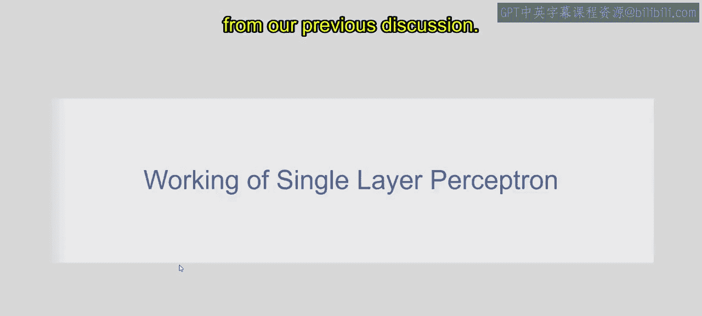
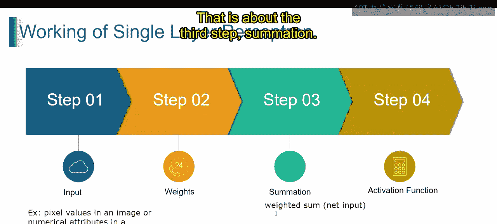
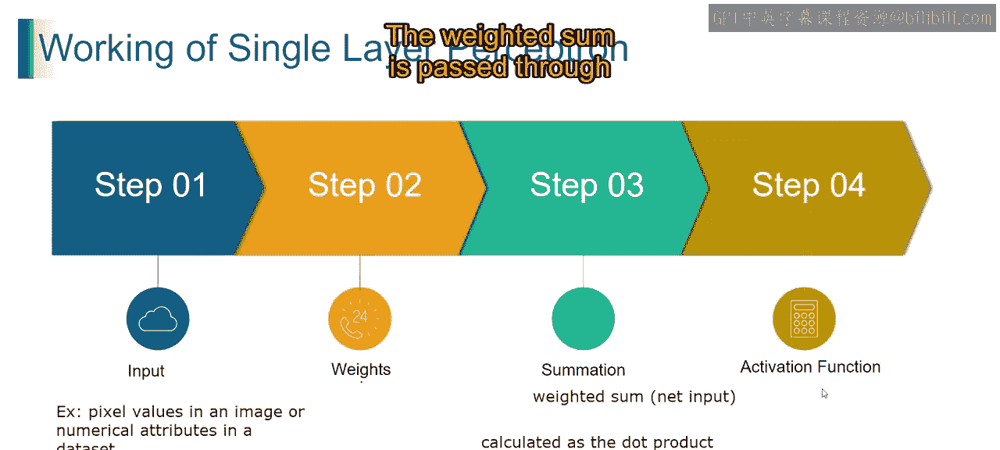
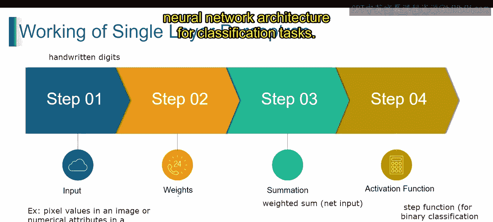
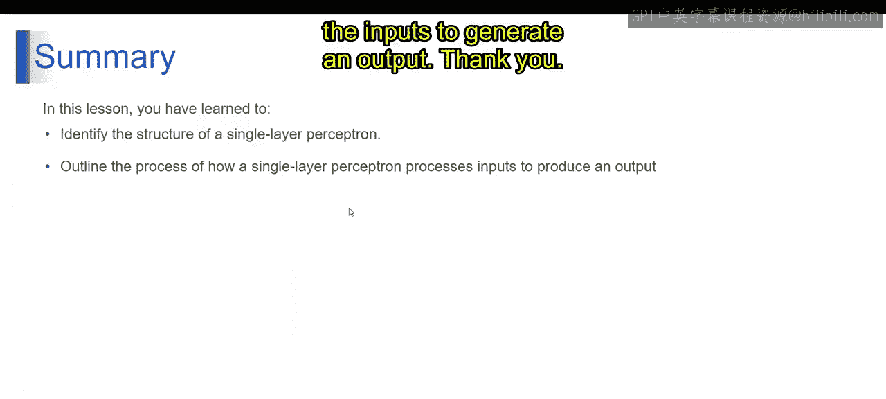

# 第一部分 42：单层感知器的工作原理 🧠

在本节课中，我们将学习单层感知器是如何工作的。感知器是神经网络中最基础的构建模块，理解其工作原理是学习更复杂模型的关键。我们将从输入开始，逐步讲解权重、求和、激活函数和最终决策的整个过程。

上一节我们介绍了感知器的基本结构，本节中我们来看看它的具体工作流程。

## 输入

处理过程从输入层开始，数据被输入到感知器中。每个输入神经元代表输入数据的一个特征，例如图像中的像素值或数据集中的数值属性。

## 权重

每个输入神经元都与一个权重相关联，该权重代表了该特定特征在决策过程中的重要性。这些权重在训练阶段进行调整，以优化模型的性能。

## 加权求和

加权输入被加在一起，产生一个加权和，也称为净输入。从数学上讲，加权和（净输入）的计算公式是输入向量与权重向量的点积，再加上偏置项。

**公式**：`净输入 = (输入1 * 权重1) + (输入2 * 权重2) + ... + 偏置`

## 激活函数

加权和被传递到一个激活函数中，该函数决定了感知器的输出。激活函数为模型引入了非线性，使其能够学习数据中复杂的模式和关系。

以下是常见的激活函数：
*   **阶跃函数**：用于二元分类任务。
*   **Sigmoid函数**：用于输出概率值。

## 决策与解释

单层感知器通过对加权输入进行求和并应用激活函数来产生输出，从而做出决策。通过在训练期间调整权重，感知器学会根据训练数据中学到的模式来正确地对输入数据进行分类。激活函数引入的非线性，使感知器能够学习数据中更复杂的关系。

为了更直观地理解，让我们看一个例子。

例如，考虑一个训练用于对手写数字进行分类的单层感知器。

每个输入神经元代表数字图像中的一个像素值。
每个权重代表该像素在确定数字身份时的重要性。
感知器对加权的像素值进行求和，并应用激活函数来预测图像所代表的数字。

## 总结

本节课中我们一起学习了单层感知器的工作原理。它涉及处理输入数据、聚合加权输入、计算加权和以及应用激活函数以产生输出决策。它作为神经网络架构中用于分类任务的基本构建模块。

通过调整权重，模型得以学习。激活函数则赋予了模型学习非线性关系的能力。