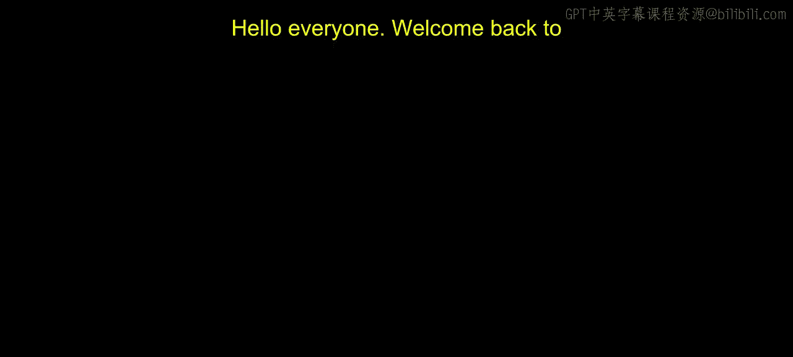
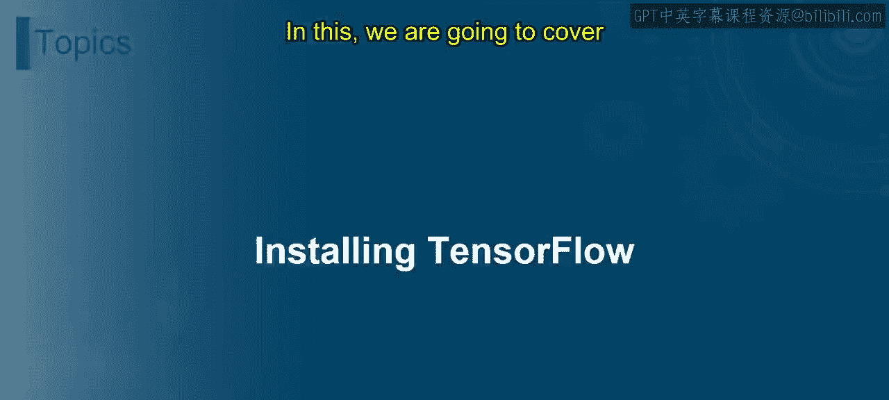
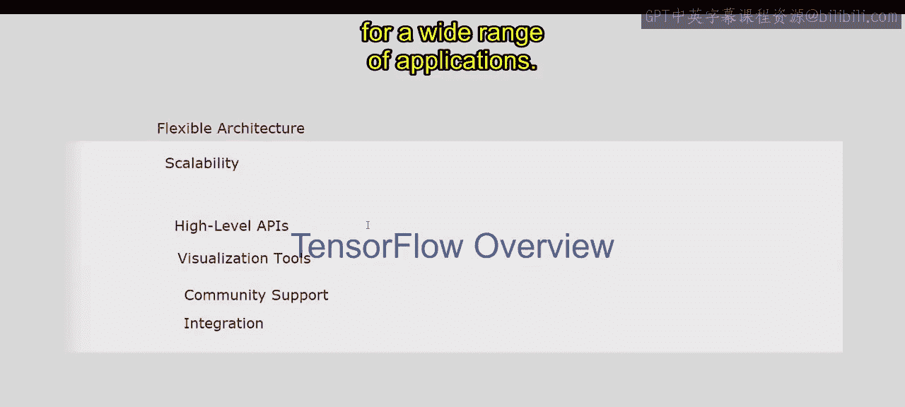
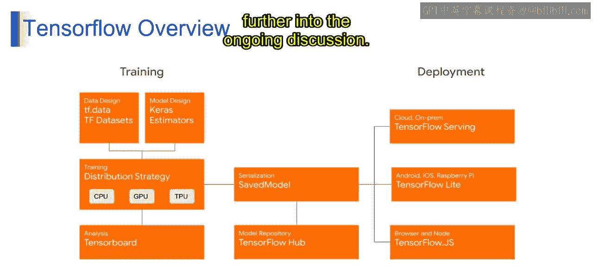

# 第一部分 43：安装TensorFlow 😊

在本节课中，我们将学习如何安装TensorFlow，并了解其核心功能。通过本节内容，你将能够熟悉TensorFlow的系统要求，并学习TensorFlow 1.x与2.0版本的主要功能。

## TensorFlow概述 😊

TensorFlow是由Google开发的开源机器学习框架，用于构建和训练机器学习模型。它提供了一个全面的工具、库和资源生态系统，支持包括深度学习、强化学习在内的多种机器学习任务。

以下是TensorFlow的关键特性：

*   **灵活的架构**：TensorFlow提供灵活的架构，允许用户在不同抽象级别上定义和定制机器学习模型，从底层的数学运算到像Keras这样的高级抽象。
*   **可扩展性**：TensorFlow旨在跨多个CPU和GPU高效扩展，使用户能够在从个人计算机到分布式计算集群的各种硬件平台上训练和部署模型。
*   **高级API**：TensorFlow提供了如Keras、`tf.keras`和Estimators等高级API，简化了构建和训练机器学习模型的过程，使不同专业水平的用户都能使用。
*   **可视化工具**：TensorFlow包含强大的可视化工具，如TensorBoard，使用户能够可视化并监控训练过程、分析模型性能以及有效地调试机器学习模型。
*   **社区支持**：TensorFlow拥有一个充满活力且活跃的开发者、研究人员和实践者社区，他们通过论坛、教程和文档为其发展做出贡献、分享资源并提供支持。
*   **集成性**：TensorFlow与其他流行的机器学习库和框架（如Scikit-learn、NumPy和PyTorch）无缝集成，允许用户利用他们现有的知识和资源。

总而言之，TensorFlow是一个多功能且强大的框架，使开发人员和研究人员能够为广泛的应用构建和部署最先进的机器学习模型。

## TensorFlow工作流程概览 😊

上一节我们介绍了TensorFlow的核心特性，本节中我们来看看其典型的工作流程。下图展示了一个从数据处理到模型部署的完整流程：

以下是该工作流程的详细步骤：

*   **数据设计**：TensorFlow提供了如`tf.data`（包含`tf.Dataset`）和TensorFlow Datasets等工具，用于高效管理和预处理数据。`tf.data`允许创建输入管道，从磁盘高效流式传输数据，并执行批处理和洗牌等转换操作。
*   **模型设计**：对于构建神经网络模型，Keras提供了一个用户友好的界面来定义和训练深度学习模型，而Estimators则提供了一种更结构化的方法，适用于分布式训练和生产部署。
*   **分布式策略训练**：TensorFlow支持多种分布式策略，用于跨多个处理单元（包括CPU、GPU和TPU）训练模型。这允许并行化计算并加速训练过程，特别是对于大规模数据集和复杂模型。
*   **序列化与SavedModel**：训练后，模型使用SavedModel格式进行序列化和保存，这为保存和共享训练好的模型提供了一种标准化方式。TensorFlow Hub充当模型仓库，机器学习社区可以在此共享、发现和重用预训练模型。
*   **分析与TensorBoard**：TensorBoard是TensorFlow提供的可视化工具包，用于理解、调试和优化机器学习模型。它允许可视化模型训练和评估的各个方面，包括损失曲线、模型架构和嵌入。
*   **部署**：TensorFlow支持跨各种平台部署，包括云端、本地、移动设备和Web浏览器。对于云端部署，TensorFlow Serving能够将训练好的模型作为可扩展的生产就绪API提供服务。对于移动电话和物联网设备等边缘设备，TensorFlow Lite提供了一个轻量级运行时，可在低延迟和资源受限的环境中运行机器学习模型。TensorFlow.js允许在浏览器和Node.js环境中部署模型，使机器学习应用程序能够直接在浏览器中运行，无需服务器端处理。

这个概述提供了从数据预处理到模型训练、分析和部署的结构化流程，反映了使用TensorFlow时的典型工作流。接下来的视频将进一步深入讨论。

## 系统要求与安装准备 😊

在开始安装TensorFlow之前，了解其系统要求至关重要。TensorFlow支持多种操作系统，包括Windows、macOS和Linux。对于GPU支持，需要安装兼容的NVIDIA GPU驱动以及CUDA和cuDNN库。建议使用Python 3.7-3.10版本，并通过`pip`包管理器进行安装。确保你的系统满足这些基本要求，以便顺利安装和运行TensorFlow。

## 总结

本节课中，我们一起学习了TensorFlow的基本概述、其关键特性以及一个典型的工作流程。我们了解到TensorFlow是一个功能强大且灵活的框架，支持从数据处理到模型部署的完整机器学习生命周期。下一节，我们将具体讲解如何在不同操作系统上安装TensorFlow。