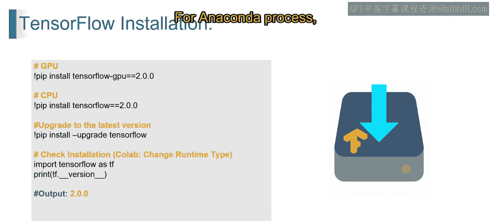
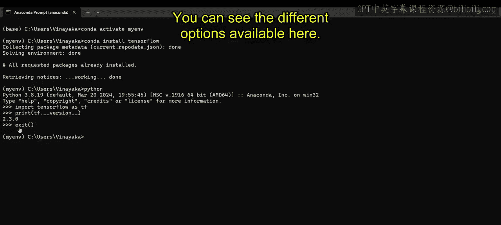
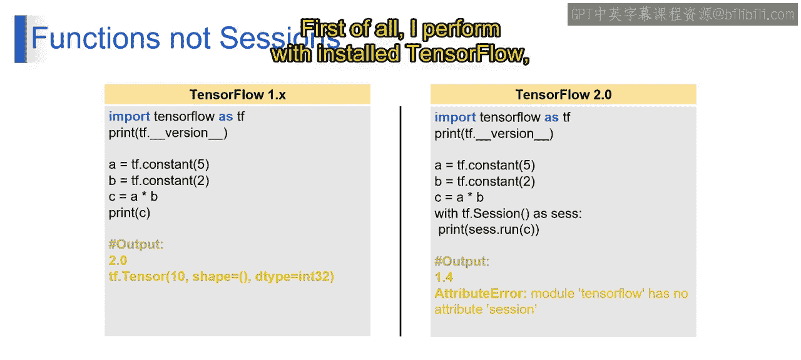
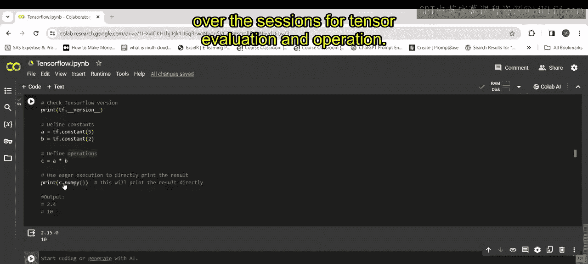
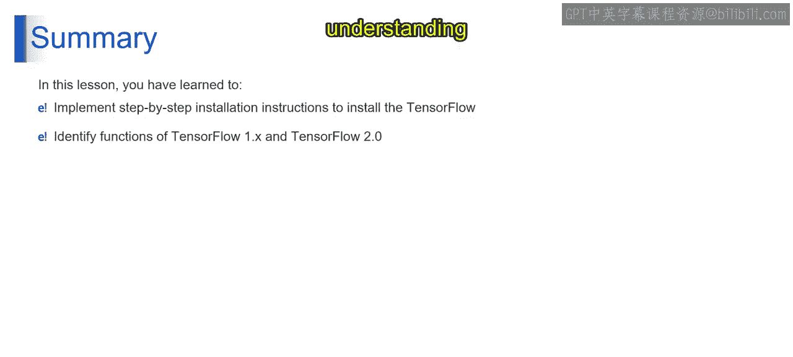

# 第一部分 44：TensorFlow安装与版本差异

在本节课中，我们将学习如何在本地环境中安装TensorFlow，并理解TensorFlow 1.x与2.x版本之间的核心操作差异。



---

## 概述

基于之前对生成式人工智能基础的理解，我们现在进入实践环节。本节将提供一个清晰的TensorFlow安装指南，涵盖在CPU或GPU环境下的安装步骤，并解释如何检查安装是否成功。随后，我们将深入探讨TensorFlow 1.x与2.x版本在编程范式上的关键区别，特别是“会话”机制的演变。

---

## TensorFlow安装指南

上一节我们介绍了环境配置的基础，本节中我们来看看具体的安装步骤。我们将使用Anaconda Prompt来完成安装过程。

以下是安装步骤：

1.  **激活虚拟环境**：首先，需要激活您计划安装TensorFlow的Anaconda环境。命令为 `conda activate [您的环境名称]`。
2.  **安装TensorFlow**：在激活的环境中，使用Conda命令安装TensorFlow。这通常比使用pip更能有效解决依赖兼容性问题。命令为 `conda install tensorflow`。
3.  **验证安装**：安装完成后，需要验证TensorFlow是否成功安装并可以正常导入。

现在，让我们详细执行验证步骤。首先，在命令行中输入 `python` 以启动Python解释器。

在Python解释器中，依次执行以下命令：
```python
import tensorflow as tf
print(tf.__version__)
```
第一条命令用于导入TensorFlow库。第二条命令将打印出已安装的TensorFlow版本号，例如 `2.3.0`。验证完毕后，输入 `exit()` 退出Python解释器。

至此，您的本地TensorFlow环境已准备就绪。您可以尝试官方文档中提供的不同功能选项进行探索。



---

## TensorFlow 1.x 与 2.x 的核心差异

安装完成后，理解您所使用的TensorFlow版本特性至关重要。本节我们将重点探讨TensorFlow 1.x与2.x版本在“会话”机制上的根本性变化。

在TensorFlow 1.x中，执行计算需要显式地创建和管理“会话”。所有操作首先被定义在一个“计算图”中，然后通过会话（`tf.Session`）来运行这个图并获取结果。



以下是一个TensorFlow 1.x风格的代码示例：
```python
import tensorflow as tf

# 第一部分 定义计算图
a = tf.constant(5)
b = tf.constant(2)
c = tf.multiply(a, b)

# 第一部分 创建会话并执行计算
with tf.Session() as sess:
    result = sess.run(c)
    print(result)  # 输出: 10
```

然而，在TensorFlow 2.x中，默认启用了“即时执行”模式。这种模式更加符合Python的直觉，操作在定义后立即被计算，无需构建计算图或显式创建会话。



以下是TensorFlow 2.x中实现相同功能的代码：
```python
import tensorflow as tf

# 第一部分 启用即时执行（TensorFlow 2.x 默认启用）
a = tf.constant(5)
b = tf.constant(2)
c = a * b  # 操作立即执行
print(c)   # 输出: tf.Tensor(10, shape=(), dtype=int32)
# 第一部分 若要获取Python数值，可使用 .numpy() 方法
print(c.numpy())  # 输出: 10
```

关键区别在于：
*   **TensorFlow 1.x**：需要 `tf.Session` 来运行计算图。代码更冗长，但适合对计算流程进行细粒度控制。
*   **TensorFlow 2.x**：采用即时执行，代码更简洁、直观。像 `c.numpy()` 这样的方法取代了会话，用于直接获取张量值。

请注意，如果在TensorFlow 2.x环境中运行为1.x编写的会话代码，将会遇到 `AttributeError`，因为 `tf.Session` 已不再被使用。

---

## 总结



本节课中我们一起学习了两个核心内容。首先，我们掌握了在Windows系统上通过Anaconda安装TensorFlow的完整步骤，确保了开发环境的顺利搭建。其次，我们深入辨析了TensorFlow 1.x与2.x版本在操作范式上的主要差异，特别是从基于会话的静态图执行到默认即时执行的转变。理解这些差异有助于您根据项目需求和代码库选择合适的TensorFlow版本进行开发。