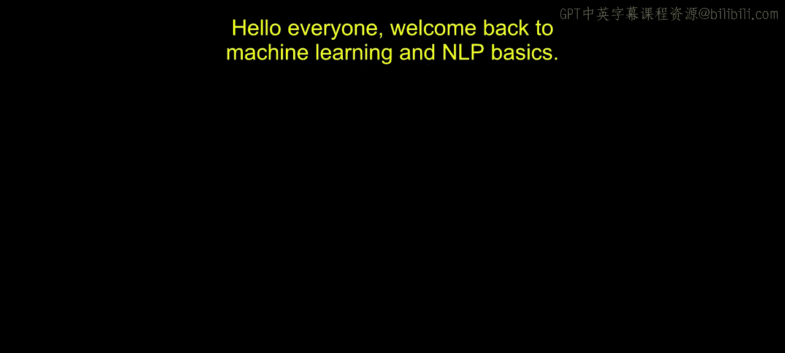
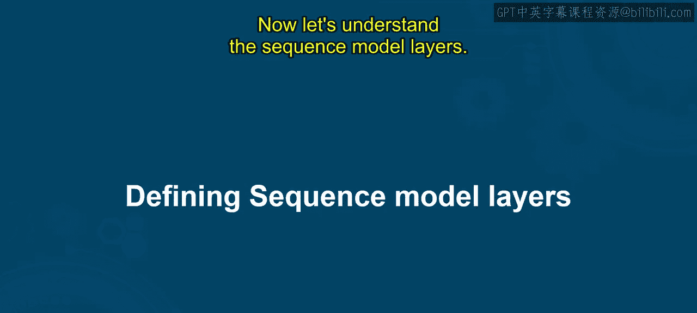
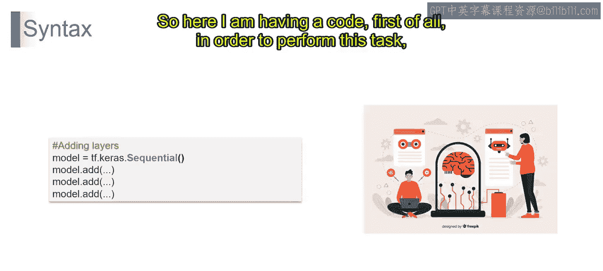
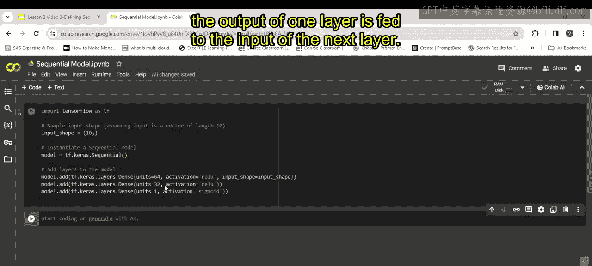
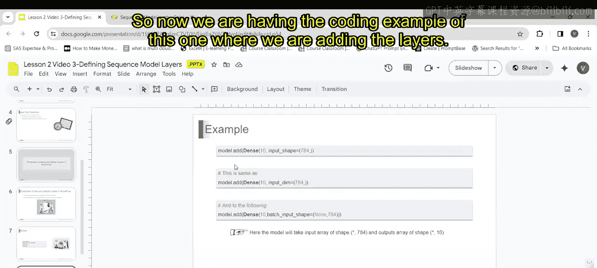
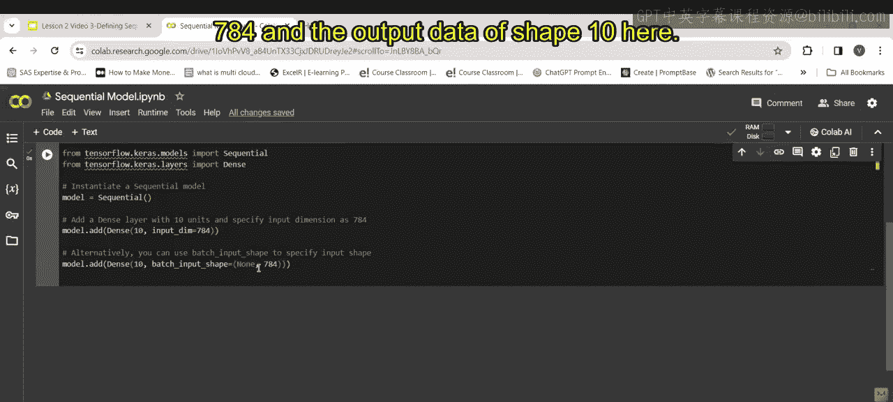
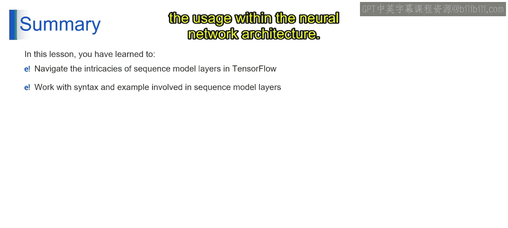

# 第一部分 45：定义序列模型层 🧠



在本节课中，我们将学习TensorFlow中的序列模型层。我们将介绍序列模型层的基本概念，并通过具体的语法和示例来理解如何构建和使用它们。课程结束时，你将能够在TensorFlow中实现序列模型，并识别与序列模型层相关的语法。



## 概述

序列模型层是专门为处理序列数据而设计的神经网络层。序列数据是指元素顺序具有重要性的数据，例如时间序列、音频信号或文本。在文本分类等任务中，单词的顺序对于确定整体情感至关重要，因此需要使用序列模型层来有效处理输入序列。

从技术上讲，TensorFlow中的序列模型层是能够处理可变长度输入序列并捕捉数据中时间依赖关系的专用层。常见的序列模型层包括循环神经网络（如LSTM和GRU）以及适用于序列数据的卷积层（如一维卷积层）。

## 理解TensorFlow中的Sequential类

TensorFlow中的`Sequential`类代表了最简单的神经网络模型形式，它将各层线性堆叠在一起。这种顺序堆叠允许创建一个简单的、数据从一层顺序流向下一层的前馈架构。

要构建一个顺序模型并定义其层，我们需要从导入必要的库开始，包括TensorFlow。

以下是添加层的基本语法示例：

```python
import tensorflow as tf
from tensorflow.keras import layers

# 第一部分 定义输入形状，例如长度为10的向量
input_shape = (10,)

# 第一部分 创建一个顺序模型
model = tf.keras.Sequential()



# 第一部分 添加第一层：具有64个神经元（单元）的全连接层，使用ReLU激活函数，并指定输入形状
model.add(layers.Dense(64, activation='relu', input_shape=input_shape))

# 第一部分 添加第二层：具有32个神经元的全连接层，使用ReLU激活函数
model.add(layers.Dense(32, activation='relu'))



# 第一部分 添加第三层：具有1个神经元的全连接层，使用Sigmoid激活函数，常用于二元分类任务
model.add(layers.Dense(1, activation='sigmoid'))
```

这段代码为一个二元分类任务设置了一个简单的前馈神经网络。它通过实例化`tf.keras.Sequential`对象，并使用`add`方法将层添加到模型中。`Sequential`类简化了构建神经网络模型的过程，允许你通过顺序堆叠层来轻松定义网络架构。

## 另一个代码示例



现在，让我们通过另一个例子来加深理解。

```python
from tensorflow.keras.models import Sequential
from tensorflow.keras.layers import Dense

# 第一部分 创建一个顺序模型
model = Sequential()

# 第一部分 添加第一个全连接层：10个单元，输入维度为784
model.add(Dense(10, input_dim=784))

# 第一部分 添加第二个全连接层：10个单元，使用batch_input_shape参数指定输入形状
model.add(Dense(10, batch_input_shape=(None, 784)))
```



这段代码建立了一个具有两个全连接层的顺序模型，每个层都有10个单元。它通过两种不同的方式指定输入形状：第一层使用`input_dim`参数，第二层使用`batch_input_shape`参数。两个层都设计为处理形状为`(batch_size, 784)`的输入数据，并输出形状为`(batch_size, 10)`的数据。这里的`batch_size`可以是任意值。

## 总结



在本节课中，我们一起学习了如何在TensorFlow中处理序列模型层。通过理解其语法和实际实现示例，你掌握了定义和操作这些层的不同方法。这为你理解序列模型层在神经网络架构中的作用和用法奠定了坚实的基础。