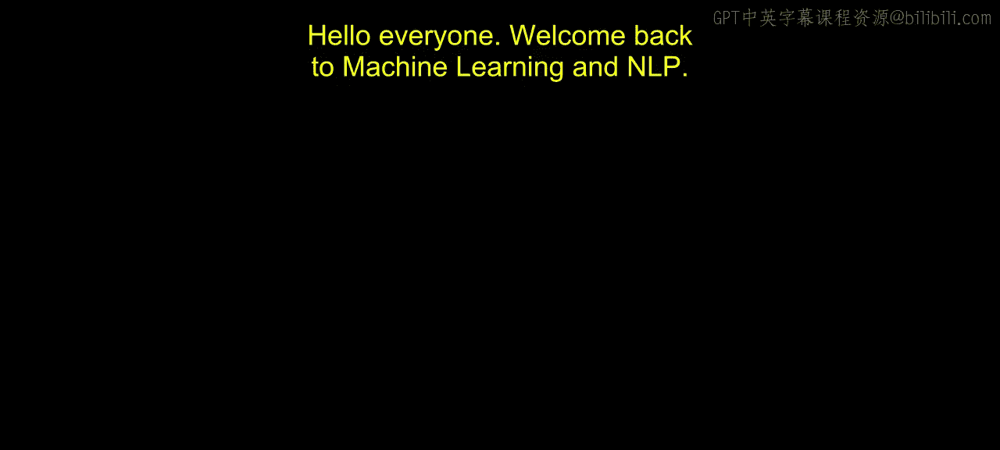
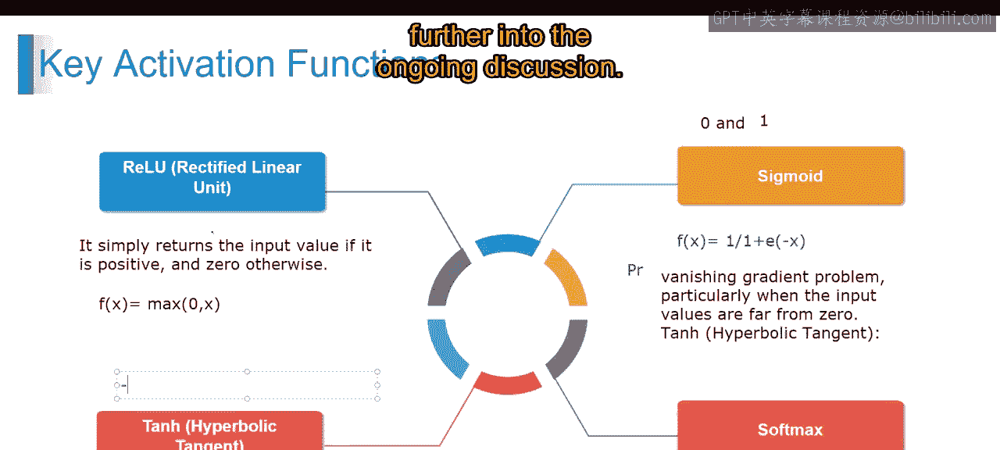

# 第一部分 46：激活函数详解 🔥

在本节课中，我们将学习深度学习神经网络中的核心组件——激活函数。我们将了解激活函数的作用、常见类型及其在TensorFlow中的实现，并学习如何为不同的模型选择合适的激活函数。

激活函数是应用于神经网络中每个神经元输出的数学函数。它们为网络引入了**非线性**，使其能够学习数据中复杂的模式和关系。没有激活函数，无论神经网络有多少层，其整体效果都等同于一个线性变换，从而无法处理复杂问题。

在TensorFlow中，激活函数是构建神经网络层的关键部分。一个激活函数，记作 **a(x)**，对输入数据 **x** 进行操作，并产生输出 **a(x)**。在神经网络中，每个神经元先计算其输入的加权和，然后应用激活函数来产生该神经元的最终输出。

---

## 常见的TensorFlow激活函数

以下是深度学习中最常用的几种激活函数，每种都有其特定的数学形式和适用场景。

### 1. ReLU（线性整流函数）
ReLU是目前深度学习中最广泛使用的激活函数之一。它的规则很简单：如果输入值为正，则直接输出该值；如果输入值为负，则输出0。

其数学公式表示为：
**a(x) = max(0, x)**

ReLU有助于缓解梯度消失问题，并能加速深度神经网络的训练。它的计算效率高，并且能产生稀疏的激活，这有助于提升网络的效率。

### 2. Sigmoid（S型函数）
Sigmoid是另一种常用的激活函数，尤其在二分类任务中。它将输入值压缩到0和1之间，非常适合表示概率。

其数学公式表示为：
**a(x) = 1 / (1 + e^(-x))**

Sigmoid函数平滑且可微，适用于基于梯度的优化算法（如反向传播）。然而，当输入值远离0时，Sigmoid函数容易导致**梯度消失**问题。

### 3. Tanh（双曲正切函数）
Tanh函数与Sigmoid类似，但它将输入值压缩到-1和1之间。相比之下，Sigmoid的输出范围是0到1，而Tanh是-1到1。

其数学公式表示为：
**a(x) = tanh(x)**

Tanh函数同样平滑可微，并且其输出以0为中心，这有时能使下一层的学习更有效率。但它也面临着与Sigmoid类似的梯度消失问题。

---

## 高级激活函数与选择策略

上一节我们介绍了三种基础的激活函数，本节中我们来看看更高级的函数以及如何根据任务进行选择。

除了上述常见函数，TensorFlow还提供了许多其他激活函数，如Softmax（常用于多分类任务的输出层）、Leaky ReLU（解决ReLU神经元“死亡”问题）等。

选择激活函数时，需要考虑以下因素：
*   **任务类型**：输出层通常根据任务选择（如二分类用Sigmoid，多分类用Softmax）。
*   **缓解梯度问题**：在深度网络中，ReLU及其变体常被用于隐藏层以避免梯度消失。
*   **计算效率**：ReLU及其变体通常计算速度更快。
*   **实践经验**：ReLU通常是隐藏层的默认良好起点，可以在此基础上根据模型表现进行调整。

---

本节课中我们一起学习了激活函数的核心概念。我们了解到激活函数通过引入非线性，是神经网络能够学习复杂模式的关键。我们详细探讨了ReLU、Sigmoid和Tanh这三种最常见激活函数的数学形式、特点及优缺点，并简要介绍了如何根据实际问题选择合适的激活函数。掌握这些知识是构建有效深度学习模型的重要基础。