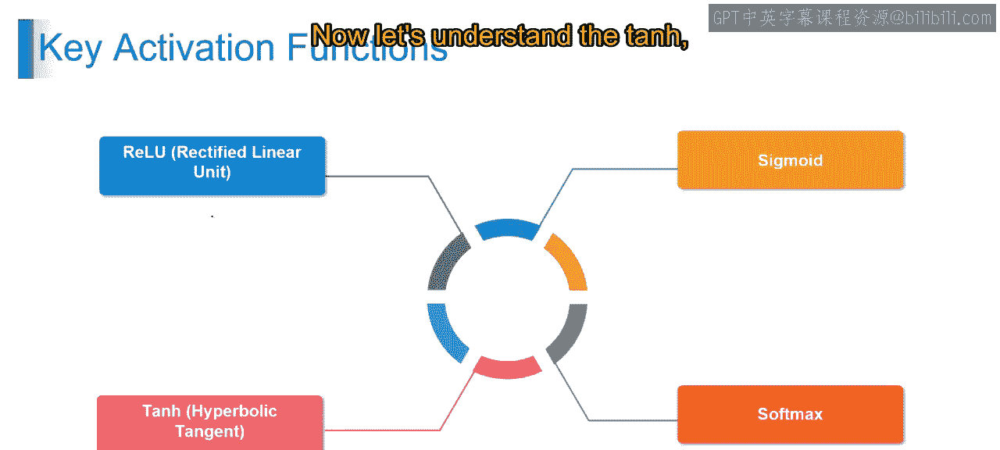
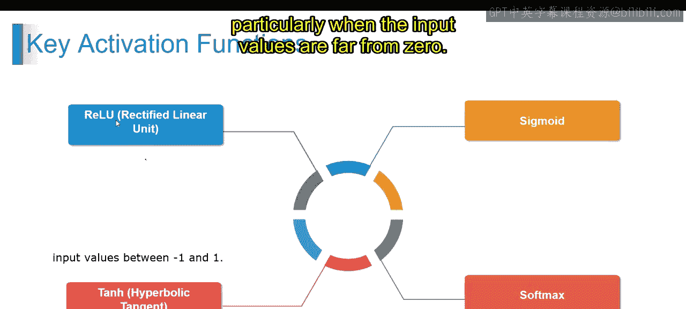
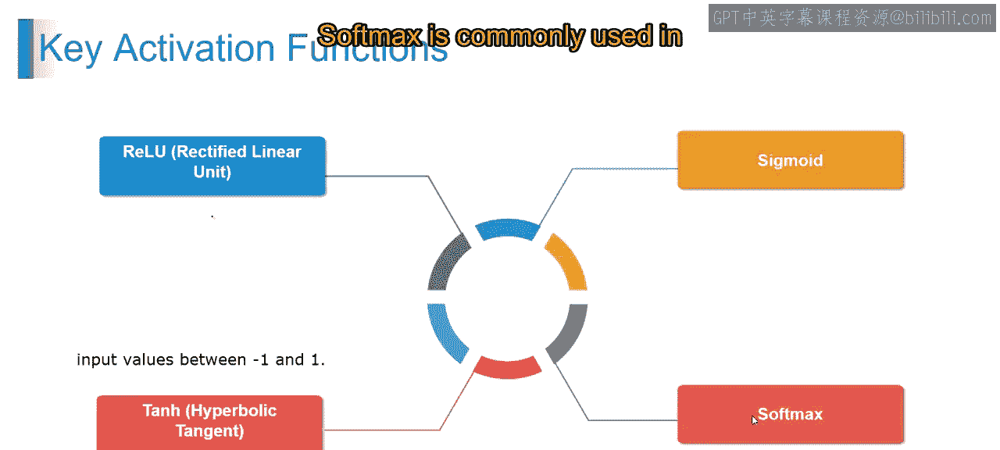
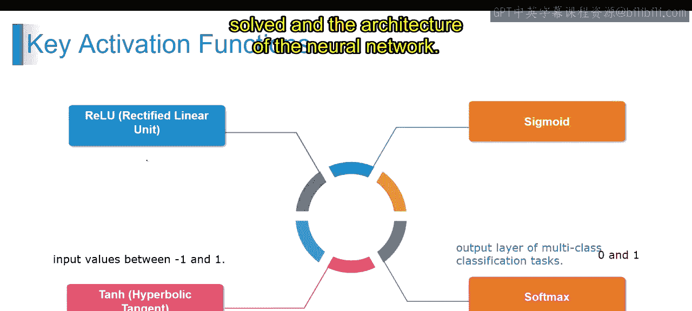
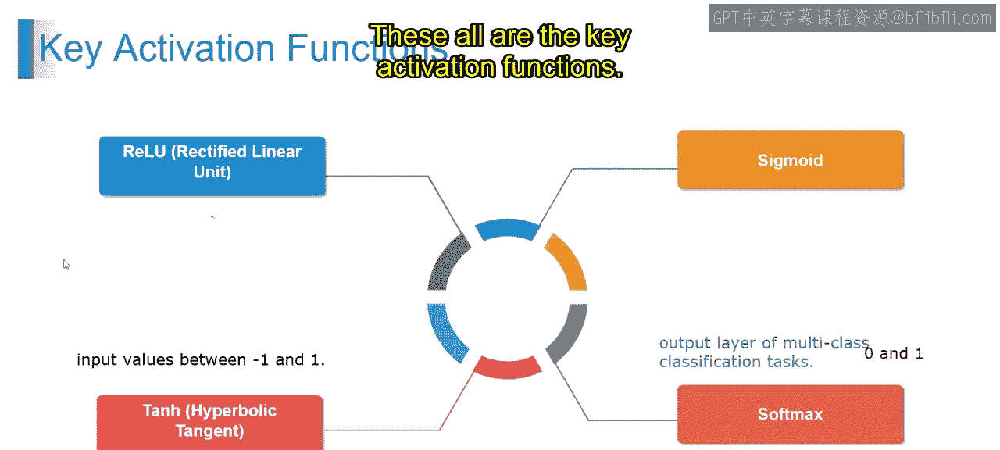
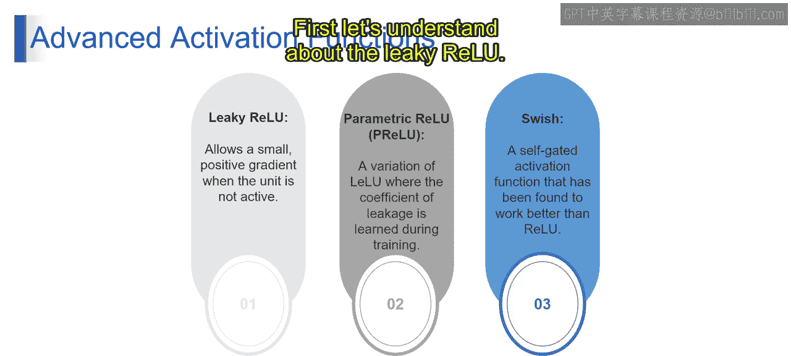
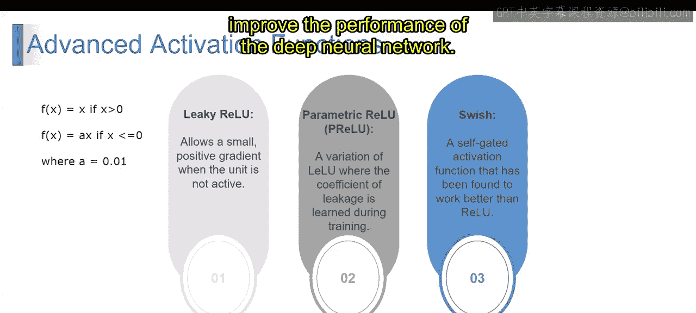
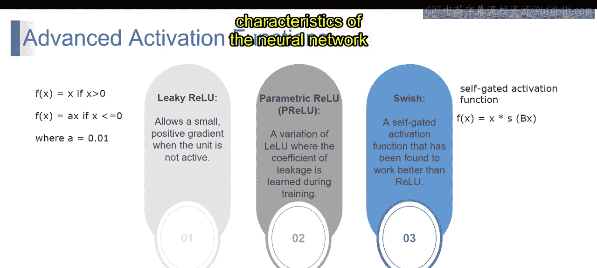

# 第一部分 47：高级激活函数



在本节课中，我们将学习神经网络中几种高级的激活函数。激活函数是神经网络的核心组件，它们决定了神经元是否应该被激活，并将输入信号转换为输出信号。上一节我们介绍了ReLU、Sigmoid等基础激活函数，本节中我们将深入探讨一些更高级的变体，如Leaky ReLU、Parametric ReLU和Swish，了解它们如何解决传统激活函数的局限性并提升模型性能。

## 双曲正切函数



首先，我们来理解双曲正切函数。tanh函数与Sigmoid函数类似，但将输入值压缩在-1和+1之间。数学上，tanh可以表示为：



**公式：** `tanh(x) = (e^x - e^{-x}) / (e^x + e^{-x})`

tanh激活函数的输出以0为中心，这使得模型比Sigmoid激活函数更容易学习和理解。与Sigmoid类似，tanh激活也是平滑且可微的，适用于基于梯度的优化算法。然而，tanh激活函数也存在梯度消失问题，特别是当输入值远离0时。

## Softmax函数

接下来是Softmax函数。Softmax通常用于多类分类任务的输出层，它将原始分数转换为0到1之间的概率值。其输出值同样在0到1之间，并且确保所有类别的概率之和为1。数学上，Softmax定义为：

**公式：** `f(x_i) = e^{x_i} / Σ_j e^{x_j}`





Softmax激活使模型能够输出多个类别的概率分布，便于解释和决策。Softmax激活是可微的，使其适用于训练过程中的基于梯度的优化。

这些常见的激活函数在神经网络中扮演着非常重要的角色，使网络能够学习复杂模式并进行预测。选择哪种激活函数取决于待解决问题的具体特征和神经网络的架构。



## 高级激活函数

现在，让我们来理解高级激活函数，包括Leaky ReLU、Parametric ReLU和Swish。

### Leaky ReLU

首先，了解Leaky ReLU。Leaky ReLU是ReLU激活函数的扩展，它允许在输入为负时有一个小的正梯度，从而防止“神经元死亡”问题（即神经元始终输出0）。以下是其工作原理：




**公式：**
```
f(x) = x, if x > 0
f(x) = αx, if x <= 0
```

其中，α是一个小的常数，通常是一个小的正值，如0.01。通过允许负输入具有非零梯度，Leaky ReLU解决了神经元死亡的问题，并有助于提高深度神经网络的性能。

### Parametric ReLU


接下来是Parametric ReLU。Parametric ReLU是Leaky ReLU的一个变体，其中泄漏系数α是在训练过程中学习得到的，而不是一个固定的常数。这也被称为PReLU。在这种方法中，α值被参数化，并在训练过程中与其他模型参数一起优化。这种适应性允许网络为每个神经元学习最优的α值，使其在不同场景下更加灵活有效。Parametric ReLU在输入空间不同部分所需的最优泄漏量不同的任务中特别有用。


### Swish激活函数

最后是Swish激活函数。Swish是一种自门控激活函数，由谷歌研究人员提出。研究发现，在许多场景下，它的性能优于ReLU。数学上，Swish可以表示为：

**公式：** `swish(x) = x * σ(βx)`

其中，σ是Sigmoid函数，β是控制激活平滑度的超参数。Swish易于实现，计算效率高，并且与ReLU相比，已被证明可以提高训练速度和性能。然而，与ReLU相比，Swish有更多的参数需要学习，这可能会增加模型的复杂性。

这些高级激活函数通过解决传统ReLU的一些局限性并增强深度神经网络的性能，提供了改进。选择哪种激活函数取决于神经网络的具体要求和待解决问题的特性。

## 总结




本节课中，我们一起探索了多种激活函数，包括ReLU、Sigmoid、tanh等，理解了它们在神经网络中的角色。此外，我们还深入研究了像Leaky ReLU、Parametric ReLU和Swish这样的高级函数，了解了它们如何通过解决传统激活函数的局限性来提升模型性能。掌握这些激活函数将帮助你为不同的神经网络架构和任务做出更合适的选择。