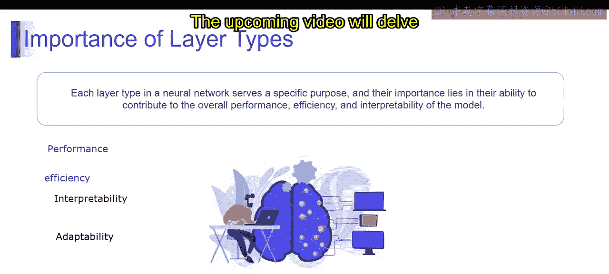

# 第一部分 48：层类型详解 🧠

在本节课中，我们将要学习神经网络中的“层类型”。我们将了解层类型的重要性、有哪些不同的层类型，以及它们各自的用途。通过本节的学习，你将能够探索各种层类型的多样性和应用，理解层类型的关键作用和多功能性，并深入了解由功能原理和应用驱动的AI系统。

## 什么是层类型？

在深入理解层类型的重要性之前，我们先来看看层类型到底是什么。那么，深度学习中的“层”又是什么呢？

深度学习中的层指的是神经网络的构建模块，负责通过一系列数学运算将输入数据转化为有意义的输出。它们将神经元组织成组，并决定信息如何在网络中流动。

例如，假设你正在构建一个用于图像分类的神经网络。网络中的每一层都以逐步的方式处理输入图像，在不同抽象层次上提取特征。初始层可能检测简单的模式，如边缘和曲线，而更深的层则识别更复杂的结构，如形状和物体。

从技术术语上讲，神经网络中的一个层是按特定架构组织起来的神经元集合。层中的每个神经元接收输入，对这些输入进行加权求和，将求和结果应用于激活函数，然后产生输出。一层的输出作为下一层的输入，从而创建输入数据的层次化表示。

深度学习中的层为神经网络提供了抽象和层次结构，使它们能够学习数据中的复杂模式和关系。通过将神经元组织成层并顺序堆叠，神经网络可以模拟日益复杂的功能，并在各个领域做出准确的预测。

## 层类型的重要性

层类型在神经网络中的重要性源于其专门化的功能，这些功能共同提升了模型的性能、效率和可解释性。每一层都有其独特的目的，对模型的整体架构和能力做出独特的贡献。

以下是层类型带来的关键能力：

**性能提升**：不同的层类型使神经网络能够捕捉输入数据的各个方面，从而实现更有效的特征提取和表示学习。例如，卷积层擅长捕捉图像数据中的空间模式，而循环层则非常适合处理文本或时间序列等顺序数据。

**效率优化**：通过利用针对数据和任务特性定制的特定层类型，神经网络可以实现更好的计算效率。例如，池化层减少了特征图的空间维度，从而降低了计算复杂度和内存需求，提高了训练和推理期间的效率。

**可解释性增强**：某些层类型通过促进对模型决策过程的洞察，增强了神经网络的可解释性。例如，Transformer架构中的注意力机制使模型能够聚焦于输入序列的相关部分，为其预测背后的推理过程提供了透明度。

**适应性增强**：多样化的层类型使得神经网络能够适应各种类型的数据和任务，使其在不同领域和应用中具有通用性。自适应层类型，如归一化层或Dropout层，使模型能够学习稳健的表示，并在未见过的数据上表现良好。

因此，层类型的重要性在于它们共同为神经网络模型的性能、效率、可解释性和适应性做出了贡献。通过理解不同层类型的特性和功能，我们可以有效地设计和配置神经网络，以满足应用程序的特定要求。

---

本节课中我们一起学习了神经网络中“层类型”的基本概念及其重要性。我们了解到，层是网络的构建模块，不同类型的层（如卷积层、循环层、池化层、注意力层等）各有其专门的功能，共同决定了网络处理数据、提取特征、进行预测的能力和效率。理解这些层类型是设计和构建有效神经网络模型的基础。