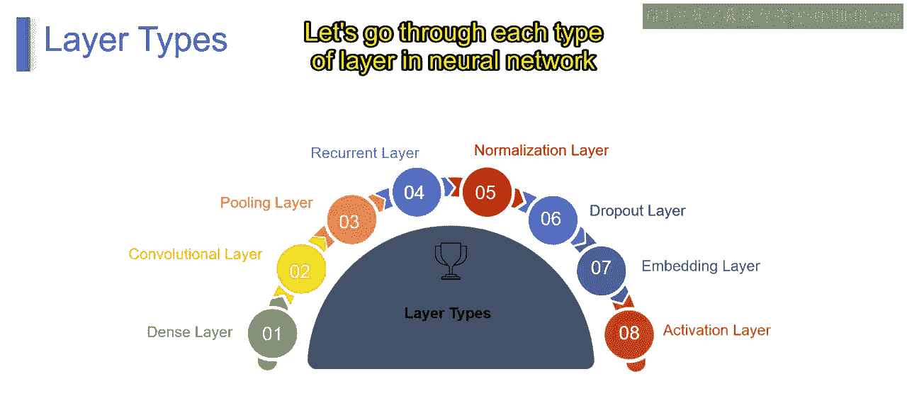
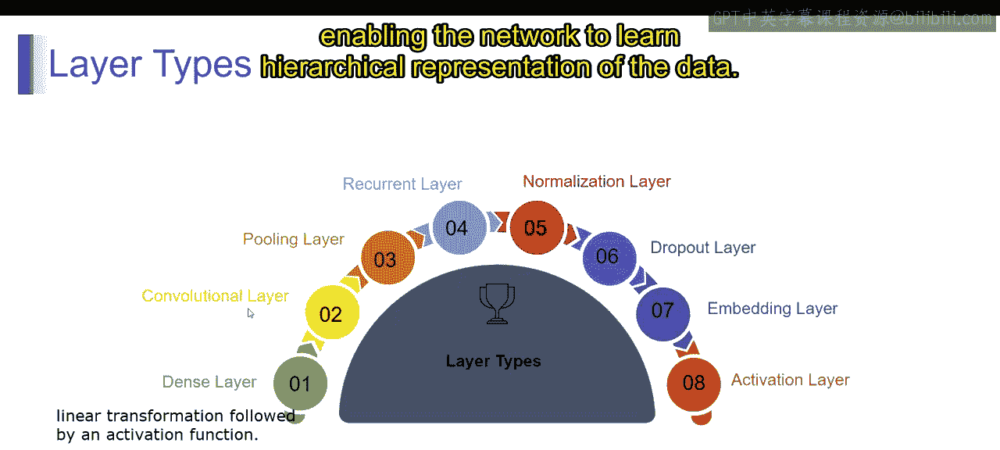
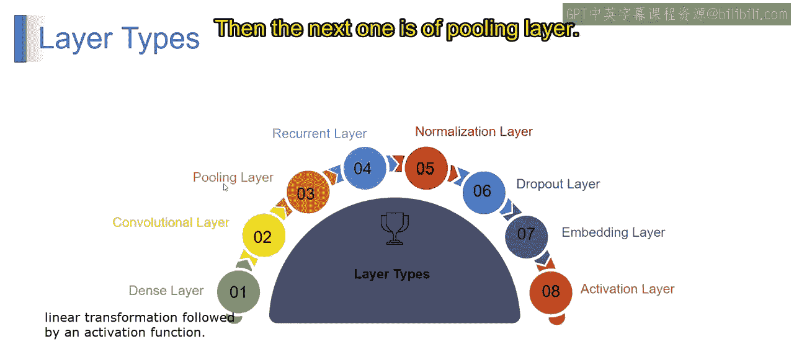
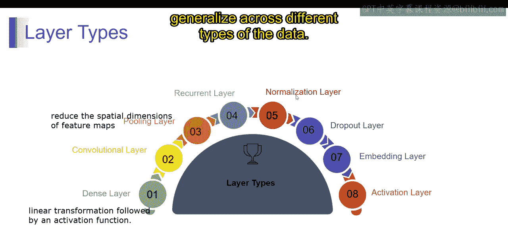
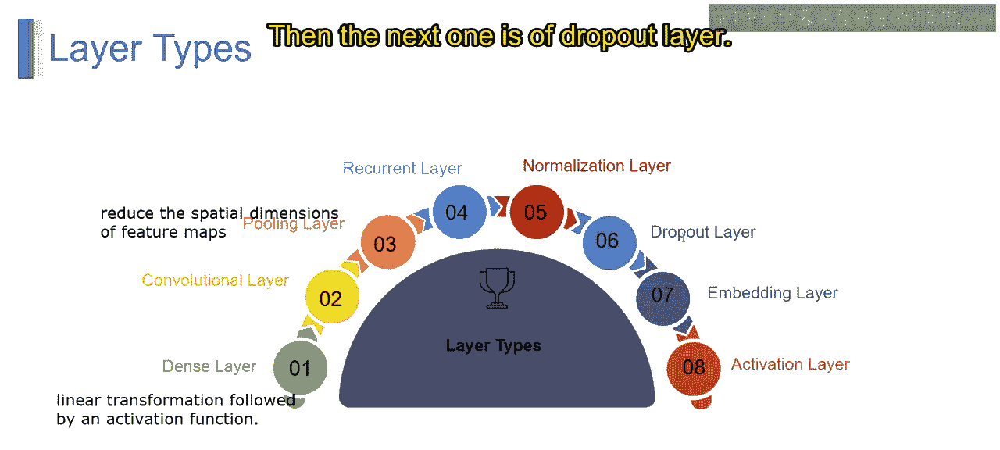
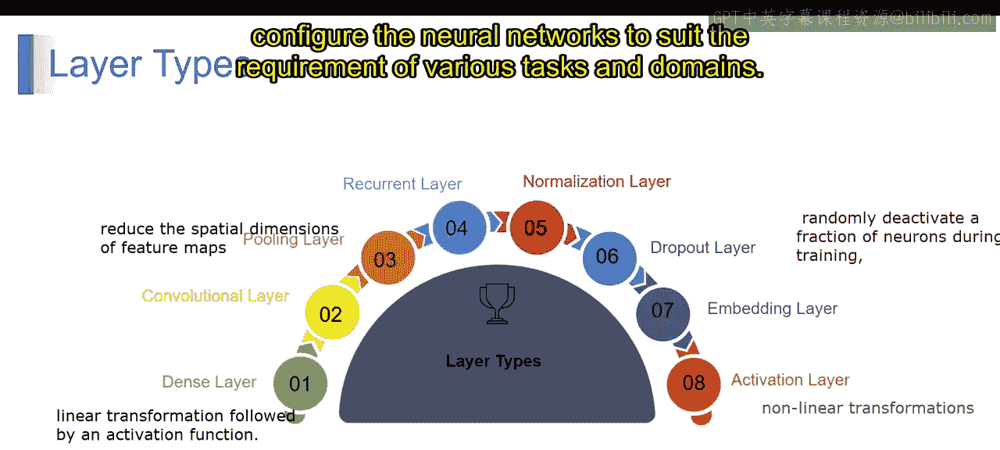
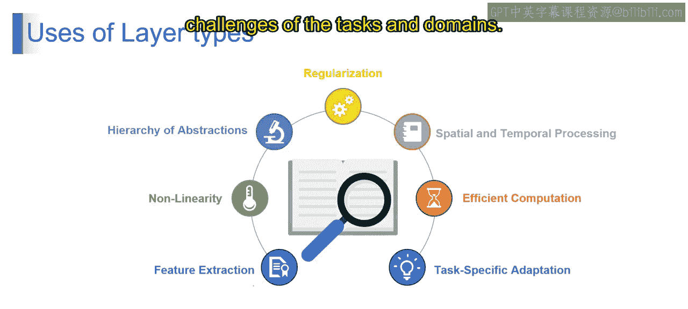
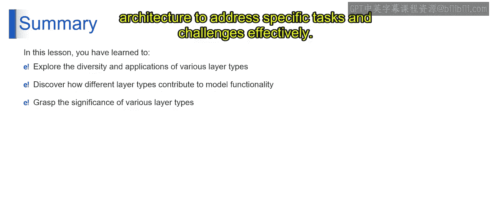

# 第一部分 49：神经网络层类型详解 🧠

在本节课中，我们将要学习神经网络中不同类型的层。每一层都有其特定的目的和功能，共同协作使模型能够从数据中有效学习。理解这些层是设计和配置神经网络以应对各种任务的基础。

上一节我们介绍了神经网络的基本概念，本节中我们来看看构成神经网络的各种核心层类型。

## 层类型及其主要目的

以下是神经网络中常见的层类型及其主要功能。

*   **全连接层**
    *   **主要目的**：执行线性变换，后接激活函数。它将当前层的每个神经元连接到下一层的每个神经元。
    *   **核心概念**：可以将其视为一个简单的映射，允许模型学习数据特征之间的复杂关系。其操作可表示为公式：`output = activation(dot(input, weights) + bias)`。

*   **卷积层**
    *   **主要目的**：对输入数据应用卷积操作，通过滑动滤波器（或称核）来提取特征。
    *   **核心概念**：特别适用于处理图像等空间数据。可以将其想象成一个扫描图像的过滤器，用于检测边缘、纹理或形状等模式，使网络能够学习数据的层次化表示。

*   **池化层**
    *   **主要目的**：减小特征图的空间尺寸，通过下采样聚合信息。
    *   **核心概念**：有助于提取最重要的特征，同时降低计算复杂度。可以将其视为一种信息汇总方式，选择最相关的特征并丢弃冗余信息，从而辅助特征提取和降维。

*   **循环层**
    *   **主要目的**：处理序列数据，通过维护一个内部状态（即记忆）来捕获跨时间步的时序依赖关系。
    *   **核心概念**：常用于自然语言处理和时间序列预测等任务。可以认为它具有记忆功能，允许网络保留过去输入的信息，并在每个时间步利用这些信息进行预测或决策。

*   **归一化层**
    *   **主要目的**：标准化神经网络的输入，使训练更加稳定和高效。
    *   **核心概念**：可以改善收敛性并防止梯度消失或爆炸等问题。它确保网络的输入具有相似的尺度，使模型更容易学习和泛化到不同类型的数据。

*   **丢弃层**
    *   **主要目的**：在训练期间随机使一部分神经元失活，防止过拟合。
    *   **核心概念**：作为一种正则化形式，迫使网络依赖不同的特征组合，防止其过度依赖特定的神经元，从而鼓励网络学习更鲁棒和可泛化的特征。

*   **嵌入层**
    *   **主要目的**：将分类输入数据（如单词或类别）映射到连续的密集向量。
    *   **核心概念**：捕获输入之间的语义关系，常用于自然语言处理任务。可以将其视为在连续空间中表示分类数据的一种方式，允许模型根据上下文学习单词或类别的有意义的表示。

*   **激活层**
    *   **主要目的**：对前一层的输出应用非线性变换，为网络引入非线性。
    *   **核心概念**：使网络能够学习数据中的复杂模式。激活层充当看门人的角色，通过应用数学函数来决定神经元是否应该被激活，从而控制信息在网络中的流动。

神经网络中的每种层类型都有其特定目的，在使模型能够从数据中有效学习方面发挥着重要作用。通过理解这些层的主要目的，我们可以设计和配置神经网络，以适应各种任务和领域的需求。

## 层类型的用途

了解了各类层的基本功能后，我们来看看它们在构建有效模型中的具体用途。

*   **特征提取**
    *   卷积层通常用于图像识别等任务中的特征提取，从原始数据中检测模式和特征，将其转换为更有意义的表示。

*   **引入非线性**
    *   激活层为网络引入非线性，使其能够学习仅靠线性函数无法捕获的复杂关系和模式。

*   **抽象层次**
    *   在神经网络中堆叠多层可以创建抽象层次，允许模型学习输入数据越来越抽象和复杂的表示，从而在图像或语音识别等任务中获得更好的性能。

*   **正则化**
    *   丢弃层作为一种正则化形式，在训练期间随机使神经元失活，防止过拟合并促进学习更鲁棒、可泛化的特征。

*   **空间与时间处理**
    *   卷积层和循环层分别专用于空间和时间处理。卷积层捕获图像等数据中的空间模式，而循环层捕获时间序列或文本等序列数据中的时序依赖关系。

*   **高效计算**
    *   池化层减小了特征图的空间尺寸，通过下采样和汇总信息（同时保留重要特征）来实现更高效的计算和内存使用。

*   **任务特定适配**
    *   不同的层类型可以针对特定任务和领域进行定制，使网络架构适应数据的特征和任务的要求。例如，嵌入层通常用于自然语言处理任务，以在连续空间中表示单词或类别。

神经网络中不同层的用途多种多样，涵盖了模型训练和性能的各个方面。通过将适当的层类型纳入网络架构，我们可以有效地应对特定任务和领域的挑战。

## 总结 📝

本节课中，我们一起深入探讨了各种层类型的应用，理解了它们在塑造模型功能和性能方面的关键作用。通过探索不同层类型的重要性，我们深入了解了神经网络如何利用专门的架构来有效地解决特定的任务和挑战。掌握这些基础知识，是进一步学习复杂模型（如大型语言模型）的重要一步。