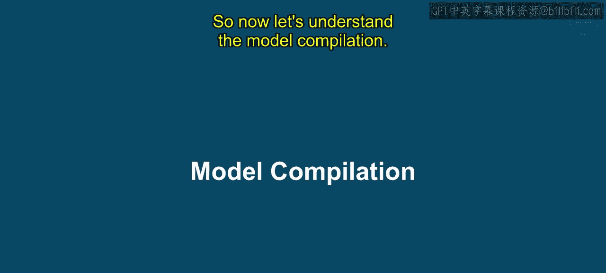
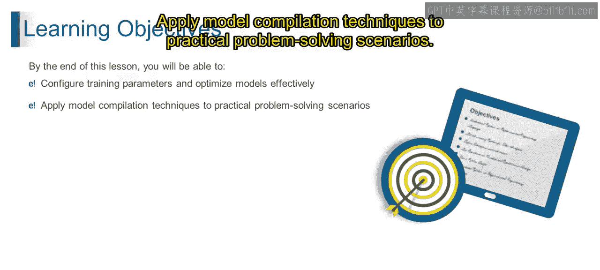
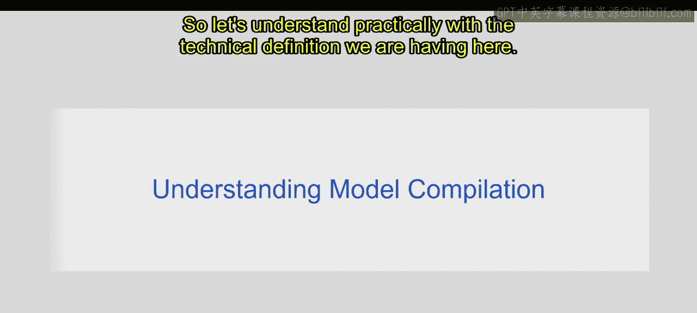
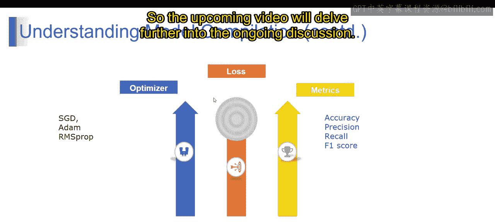

# 第一部分 50：模型编译 🧠

在本节课中，我们将要学习模型编译。我们将理解模型编译是什么、它的用途，以及它在现实世界中的应用。课程结束时，你将能够配置训练参数以有效优化模型，并将模型编译技术应用于实际问题解决场景。

## 什么是模型编译？

模型编译是配置和准备机器学习模型（或任何类型的模型）进行训练的过程，通过指定各种训练参数和优化技术来实现。

例如，在构建用于图像分类的神经网络时，模型编译涉及设置诸如优化器、损失函数和评估指标等参数。这些参数决定了模型在训练过程中将如何被训练和优化。

从技术上讲，模型编译涉及将优化器、损失函数和评估指标与模型架构绑定在一起，创建一个指定模型如何训练和评估的计算图。这个编译后的模型可以在训练数据上进行训练，在测试数据上进行评估，并对新的、未见过的数据进行预测。

## 模型编译的关键组件

在深度学习中，模型编译通过指定三个关键组件来配置模型的训练过程：**优化器**、**损失函数**和**评估指标**。

以下是每个组件的详细说明：

### 1. 优化器

优化器决定了在训练期间用于更新模型参数的算法。它负责执行优化过程以最小化损失函数。

常见的优化器包括：
*   **SGD（随机梯度下降）**：使用学习率，沿最小化损失函数的方向更新参数。
*   **Adam**：结合了动量和RMSprop的特点，为每个参数自适应地调整学习率。
*   **RMSprop**：将学习率除以平方梯度的指数衰减平均值。

### 2. 损失函数

损失函数量化了在训练期间模型的预测与实际目标值的匹配程度。它衡量了预测输出与真实目标输出之间的差异。

损失函数的选择取决于所解决问题的类型：
*   **回归问题**：通常使用**均方误差（MSE）**。
*   **二分类问题**：通常使用**二元交叉熵**或**Sigmoid交叉熵**。
*   **多分类问题**：通常使用**分类交叉熵**。

### 3. 评估指标

评估指标用于在训练和测试期间评估模型的性能。它们提供了超越损失函数的额外洞察，帮助评估模型性能的不同方面。

常见的评估指标包括：
*   **准确率**：正确分类实例的比例。
*   **精确率**：在所有被预测为正类的实例中，真正为正类的比例。
*   **召回率**：在所有实际为正类的实例中，被正确预测为正类的比例。
*   **F1分数**：精确率和召回率的调和平均数，提供了两者之间的平衡度量。

通过在上述模型编译过程中配置这些组件，我们定义了模型将如何从数据中学习，以及其性能将如何被评估，从而为训练和评估奠定了基础。

## 总结

本节课中，我们一起学习了模型编译。我们了解到，模型编译是为模型训练做准备的关键步骤，它通过定义优化器、损失函数和评估指标来配置学习过程。掌握这些概念对于有效训练和评估机器学习模型至关重要。