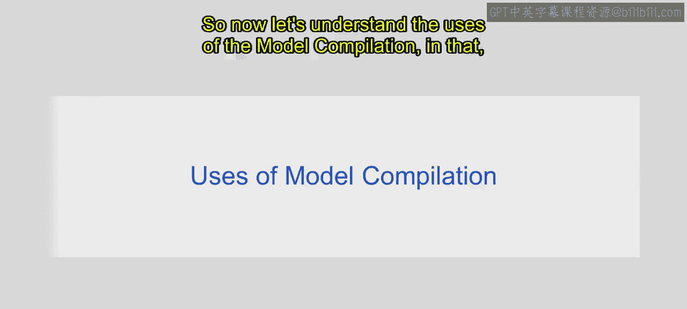
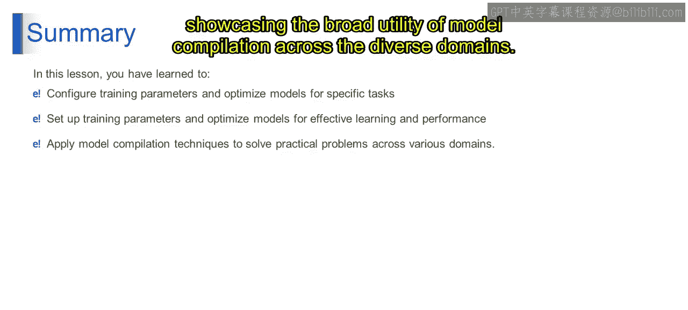

# 第一部分 51：模型编译的用途 🛠️

在本节中，我们将探讨模型编译的具体用途及其在现实世界中的应用。模型编译是机器学习工作流程中的关键一步，它决定了模型如何被训练和优化。

## 模型编译的核心用途

上一节我们介绍了模型编译的基本概念，本节中我们来看看它的具体用途。模型编译主要服务于以下几个关键方面：

### 1. 训练参数配置
模型编译允许我们设置各种训练参数，例如学习率、批大小和训练轮数。这些参数决定了模型在训练期间如何更新其权重，以及数据在每次训练迭代中如何被处理。

### 2. 优化策略选择
选择一个合适的优化器对于模型训练的有效性和效率至关重要。不同的优化器为调整模型参数提供了独特的策略，例如动量、自适应学习率和梯度归一化。

### 3. 性能评估
在模型编译过程中，我们需要指定用于评估模型性能的指标。这些指标提供了关于模型准确率、精确率、召回率和其他性能方面的洞察，有助于评估其有效性。

### 4. 定制化与实验
模型编译支持对不同架构、损失函数和优化器进行定制和实验。研究人员和从业者可以探索各种配置，以提升模型性能并应对特定领域的挑战。

### 5. 调试与故障排除
模型编译是调试和排除机器学习模型故障的重要步骤。通过分析训练参数、优化策略和性能指标，从业者可以诊断问题并相应地微调模型。

总而言之，模型编译在配置、优化、评估和完善机器学习模型方面扮演着非常重要的角色，使从业者能够为多样化的任务和应用构建有效且稳健的解决方案。

## 模型编译的现实世界应用

了解了模型编译的核心用途后，我们来看看它在现实世界中的具体应用场景。

### 1. 研究与开发
在研究环境中，模型编译被用于实验新颖的架构、优化技术和训练配置。研究人员利用模型编译为计算机视觉、自然语言处理和强化学习等各种领域开发最先进的模型。

### 2. 工业应用
在金融、医疗保健和电子商务等行业，模型编译被用于在生产环境中部署机器学习模型。它使公司能够针对特定任务优化模型、微调性能，并确保在现实应用中的可扩展性和效率。

### 3. 教育与培训
模型编译是机器学习教育和培训计划中不可或缺的一部分，学生在此学习如何为不同任务配置和优化模型。教育机构利用模型编译来教授超参数调优、优化算法和模型评估等概念。

### 4. 开源项目
许多开源机器学习框架提供了用于模型编译的工具和库。这些项目的贡献者和用户利用模型编译来构建和分享模型，在研究上进行协作，并为多样化的问题开发创新解决方案。

### 5. 云计算平台
云平台提供模型训练和部署服务，其中模型编译是基础步骤。用户可以访问可扩展的计算资源和工具，以便在云基础设施上高效地编译、训练和部署模型。

总的来说，模型编译在研究、工业、教育、开源社区和云平台中都有广泛的应用，推动了创新，并使机器学习解决方案能够在各种领域和情境中得以部署。

## 总结 📝

本节课中，我们一起学习了模型编译的概念及其重要性。我们了解到，模型编译涉及在训练模型之前配置训练参数，如优化器、损失函数和评估指标。它对于针对特定任务优化模型、评估性能以及增强定制化和实验能力至关重要。其现实应用涵盖了研究、工业部署、教育、开源项目和云计算平台，展示了模型编译在多样化领域的广泛效用。