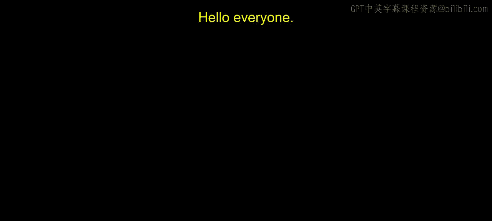
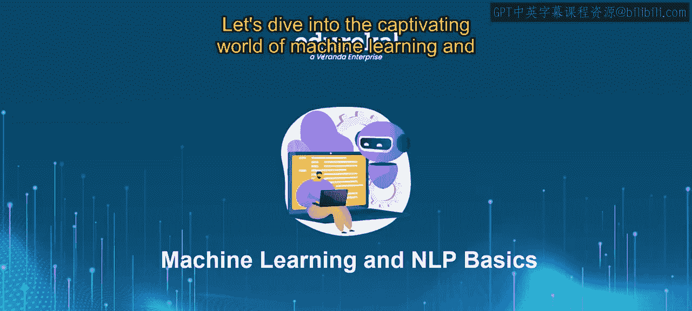
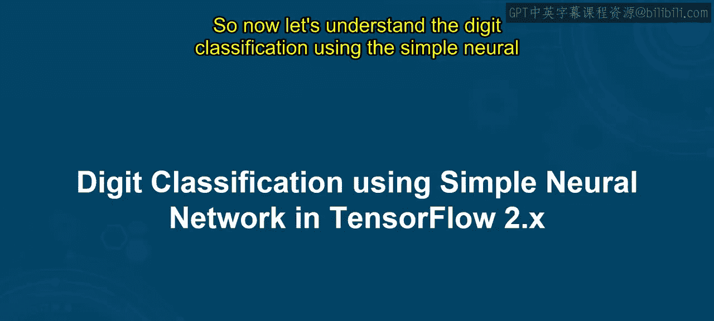
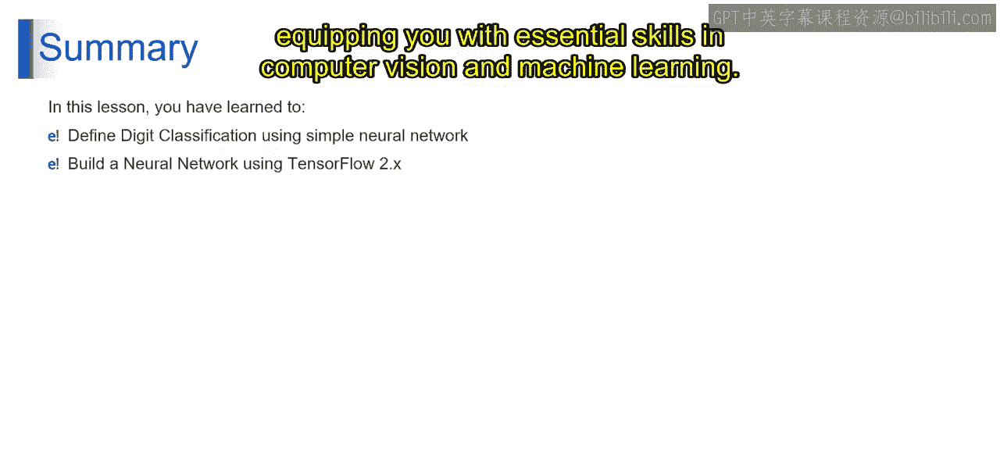

# 第一部分 55：使用TensorFlow 2.x的简单神经网络进行数字分类 🧠

在本节课中，我们将一起探索机器学习的迷人世界，并学习使用TensorFlow 2.x框架构建一个简单的神经网络来完成手写数字分类任务。通过本课，你将能够理解数字分类的基本概念，并掌握构建、训练和评估一个神经网络模型的完整流程。

---

## 数字分类简介

想象一下，你正在教一位朋友识别手写数字。你会向他们展示不同的手写数字图片（例如0到9），并告诉他们每个数字是什么。为了帮助他们学习，你让他们通过观察新图片并猜测数字来练习。每当他们犯错时，你就纠正他们，帮助他们提高。

从技术定义上讲，在机器学习的背景下，**数字分类**涉及训练一个神经网络来识别图像中的手写数字。







神经网络学习将代表数字的输入图像（像素）映射到它们对应的标签（即数字值）。每张图像都表示为一个像素值向量，神经网络使用由相互连接的节点（即神经元）组成的层来处理这些输入数据。

通过一个称为**训练**的过程，神经网络根据带标签的数字图像数据调整其内部参数（即**权重**），以最小化预定义的**损失函数**（例如交叉熵），从而提高其预测数字标签的准确性。一旦训练完成，神经网络就能通过应用学习到的映射关系，准确地分类新的、未见过的数字图像。

---

## 使用TensorFlow 2.x进行数字分类

上一节我们介绍了数字分类的基本概念，本节中我们来看看如何使用TensorFlow 2.x具体实现它。该过程包含多个步骤。

以下是实现数字分类的主要步骤：

1.  **准备数据**
2.  **构建模型**
3.  **编译模型**
4.  **训练模型**
5.  **评估模型**

现在，让我们通过一个演示来详细理解每个步骤。

### 第一步：准备数据

我们首先需要准备带标签的手写数字图像数据集，例如**MNIST数据集**（修改版国家标准与技术研究院数据集）。你可以在Kaggle或Google等平台下载它。数据集中，每张图像都关联着一个数字标签。

然后，将数据分成两个子集：
*   **训练集**：用于训练模型。
*   **测试集**：用于评估模型性能。

### 第二步：构建模型

接下来，我们需要定义神经网络的架构。通常，我们从创建一个**Sequential模型**开始，该模型由按顺序堆叠的层组成。

以下是向模型中添加层的过程：
*   添加**输入层**、**隐藏层**和**输出层**。对于数字分类，输入层的大小应与输入图像的维度匹配，输出层的大小应对应类别的数量（例如，对于数字0到9，输出大小为10）。
*   根据问题需求和网络设计原则，为每一层选择合适的**激活函数**。例如，隐藏层常用`ReLU`，输出层常用`Softmax`。

一个简单的模型构建代码示例如下：
```python
import tensorflow as tf
model = tf.keras.Sequential([
    tf.keras.layers.Flatten(input_shape=(28, 28)), # 输入层，将28x28图像展平
    tf.keras.layers.Dense(128, activation='relu'), # 隐藏层，128个神经元，使用ReLU激活函数
    tf.keras.layers.Dense(10, activation='softmax') # 输出层，10个神经元，使用Softmax激活函数
])
```

### 第三步：编译模型

模型构建好后，我们需要编译它。这一步需要指定：
*   **损失函数**：用于衡量模型预测值与实际数字标签之间的差异。对于像数字分类这样的多分类问题，通常使用**分类交叉熵**。
*   **优化器**：例如**Adam优化器**，用于在训练期间更新模型的权重，目标是最小化损失函数。
*   **评估指标**：例如**准确率**，用于在训练和评估期间监控模型性能。

编译模型的代码示例如下：
```python
model.compile(optimizer='adam',
              loss='sparse_categorical_crossentropy',
              metrics=['accuracy'])
```

### 第四步：训练模型

现在，我们可以开始训练模型了。我们将训练数据输入模型，并指定训练的**轮数**，它代表整个训练数据集在网络中前向和后向传递的次数。

在训练期间，模型通过根据损失函数和优化器调整其内部参数（即权重），来学习将输入图像映射到其对应的数字标签。我们需要监控训练过程，以确保模型收敛并防止过拟合，可以采用如**早停**或**正则化**等技术。

训练模型的代码示例如下：
```python
model.fit(train_images, train_labels, epochs=10)
```

### 第五步：评估模型

训练完成后，我们需要在测试集这个未见过的数据上评估模型的性能。

我们需要计算评估指标，如**准确率**、**精确率**、**召回率**和**F1分数**，以评估模型在数字分类上的有效性。同时，分析任何错误分类，以确定模型架构或数据集质量中潜在的改进领域。

评估模型的代码示例如下：
```python
test_loss, test_acc = model.evaluate(test_images, test_labels)
print('Test accuracy:', test_acc)
```

通过遵循这些步骤，你可以使用TensorFlow 2.x为数字分类任务创建一个简单的神经网络，为计算机视觉和机器学习中更高级的技术奠定基础。

---

## 总结



在本节课中，我们一起学习了如何使用简单的神经网络定义数字分类任务，并通过TensorFlow 2.x逐步构建此类模型。你掌握了准备数据集、设计神经网络架构、使用适当参数编译模型、在带标签数据上训练模型以及评估其性能以完成准确数字识别任务的技能。这些是计算机视觉和机器学习领域的基础核心能力。