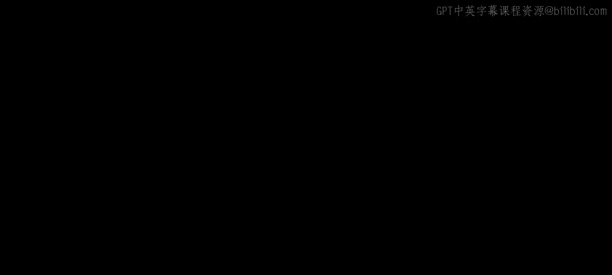
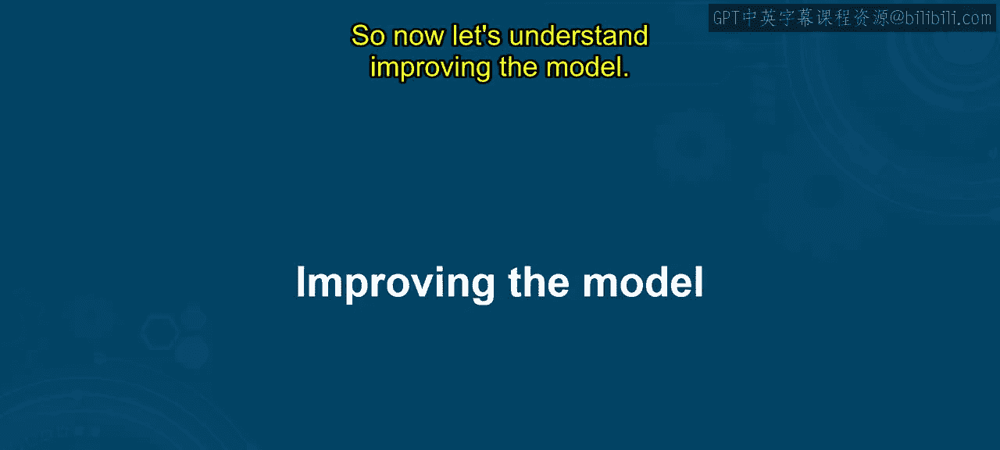
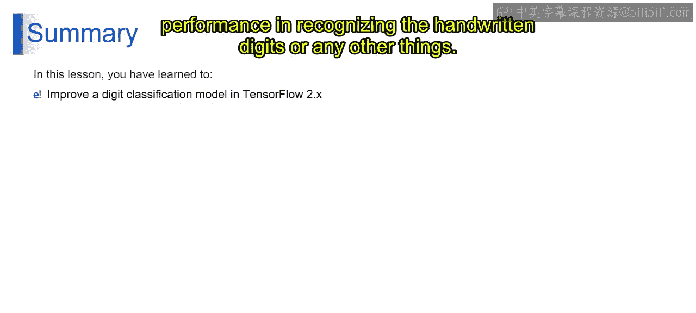

# 第一部分 56：改进模型 🚀

在本节课中，我们将学习如何改进机器学习模型，特别是针对手写数字分类任务。我们将探讨通过调整模型架构来提升其性能的各种方法。

---

## 🧠 理解模型架构改进

想象你正在按照食谱烘焙蛋糕。最初，你完全按照食谱操作。但品尝后，你觉得蛋糕可以做得更好。于是你开始尝试添加额外配料（如巧克力豆），并调整烘焙时间和温度，以获得更好的口感和风味。通过根据表现和反馈调整食谱，你最终做出了超出预期的美味蛋糕。

在机器学习中，**改进模型架构**与此类似。它涉及对模型的结构和参数进行调整，以提升其性能。这包括：
*   添加或移除层。
*   改变层的大小。
*   应用正则化技术，如 **Dropout** 或 **L2正则化**。
*   调整超参数，如**学习率**或**批次大小**。
*   引入先进的架构组件，如残差连接或注意力机制。

这些调整旨在优化模型从训练数据中学习和泛化的能力，从而带来更高的准确率、更快的收敛速度，以及对未见数据更强的鲁棒性。在蛋糕烘焙的例子中，根据口味偏好和反馈调整食谱，就相当于根据模型在训练和验证数据上的表现来调整其架构。数据科学家和机器学习工程师通过实验不同的模型架构和参数，来增强模型的预测能力和有效性。这两个过程都涉及迭代和调整的循环，以达到预期目标——无论是美味的蛋糕还是精确的机器学习模型。

---

## 🔍 改进模型的具体技术

上一节我们介绍了改进模型架构的基本概念，本节中我们来看看几种具体的技术。

以下是三种主要的模型改进方法：

### 1. 加深网络
加深网络意味着添加更多的隐藏层，使模型能够学习数字更复杂的特征。

想象你正在构建一个根据图像对花卉进行分类的模型。最初，你的模型只有一个隐藏层。然而，你发现它难以捕捉不同花卉种类之间复杂的细节和差异。为了解决这个问题，你决定通过添加更多隐藏层来加深网络。每增加一层，模型就能学习到更复杂的特征表示，从而能根据花瓣形状、颜色等细微特征更好地区分不同花卉类型。

**加深网络**是指向神经网络架构中添加更多隐藏层的过程。这项技术允许模型学习数据的层次化表示，其中每一层从输入数据中提取越来越抽象的特征。网络越深，模型就越有能力捕捉数据中更复杂的模式和关系，从而在处理复杂任务时获得更好的性能和泛化能力。

### 2. 加宽网络
加宽网络意味着增加隐藏层中的神经元数量。

假设你正在开发一个模型，根据平方英尺面积、卧室数量和地理位置等各种特征来预测房价。最初，你的模型架构较窄，每个隐藏层的神经元数量较少。然而，你发现它难以捕捉影响房价的多种因素。为了提升模型容量，你通过增加隐藏层中的神经元数量来加宽网络。网络变宽后，模型能更好地捕捉不同特征之间的细微差别和关系，从而对房价做出更准确的预测。

**加宽神经网络**涉及增加神经网络架构隐藏层中的神经元数量。通过添加更多神经元，模型获得了更大的表示容量，使其能够从输入数据中学习更复杂、更详细的模式。这项技术增强了模型捕捉特征间多样性和复杂关系的能力，从而在处理具有挑战性的预测任务时获得更好的性能和准确率。

### 3. 卷积神经网络
从全连接架构过渡到CNN意味着什么？

考虑这样一个场景：你正在开发一个模型，将动物图像分类到不同类别。你没有使用传统的全连接神经网络，而是选择了卷积神经网络架构。CNN专为图像相关任务设计，包含卷积层，能高效地从图像中提取层次化特征。通过过渡到CNN架构，你的模型变得更擅长捕捉图像中的空间关系和局部模式，从而在动物分类任务中实现更高的准确率和鲁棒性。

**卷积神经网络**是一种专门用于处理和分析视觉数据（如图像）的神经网络架构。CNN利用卷积层，对输入图像应用卷积操作，使模型能够提取层次化特征和空间模式。通过高效捕捉特征的局部关系和层次结构，CNN在图像分类、目标检测和图像分割等任务中表现出色，使其在计算机视觉应用中被广泛使用。

---

## 📝 总结

本节课中，我们一起学习了如何在TensorFlow中通过应用加深网络、加宽网络以及过渡到卷积神经网络等专门架构的技术，来增强手写数字分类模型的性能。这些方法有助于提升模型在识别手写数字或其他任务上的准确率和表现。