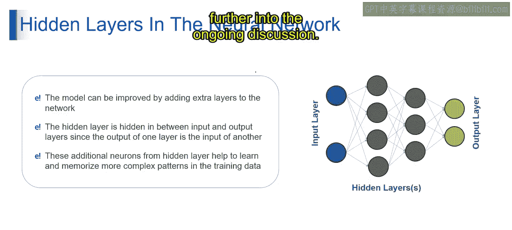

# 第一部分 57：添加隐藏层 🧠

在本节课中，我们将学习神经网络中的一个核心概念：隐藏层。我们将探讨为什么需要添加隐藏层，以及它在提升模型能力方面扮演的关键角色。

---

上一节我们介绍了神经网络的基本结构，本节中我们来看看如何通过添加隐藏层来增强网络的能力。

## 隐藏层的定义

在神经网络架构中，添加隐藏层是指在输入层和输出层之间加入额外的层。这个隐藏层包含神经元，这些神经元对输入数据进行计算，使网络能够从数据中学习复杂的模式和表示。

通过添加隐藏层，模型获得了捕获输入数据中更多特征和关系的能力，从而潜在地提升了其在各种任务上的性能和准确性。

## 如何添加隐藏层

添加隐藏层涉及定义一个具有指定数量神经元的新层，并将其连接到前一层。以下是其工作原理：

*   隐藏层中的每个神经元接收来自前一层神经元的输入。
*   它计算输入的加权和，并加上偏置项。
*   然后将结果传递给激活函数以产生输出。

这个过程允许隐藏层从输入数据中学习和提取有意义的特征，从而增强神经网络的整体预测能力。

## 为什么需要添加隐藏层？

我们为神经网络添加隐藏层，主要是为了增加模型学习数据中复杂模式和关系的能力。以下是几个关键原因：

以下是添加隐藏层的主要目的：

1.  **特征学习**：隐藏层允许神经网络对输入数据进行抽象和分层表示。每一层都从上一层的输出中提取和转换特征，使网络能够捕获原始输入中可能无法直接观察到的复杂模式。
2.  **引入非线性**：隐藏层向输入数据引入非线性变换，使网络能够建模输入和输出之间的非线性关系。如果没有隐藏层，网络只能学习线性映射，限制了其处理复杂任务的能力。
3.  **增强表达能力**：添加隐藏层增加了神经网络的表达能力，使其能够逼近更复杂的函数。这对于具有高维输入数据或非平凡决策边界的任务尤其重要。
4.  **提升泛化能力**：通过隐藏层，网络可以学习到数据更多样化和鲁棒的表示，从而更好地泛化到未见过的样本。隐藏层通过捕获相关模式并过滤掉输入中的噪声和不相关信息，有助于防止过拟合。

总而言之，为神经网络添加隐藏层使其能够学习复杂的特征、建模非线性关系、增强表达能力并提升泛化能力，从而更有效地解决复杂的机器学习任务。

## 隐藏层的重要性

隐藏层在神经网络中扮演着至关重要的角色，它能显著提升模型性能和学习数据中复杂模式的能力。

以下是隐藏层的核心作用：

1.  **提升模型性能**：通过向网络添加额外的隐藏层，我们增加了其深度和复杂性，使其能够捕获数据中更细微和复杂的模式。这可以带来模型性能的显著提升。
2.  **中间处理**：隐藏层充当输入层和输出层之间的中介。一层的输出成为下一层的输入，从而实现了数据的分层表示。这种分层表示使网络能够从输入数据中学习并提取越来越抽象和复杂的特征。
3.  **学习复杂模式**：隐藏层中额外的神经元增强了网络学习和记忆训练数据中复杂模式的能力。这些神经元可以检测输入特征之间微妙的关系和依赖，从而更全面地理解底层的数据分布。

隐藏层在深度神经网络中起着非常重要的作用，它使网络能够从数据中学习复杂的模式和表示。通过添加这些隐藏层，我们增强了模型从训练数据中学习和泛化的能力，最终提升了其在各种机器学习任务上的性能。

---

本节课中，我们一起学习了神经网络中隐藏层的概念。我们了解了它的定义、添加方法、存在的必要性及其在提升模型能力方面的重要性。下一节视频将继续深入探讨相关主题。