# 第一部分 58：神经网络中的隐藏层 🧠

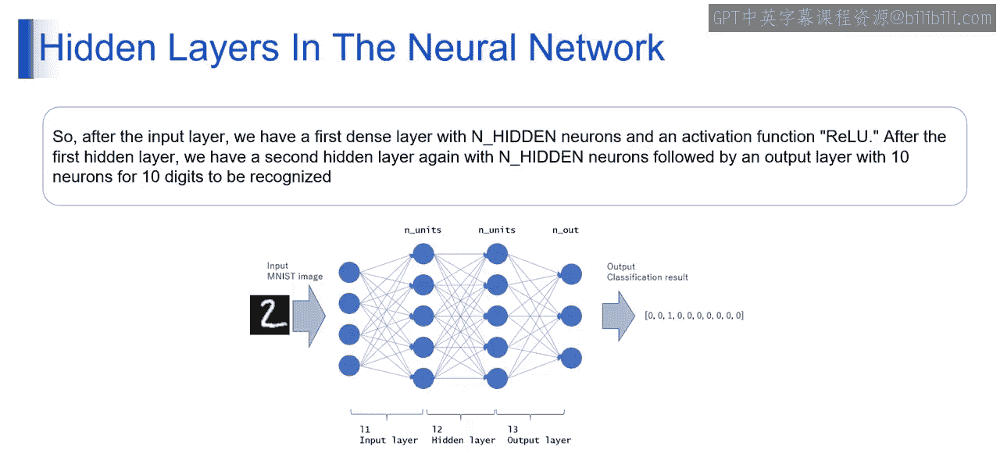

在本节课中，我们将要学习神经网络架构中的一个核心组成部分——隐藏层。我们将通过一个具体的例子，来理解隐藏层如何工作，以及它在处理复杂数据（如手写数字图像）时扮演的关键角色。

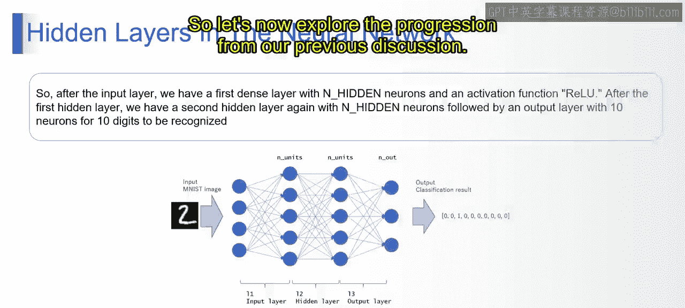

---

上一节我们讨论了神经网络的基本概念，本节中我们来看看一个包含隐藏层的具体神经网络架构示例。

## 神经网络架构示例

假设我们有一个任务：识别手写数字图像（例如MNIST数据集中的图像）。我们将构建一个包含输入层、两个隐藏层和一个输出层的神经网络。

以下是该网络的基本结构：
1.  **输入层**：接收图像像素数据。
2.  **第一隐藏层（第一密集层）**：包含 `n_hidden` 个神经元，使用ReLU激活函数。
3.  **第二隐藏层（第二密集层）**：同样包含 `n_hidden` 个神经元，使用ReLU激活函数。
4.  **输出层**：包含10个神经元，对应数字0到9，使用Softmax激活函数。

## 第一隐藏层详解

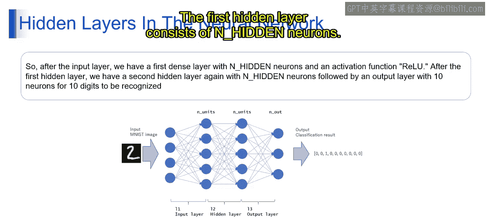

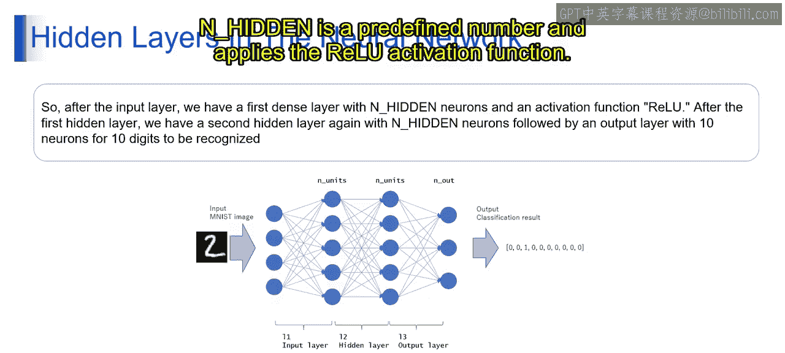

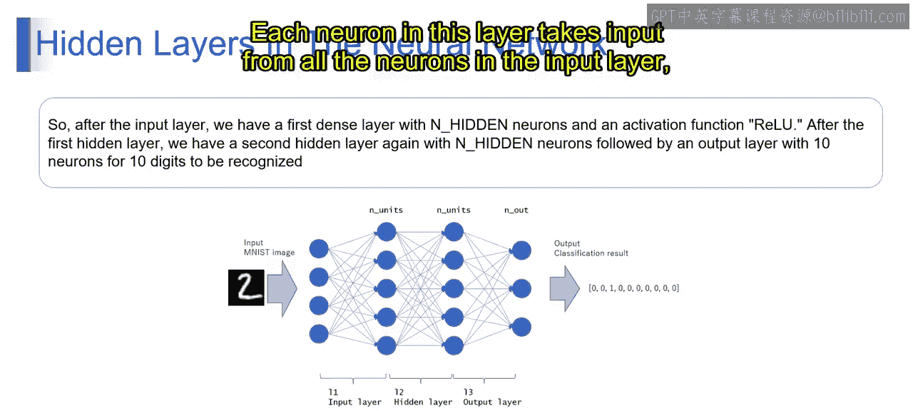

第一隐藏层，也称为第一密集层，是网络学习数据特征的第一站。

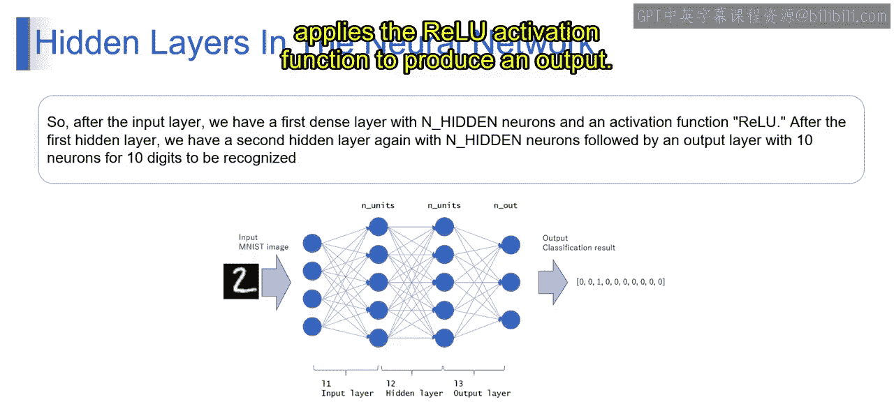

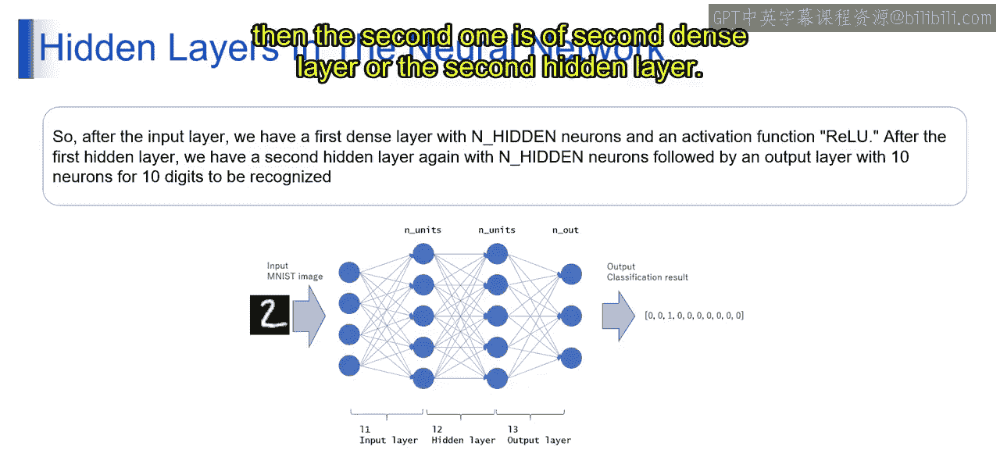

该层由预先定义数量的 `n_hidden` 个隐藏神经元组成，并应用ReLU激活函数。该层中的每个神经元执行以下操作：
*   接收来自输入层所有神经元的输入信号。
*   计算输入的加权和，并加上一个偏置项。
*   对结果应用ReLU激活函数以产生输出。

**ReLU（修正线性单元）** 是一个流行的激活函数，其公式为：
`f(x) = max(0, x)`
它为网络引入了非线性，如果输入为正数则直接输出该值，否则输出0。

## 第二隐藏层的作用

紧随第一隐藏层之后，我们设置了第二隐藏层。

第二隐藏层同样包含 `n_hidden` 个神经元，其结构与第一隐藏层相似。该层的每个神经元也计算输入的加权和，加上偏置，并应用ReLU激活函数来产生输出。

增加这个额外的隐藏层，使得神经网络能够学习输入数据中更复杂、更抽象的表示和模式。

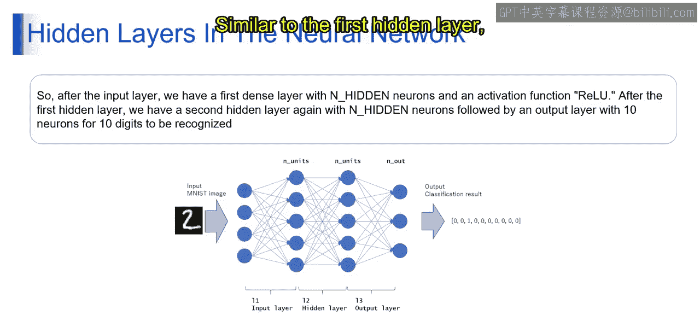

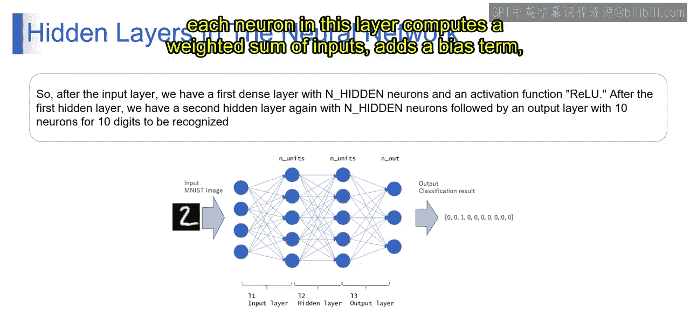

## 输出层与最终预测

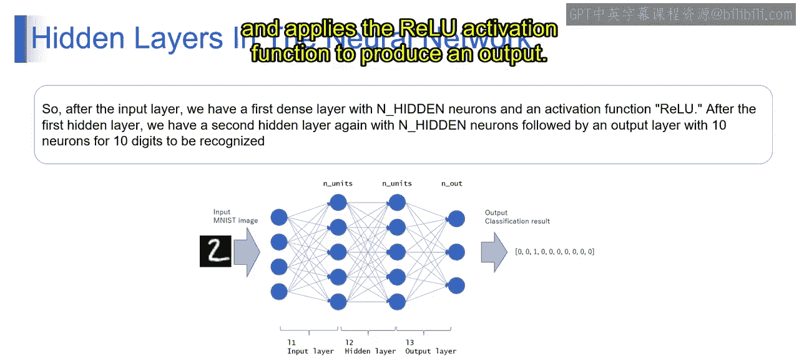

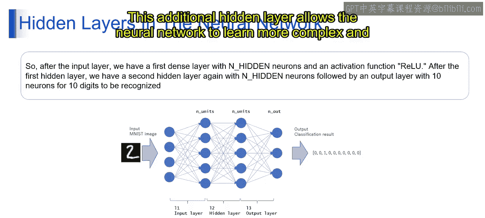

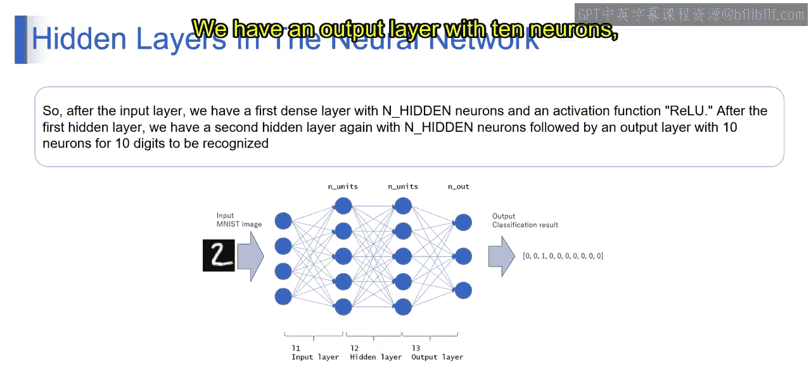

最后，我们到达网络的末端——输出层。

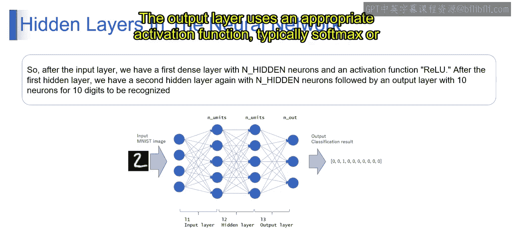

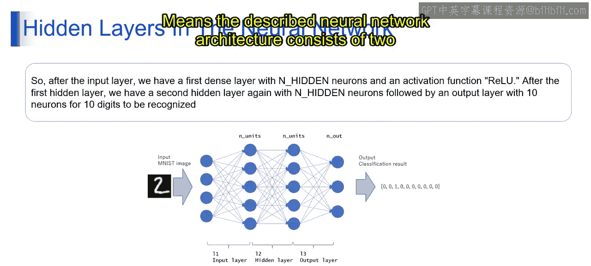

输出层设计有10个神经元，每个神经元对应一个待识别的数字类别（0到9）。对于像数字识别这样的多分类任务，输出层通常使用Softmax激活函数。

**Softmax函数** 将所有神经元的输出分数进行归一化处理，生成一个覆盖所有可能类别的概率分布。概率最高的那个神经元对应的类别，就是网络的最终预测结果。

## 架构总结与能力

所描述的神经网络架构由两个隐藏层（每层有 `n_hidden` 个神经元并使用ReLU激活函数）和一个输出层（10个神经元并使用Softmax激活函数）组成。

这种架构使网络能够学习输入数据中复杂的模式和关系，从而为数字分类任务做出准确的预测。

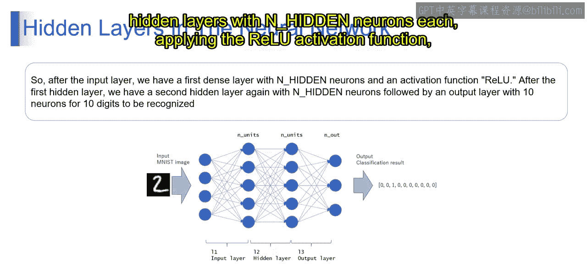

---

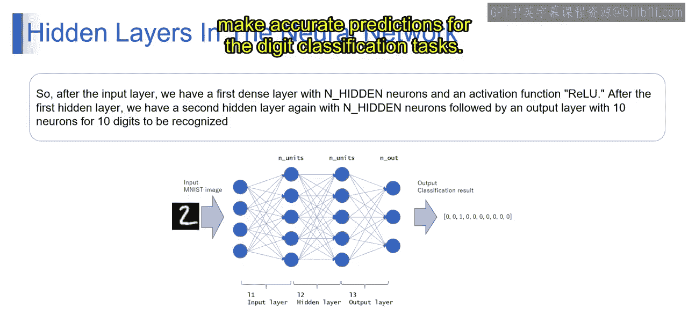

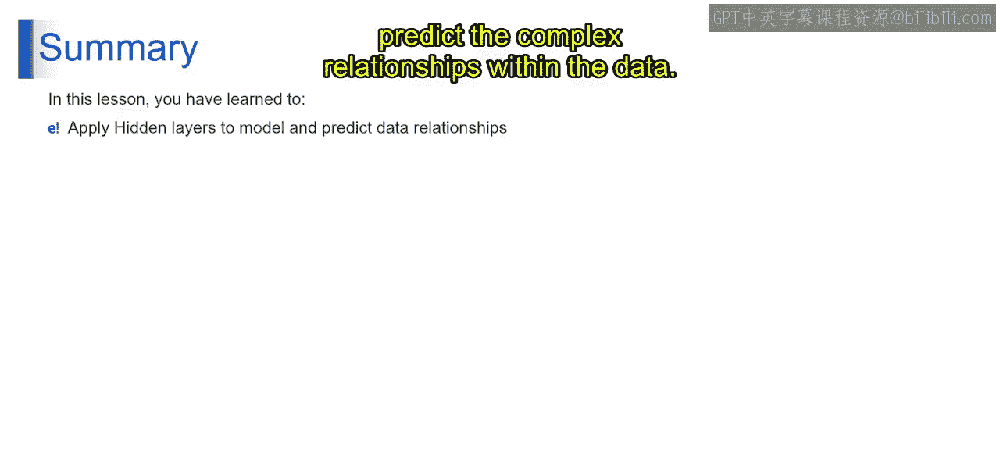

本节课中我们一起学习了神经网络中隐藏层的核心作用。你已了解如何利用神经网络模型中的隐藏层来捕捉和预测数据内部的复杂关系。通过包含多个隐藏层的架构，网络能够逐步从原始输入中提取更高级的特征，最终完成精确的分类任务。