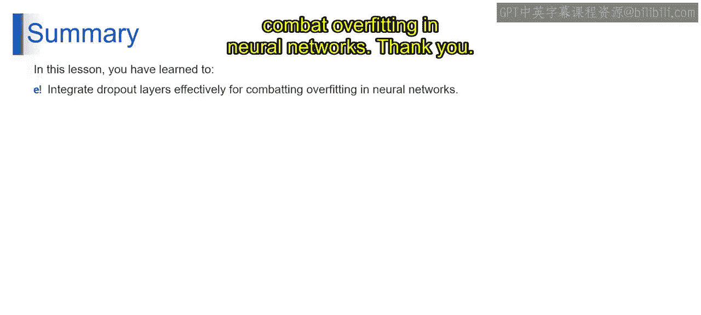

# 第一部分 59：添加Dropout层

在本节课中，我们将学习神经网络中一个重要的概念——Dropout。我们将了解什么是Dropout，为什么需要它，以及它如何通过防止过拟合来提升模型的泛化能力。

## 概述

上一节我们介绍了神经网络的基本结构，包括输入层、隐藏层和输出层。本节中，我们来看看如何通过添加Dropout层来提升神经网络的性能。Dropout是一种正则化技术，通过在训练过程中随机“丢弃”一部分神经元，来防止模型对训练数据产生过拟合。

## 什么是Dropout？

Dropout是一种在神经网络训练过程中使用的正则化技术。其核心思想是：在每次训练迭代中，随机“关闭”或“丢弃”网络中的一部分神经元。

**公式/代码描述**：
对于一个在训练中的神经元，其输出 `h` 在应用Dropout后变为：
`h' = h * m`
其中 `m` 是一个伯努利随机变量（例如，以概率 `p` 为1，以概率 `1-p` 为0）。

这相当于在训练时，每个神经元都有概率 `p` 被保留，有概率 `1-p` 被暂时从网络中移除。

## 为什么需要Dropout？

Dropout主要用于解决神经网络中的过拟合问题。

*   **过拟合**：当模型过于复杂，或训练数据不足时，模型可能会“死记硬背”训练数据中的细节和噪声，导致在训练集上表现很好，但在未见过的测试数据上表现很差。
*   **Dropout的作用**：通过随机丢弃神经元，Dropout阻止了任何单个神经元或一小群神经元过度依赖于特定的输入特征或模式。这迫使网络学习更鲁棒、更具泛化性的特征表示。

可以这样理解：Dropout在训练过程中创建了许多不同的、更小的“子网络”的集合。在预测时，使用完整的网络，相当于对这些子网络的预测结果进行了平均，这通常能带来更稳定、更泛化的性能。

## Dropout的类比演示

为了更好地理解Dropout，我们可以通过一个类比来演示。

想象你正在学习投掷飞镖，靶心代表最优解。最初，你通过反复瞄准靶心练习。然而，你发现你的瞄准变得过于精确，每次都击中同一个点（可能还不是靶心）。这反映了机器学习中的过拟合——模型对训练数据过度特化。

为了解决这个问题，你在练习中引入“Dropout”机制：偶尔，你决定蒙上眼睛，随机投掷飞镖，而不精确瞄准靶心。这种Dropout技术为你的练习引入了变异性，防止你过度依赖特定的瞄准技巧。结果，你发展出一种更鲁棒、适应性更强的投掷技术，能够命中靶盘上的不同区域，包括靶心，即使在不同的条件下也是如此。

类似地，在神经网络中，Dropout在训练过程中随机忽略一些神经元，迫使模型学习更鲁棒的特征，防止其对训练数据过度特化。这鼓励网络形成对数据更泛化的理解，从而提升其在未见数据上做出准确预测的能力。

## 关键要点总结

以下是关于Dropout需要记住的几个核心要点：

*   **训练与推理**：Dropout**仅**在模型训练阶段启用。在模型完成训练后进行预测（推理）时，会关闭Dropout，使用完整的网络。
*   **防止共适应**：它打破了神经元之间的复杂共适应关系，因为一个神经元不能总是依赖于网络中其他特定神经元的存在。
*   **一种集成学习**：Dropout可以看作是一种高效的、近似训练大量不同网络结构并对其结果进行平均的方法。

## 课程总结

本节课中，我们一起学习了神经网络中至关重要的Dropout技术。我们了解了它的定义、解决过拟合问题的原理，并通过生动的类比演示了其工作方式。掌握如何有效地集成Dropout层，是构建强大、泛化能力好的神经网络模型的关键技能之一。在接下来的课程中，我们将继续探索其他提升模型性能的技术。