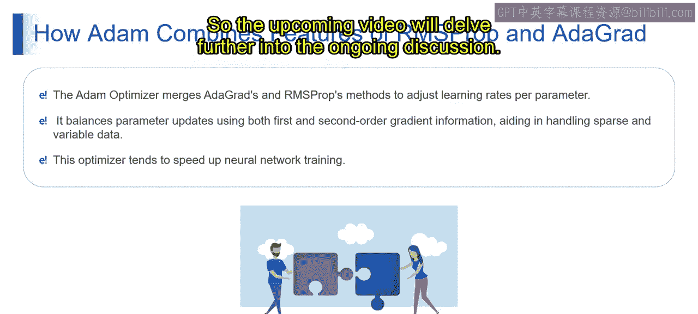

# 第一部分 60：Adam优化器 🧠

在本节课中，我们将要学习Adam优化器。这是一种在训练神经网络时广泛使用的优化算法。我们将了解它的用途、为什么需要它，以及如何在实际中应用它。通过本节的学习，你将掌握Adam优化器的基本原理，包括其自适应学习率和动量特性，并能够在TensorFlow等深度学习框架中高效地使用它来提升神经网络的训练性能。

## Adam优化器概述

上一节我们介绍了神经网络训练的基本概念，本节中我们来看看一个关键的加速工具——Adam优化器。

想象你正在攀登一座山，目标是尽快到达顶峰，同时需要应对不断变化的地形。

在攀登过程中，你会遇到陡峭的上坡和平坦的路段，每种地形都需要不同的努力程度来前进。为了优化你的进度，你会根据地形的坡度和自身的动量来动态调整步伐。在陡坡上，你会放慢速度以保持稳定；在平地上，你会加快步伐以更快前进。通过这种自适应的速度调整，即使地形复杂，你也能高效地到达顶峰。

在技术定义上，Adam优化器是一种自适应优化算法，用于神经网络训练。它能根据参数的梯度及其历史动量动态调整学习率。它结合了另外两种流行优化技术（RMSprop和AdaGrad）的优点，以提供更快的收敛速度和更好的泛化能力。Adam为每个参数计算独立的自适应学习率，确保在各种深度学习任务上实现更快的收敛和更好的性能。

在我们的登山类比中，你根据地形的坡度和动量自适应调整步伐，这正反映了Adam优化器在神经网络训练中的功能。正如你动态调整步伐以高效应对多变地形一样，Adam优化器根据梯度和历史动量自适应地调整每个参数的学习率，从而实现神经网络的快速收敛和性能提升。

## Adam优化器的核心原理

现在，让我们深入理解Adam优化器的技术原理。

Adam优化器，全称“自适应矩估计”，是一种广泛用于训练神经网络的优化算法。它结合了另外两种流行优化技术的优点，即RMSprop和AdaGrad。

以下是Adam优化器核心组件的简要说明：

*   **RMSprop（均方根传播）**：它根据近期梯度的大小调整各个参数的学习率。其方法是将梯度除以过去平方梯度的指数衰减平均值，这有助于加速深度学习模型的收敛。
*   **AdaGrad（自适应梯度算法）**：它根据参数的历史梯度来调整其学习率。它会降低频繁出现特征的学习率，提高不频繁特征的学习率，使得模型即使在稀疏数据上也能高效收敛。

Adam整合了这些原理，通过为每个参数计算独立的自适应学习率，将自适应学习率和动量的优势结合到一个优化算法中。这使得在多种任务上训练深度神经网络时，能够实现更快的收敛和更好的性能。

Adam优化器通过基于梯度大小及其历史动量动态调整学习率，为神经网络训练提供了一个有效的解决方案，从而实现更快的收敛和增强的性能。

## Adam如何工作

接下来，我们具体看看Adam优化器是如何结合RMSprop和AdaGrad的特性来有效调整网络训练中每个参数的学习率的。

以下是Adam优化器工作的关键步骤：

1.  **集成AdaGrad和RMSprop方法**：Adam将RMSprop的自适应学习率机制与AdaGrad的历史梯度信息相结合。
2.  **计算自适应学习率**：它基于梯度的大小及其历史动量，为每个参数计算独立的自适应学习率。
3.  **平衡参数更新**：Adam通过同时考虑一阶梯度（当前梯度）和二阶梯度（历史动量）来平衡参数更新。通过结合当前梯度及其历史趋势的信息，Adam优化了学习过程，尤其在处理稀疏和变化数据时表现优异。
4.  **加速神经网络训练**：通过利用自适应学习率和基于动量的更新，Adam倾向于加速神经网络的训练。这些特性的结合使得Adam能够更快地收敛，并在广泛的深度学习任务中实现更好的性能。

总而言之，Adam优化器通过集成自适应学习率和历史梯度信息，结合了RMSprop和AdaGrad的优势。这使得它能够有效地平衡参数更新并加速神经网络训练，使其成为优化深度学习模型的热门选择。

## 总结

本节课中我们一起学习了Adam优化器。我们首先通过一个登山的类比理解了其核心思想——自适应调整。然后，我们探讨了它的技术原理，了解到它是RMSprop和AdaGrad优势的结合体，能够为每个参数独立计算学习率并利用动量来加速训练。Adam优化器因其高效和鲁棒性，已成为训练深度学习模型的标准工具之一。在接下来的课程中，我们将继续深入其他重要的机器学习概念。