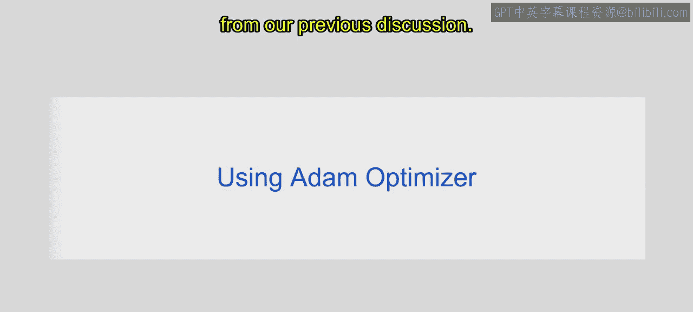
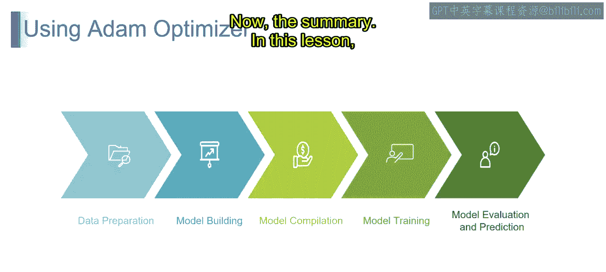
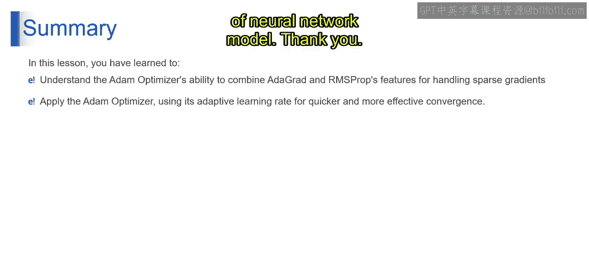

# 第一部分 61：如何使用Adam优化器 🚀


在本节课中，我们将学习如何在TensorFlow/Keras中使用Adam优化器来训练神经网络。我们将从数据准备开始，逐步完成模型构建、编译、训练、评估和预测的完整流程。

上一节我们介绍了Adam优化器的理论基础，本节中我们来看看如何在实际项目中应用它。

## 概述

Adam优化器结合了AdaGrad和RMSProp的优点，能自适应地调整每个参数的学习率，并利用梯度的一阶矩估计（均值）和二阶矩估计（未中心化的方差）进行更新。其核心更新公式如下：

**公式：**
```
m_t = β1 * m_{t-1} + (1 - β1) * g_t
v_t = β2 * v_{t-1} + (1 - β2) * g_t^2
m_hat_t = m_t / (1 - β1^t)
v_hat_t = v_t / (1 - β2^t)
θ_t = θ_{t-1} - α * m_hat_t / (sqrt(v_hat_t) + ε)
```
其中，`g_t`是当前梯度，`α`是学习率，`β1`和`β2`是衰减率，`ε`是为数值稳定性添加的小常数。

## 使用步骤

以下是使用Adam优化器训练神经网络的标准步骤。



### 1. 数据准备

此步骤涉及为训练准备数据集。通常需要将数据集分割为训练集、验证集和测试集。确保数据经过适当的预处理和格式化，以便输入到神经网络中。

### 2. 模型构建

使用TensorFlow的高级API（如Keras）设计和构建神经网络架构。定义模型的层、激活函数和其他参数。将优化器指定为Adam，并根据需要配置其参数。

**代码示例：**
```python
import tensorflow as tf
from tensorflow import keras

model = keras.Sequential([
    keras.layers.Dense(128, activation='relu', input_shape=(input_dim,)),
    keras.layers.Dense(64, activation='relu'),
    keras.layers.Dense(output_dim, activation='softmax')
])

# 第一部分 配置Adam优化器，可调整学习率、beta1、beta2等参数
optimizer = keras.optimizers.Adam(learning_rate=0.001, beta_1=0.9, beta_2=0.999, epsilon=1e-07)
```

### 3. 模型编译

构建模型后，使用TensorFlow或Keras中的`compile`函数对其进行编译。指定用于衡量模型性能的损失函数，例如分类任务使用分类交叉熵。选择Adam优化器作为训练模型的优化器。可选地，定义在训练期间要监控的额外指标，例如准确率。

**代码示例：**
```python
model.compile(optimizer=optimizer,
              loss='categorical_crossentropy',
              metrics=['accuracy'])
```

### 4. 模型训练

使用`fit`函数在训练数据上训练已编译的模型。指定训练的轮数（对整个数据集的迭代次数）和批次大小。在训练期间，Adam优化器将动态调整模型参数的学习率，以最小化指定的损失函数。

**代码示例：**
```python
history = model.fit(x_train, y_train,
                    epochs=10,
                    batch_size=32,
                    validation_data=(x_val, y_val))
```

### 5. 模型评估与预测

最后一步，使用`evaluate`函数在验证集或测试集上评估训练后模型的性能，并获得损失和准确率等性能指标，以评估模型的泛化能力。可选地，使用训练好的模型，通过`predict`函数对新的、未见过的数据进行预测。



**代码示例：**
```python
# 第一部分 评估模型
test_loss, test_accuracy = model.evaluate(x_test, y_test)
print(f"Test Loss: {test_loss}, Test Accuracy: {test_accuracy}")

# 第一部分 进行预测
predictions = model.predict(new_data)
```

遵循这些步骤，可以有效地利用TensorFlow中的Adam优化器来训练神经网络，并在各种机器学习任务上进行预测。Adam优化器的自适应学习率和动量特性有助于提高训练模型的收敛速度和性能。

## 总结



本节课中我们一起学习了Adam优化器的实际应用流程。我们了解到，Adam优化器融合了AdaGrad的自适应学习率机制和RMSProp的历史梯度信息，使其能够高效处理稀疏梯度并实现更快收敛。通过利用其自适应学习率，Adam优化器增强了训练过程，从而使得神经网络模型能够更快、更有效地收敛。