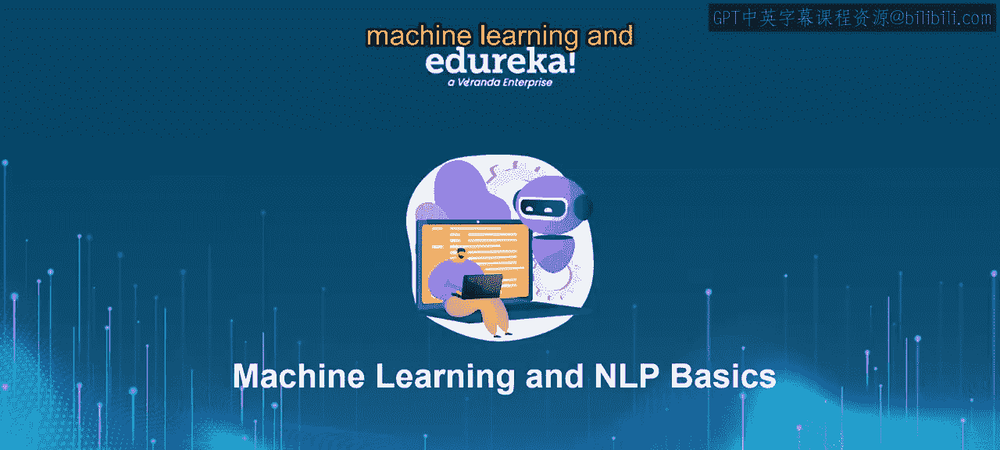
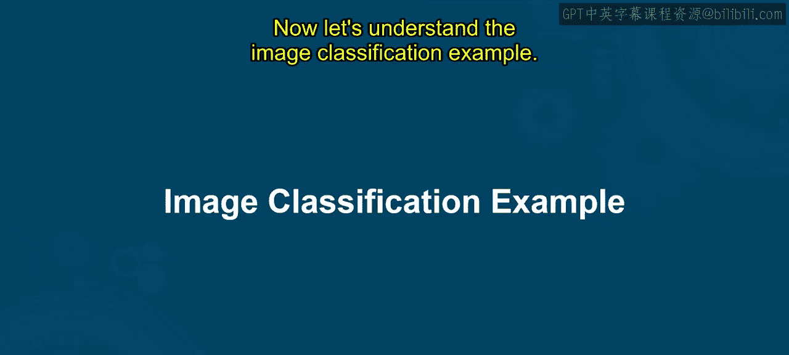
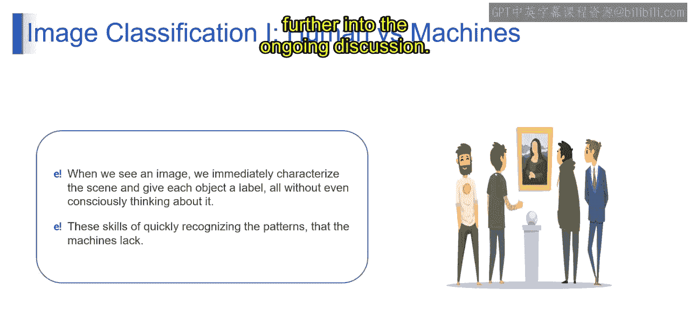

# 第一部分 62：图像分类示例 🖼️

在本节课中，我们将一起探索机器学习的迷人世界，并深入了解图像分类这一核心概念。我们将通过具体的例子，学习机器如何根据特征和模式来分类与识别图像，并探讨人类与机器在图像识别能力上的差异。

## 什么是图像分类？ 🤔

在深入理解具体的图像分类示例之前，让我们先明确图像分类的定义。

想象你有一个动物图片集，你需要开发一个能自动识别每张图片中是猫还是狗的系统。为了训练这个系统，你首先给它展示许多已标记的猫和狗的图片。系统从这些例子中学习，开始识别出区分猫和狗的常见特征与模式。最终，当你展示一张新图片时，系统就能根据学习到的特征，准确地预测它是猫还是狗。

从技术上讲，**图像分类**是一项计算机视觉任务，旨在将图像归类到预定义的类别中。它利用机器学习算法（通常是深度学习模型，如卷积神经网络）自动从图像中学习和提取特征，并对其内容进行预测。其目标是训练一个模型，使其能够根据图像的视觉特征，准确地将标签或类别分配给每张图像。图像分类在多个领域都有应用，例如物体识别、医学影像、自动驾驶和内容过滤。

## 图像分类示例一：识别与匹配 🧩

现在，让我们基于一个具体例子来理解图像分类一的核心内容。

图像分类的任务是接收一张输入图像，并预测最能描述该图像的类别的概率。在下面的例子中，我们有一些图片。问题是：哪个剪影与图片中的物体最匹配？

对于人类而言，识别能力是我们从出生那一刻起就获得的首批技能之一，成年后更是自然而轻松。现在，让我们从技术角度理解这是如何发生的。

在图像分类中，目标是分析输入图像，并预测最能描述图像内容的各种预定义类别或分类的可能性或概率。这是计算机视觉中的一项基本任务，算法（通常由深度学习技术如卷积神经网络驱动）学习识别图像中的模式和特征，以便对其内容做出准确预测。

例如，在提供的场景中，任务是识别哪个剪影与描绘的图像最相似。人类天生擅长此道，从小就能轻松识别周围环境中的物体和模式。类似地，图像分类算法旨在模拟这种认知过程，使机器能够准确识别和分类图像，这是一项从物体识别到医学影像和自动驾驶都至关重要的能力。

## 人类与机器的图像分类能力对比 🤖👤

在图像分类的背景下，人类拥有快速解读视觉信息并为图像中的物体分配标签的先天能力，这通常无需有意识的努力。这项技能使我们能够轻松识别模式，并区分图像中描绘的不同物体、场景或实体。

然而，机器（特别是执行图像分类任务的人工智能系统）缺乏人类固有的认知能力。虽然机器擅长处理海量数据和执行复杂计算，但它们难以模仿人类对视觉场景的直观和整体理解。与人类不同，机器需要明确的训练和算法来准确识别模式和分类图像。

因此，我们采用深度学习（特别是卷积神经网络）等技术来教导机器分析图像特征，并根据学习到的模式进行预测。

本质上，人类擅长快速、无意识地识别和标记图像中的物体，而机器则依赖计算算法和训练数据来执行类似任务，这突显了人类与机器能力之间的显著差异。

## 总结 📝

本节课中，我们一起学习了图像分类的基本概念。我们了解到，图像分类是让机器学会识别图像内容并归类的过程，其核心在于从数据中提取特征和模式。我们通过“猫狗识别”和“剪影匹配”的例子，具体分析了分类任务如何执行。最后，我们对比了人类与机器在图像识别上的不同：人类依赖与生俱来的直觉认知，而机器则需要通过算法和大量数据训练来获得类似能力。理解这些基础，是进一步探索更复杂人工智能应用的关键。

接下来的课程将继续深入这一主题的讨论。

