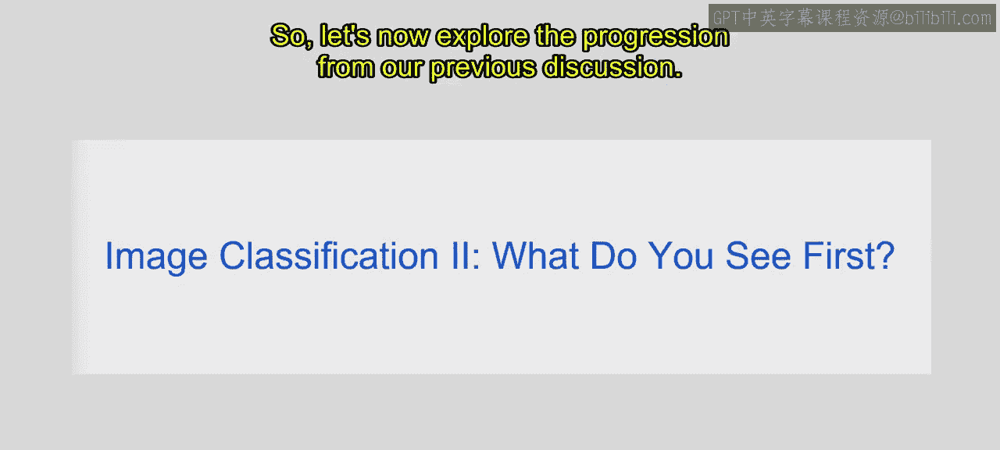
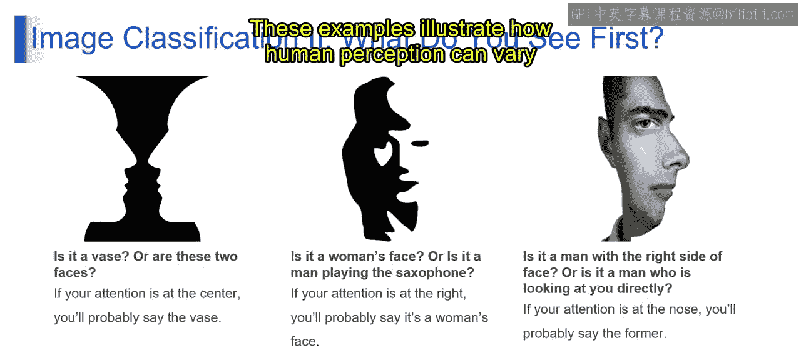
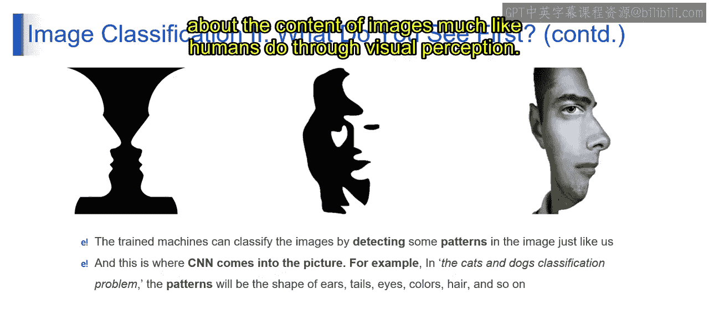
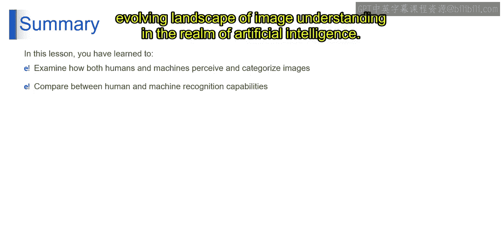

# 第一部分 63：图像分类II


在本节课中，我们将深入探讨图像分类任务中人类感知与机器识别之间的差异与联系，并了解卷积神经网络（CNN）如何模仿人类视觉系统来处理图像。

---

上一节我们介绍了图像分类的基本概念，本节中我们来看看人类视觉感知的主观性及其对机器学习的启示。



人类观察图像时，首先注意到什么取决于其注意力在图像中的焦点。例如，在下图中：


如果一个人的注意力集中在图像中心，他很可能首先感知到花瓶。然而，如果他的注意力转移到周围区域，则可能会注意到两张人脸。

在另一幅图中：


如果注意力集中在右侧，观察者可能会更突出地感知到女性的脸。但经过仔细审视或将焦点转移到吹萨克斯管的男性身上，感知结果可能会发生变化。

再看第三幅图：



在一幅显示男性脸部、一侧清晰可见而另一侧部分遮挡的图像中，感知会因注意力方向而异。如果注意力集中在鼻子上，观察者可能感知到右侧脸可见的男性。但如果注意力转移到其凝视的方向，解读可能倾向于认为男性正直接看向观察者。

这些例子说明了人类感知如何因图像中注意力焦点的不同而变化，凸显了视觉信息的主观性。

---

类似地，在图像分类任务中，算法必须经过训练，以准确识别和解释视觉特征，同时考虑到人类感知可能存在的差异。


经过训练的机器学习模型，特别是那些采用**卷积神经网络（CNN）**的模型，能够通过识别和分析图像数据中的模式来对图像进行分类。

与人类感知类似，CNN的设计旨在模仿人脑的视觉处理能力，使其能够有效地从图像中检测和提取有意义的特征。

例如，在猫狗分类问题中，CNN可以学习识别独特的模式，例如耳朵的形状、尾巴、眼睛、颜色、毛发纹理以及其他视觉属性。

以下是CNN处理流程的简化表示：

```python
# 第一部分 伪代码示例：CNN分类流程
输入图像 -> 卷积层（提取特征）-> 池化层（降维）-> 全连接层 -> 输出分类（猫/狗）
```

通过分析图像不同区域学习到的这些模式，CNN可以对图像的内容或类别做出准确预测。在训练过程中，CNN会调整其内部参数（如**权重**和**偏置**），以优化对这些模式的检测和解释，最终提高其高精度分类图像的能力。

这意味着CNN通过有效捕获和利用视觉模式来对图像内容做出明智决策，在图像分类任务中扮演着非常重要的角色，这与人类通过视觉感知进行判断的方式非常相似。

---

## 总结

本节课中，我们一起学习了图像感知和分类的复杂性，探讨了人类和机器在识别与分类图像方面的能力。通过比较人类直觉与机器学习算法之间的异同，我们深入了解了各自用于解释视觉信息的不同方法，从而揭示了人工智能领域图像理解不断发展的前景。






