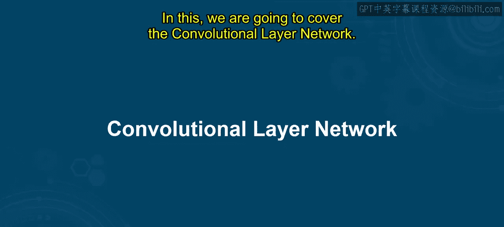
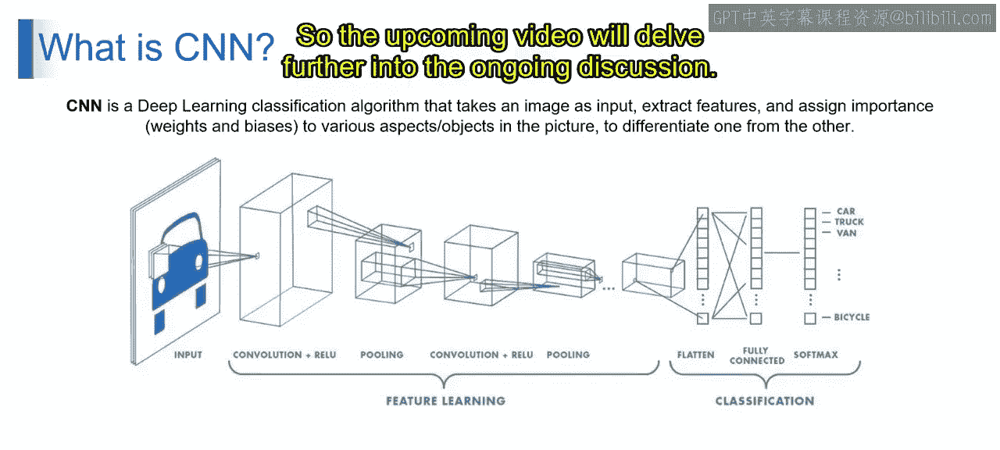

# 第一部分 64：卷积神经网络

在本节课中，我们将一起探索机器学习的迷人世界和自然语言处理的基础概念。我们将重点介绍卷积神经网络。通过本节学习，你将理解CNN的基本概念，并了解为何CNN比多层感知机更受青睐。

## 概述

想象一下，你正在阅读一本书，并试图在文本中寻找特定的单词。你不是逐字逐句地阅读整页，而是一次只关注一小段文本，扫描其中与你搜索内容匹配的模式或关键词。一旦找到相关部分，你就将这些信息拼凑起来，以理解文本的整体含义。这种局部化和层次化的方法，使你能够有效地处理大量文本并提取有意义的信息。

CNN正是受此启发而设计的一类深度学习模型，专门用于处理和分析图像等视觉数据。它模仿了动物视觉皮层的组织结构。

## CNN的构成与工作原理

CNN由多个层组成，包括卷积层、池化层和全连接层。

在CNN中，卷积层将**滤波器**（或称为**核**）应用于输入图像，通过卷积运算提取局部特征和模式。这些滤波器在输入图像上滑动，捕捉空间关系并检测相关的视觉模式，如边缘、纹理或形状。

通过堆叠多个卷积层并结合池化层来降低空间维度，CNN能够学习视觉特征的层次化表示，从而在图像分类、目标检测和图像分割等任务中实现卓越的准确性。

在我们之前的阅读例子中，扫描文本片段以寻找特定单词的过程，就类似于CNN中卷积层的操作。CNN通过将视觉数据分解为更小、更易管理的片段，并逐步分析它们以提取层次化特征，模仿了人类视觉中观察到的局部化和层次化处理方式，使其成为理解和解释视觉信息的强大工具。

## 图像分类示例详解

现在，让我们通过一个具体的图像分类例子来深入理解CNN的工作流程。我们的目标是：将一张输入图片（例如一辆汽车）分类到预定义的类别中，如“汽车”、“卡车”、“厢式货车”或“自行车”。

以下是CNN处理此任务的核心步骤：

### 1. 特征学习

特征学习阶段是CNN提取图像关键信息的过程，主要由以下步骤构成：

*   **卷积层**：输入图像经过一系列卷积层。每个卷积层应用**滤波器**（也称为**核**）到输入图像上，提取重要特征，如边缘、纹理和形状。
*   **ReLU激活**：在每次卷积操作后，会应用**ReLU**激活函数。其公式为 `f(x) = max(0, x)`。这个函数逐元素地引入非线性，使网络能够学习特征之间的复杂关系。
*   **池化层**：在ReLU激活之后是池化层（例如最大池化）。池化层减少了特征图的空间尺寸，保留了最重要的特征，同时丢弃了冗余信息。这有助于降低计算复杂度并防止过拟合。

### 2. 分类

特征学习完成后，网络进入分类阶段，将提取的特征映射到具体的类别：

*   **展平层**：最后一个池化层的输出被**展平**成一个一维向量，为输入到全连接层做准备。
*   **全连接层**：展平后的特征向量通过一个或多个**全连接层**。这些层是密集连接的神经网络层，学习如何组合前面各层提取的特征，并将它们映射到期望的输出类别。
*   **Softmax激活**：最后一个全连接层后面跟着一个**Softmax**激活函数。它将原始输出值转换为概率分数。每个分数代表输入图像属于某个特定类别（如汽车、卡车等）的可能性。Softmax函数的公式为：`σ(z)_i = e^{z_i} / Σ_{j=1}^{K} e^{z_j}`，其中 `K` 是类别总数。
*   **输出**：根据从Softmax层获得的概率分数，网络将输入图像分类到预定义的类别中（例如“汽车”）。

## 总结

本节课中，我们一起学习了卷积神经网络。CNN通过一系列卷积层和池化层处理输入图像以提取相关特征，然后将这些特征展平并通过全连接层进行分类，最终生成一个覆盖所有可能输出类别的概率分布。通过在带标签的数据集上进行训练，CNN学会为输入图像的不同方面分配重要性，从而能够准确地将图像分类到适当的类别中。

接下来的视频将继续深入探讨相关话题。