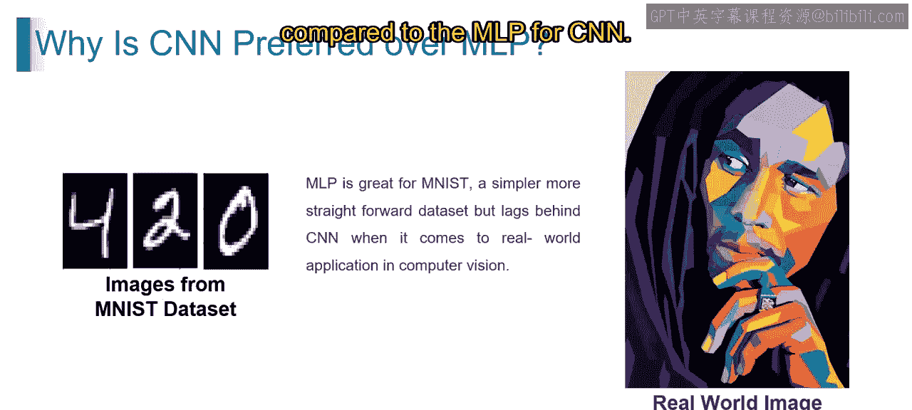
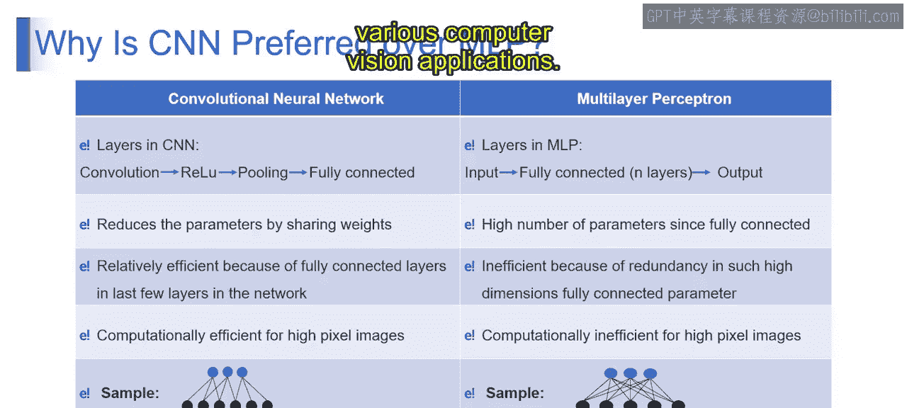
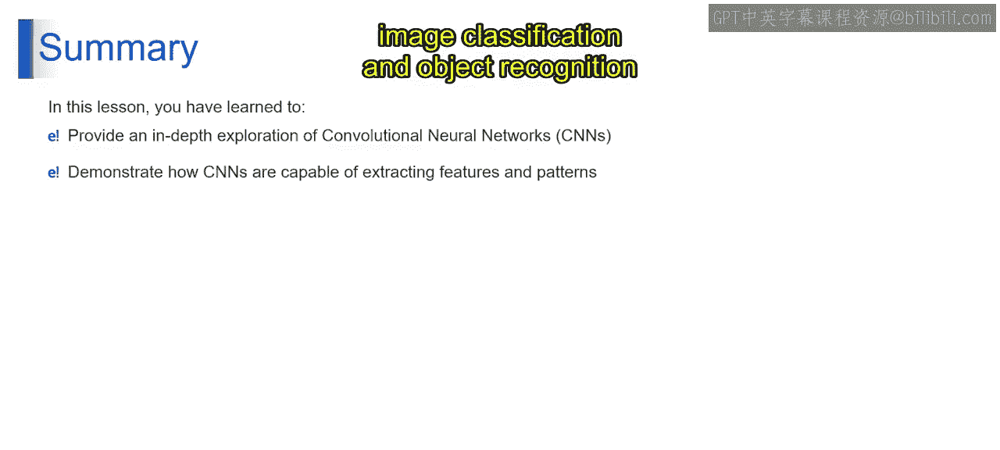

# 第一部分 65：为什么CNN优于MLP 🖼️➡️🧠

在本节课中，我们将探讨在图像分类任务（如MNIST数据集）中，卷积神经网络（CNN）为何比多层感知机（MLP）更受青睐。我们将从两者的基本概念出发，分析CNN在架构和效率上的优势。

---

## 多层感知机（MLP）简介


首先，我们来理解什么是多层感知机。MLP是一种神经网络架构，由多层相互连接的神经元组成，常用于分类和回归等机器学习任务。

**MLP的基本结构**可以表示为：
```
输入层 -> [隐藏层1 -> 隐藏层2 -> ...] -> 输出层
```
其中，每一层的每个神经元都与下一层的所有神经元相连，这被称为全连接。

---

## CNN优于MLP的原因

上一节我们介绍了MLP的基本概念，本节中我们来看看为什么在处理图像数据时，CNN是更好的选择。主要原因有以下几点：

### 1. 空间结构保留

图像数据（如MNIST数据集）具有高维度和像素间的空间关系，因此本质上是复杂的。MLP将每个像素视为独立的特征，忽略了图像的空间结构。相比之下，CNN通过使用卷积层来保留空间信息，这些卷积层能够捕捉相邻像素之间的局部模式和关系。这使得CNN更适合涉及图像数据的任务，因为空间特征在其中扮演着至关重要的角色。

### 2. 特征学习

MLP完全依赖全连接层，这需要大量参数来从原始输入数据中学习复杂特征。对于像图像这样的高维数据，这容易导致过拟合。另一方面，CNN使用卷积层，通过**共享权重**和利用局部连接性，自动从输入图像中学习和提取层次化特征。这有效地捕捉了相关模式，同时减少了参数数量，从而缓解了过拟合并提高了泛化性能。

### 3. 平移不变性

通常，MLP缺乏平移不变性，这意味着它们无法识别图像中不同空间位置的相同模式。相比之下，CNN利用共享权重和池化操作，使其能够检测和识别模式，而不管这些模式在图像中的位置如何。这种平移不变性使CNN对物体位置和方向的变化具有鲁棒性，这对于物体识别和检测等任务至关重要。



### 4. 现实世界适用性

虽然MLP在像MNIST这样的简单数据集上可能表现尚可，但它们通常难以泛化到具有更复杂结构、背景和光照条件变化的现实世界图像数据。CNN在计算机视觉的现实应用中表现出色，例如物体检测、图像分割和人脸识别，在这些任务中，空间关系和局部特征对于准确的分类和分析是必不可少的。

---

## CNN与MLP的架构与效率对比

以上我们探讨了CNN的理论优势，接下来我们通过对比两者的架构和效率来进一步理解。

以下是CNN与MLP在几个关键方面的比较：

**1. 网络层结构**
*   **CNN**：由卷积层（后接激活函数，如ReLU）、池化层和全连接层组成。卷积层从输入图像中提取局部模式，池化层减少空间维度，全连接层组合提取的特征进行分类。
*   **MLP**：主要由全连接层构成，其中一层的每个神经元都与下一层的每个神经元相连。通常包括一个输入层、一个或多个隐藏层和一个输出层。

**2. 参数数量与效率**
*   **CNN**：通过在输入图像的不同区域**共享权重**，并利用局部连接和平移不变性，显著减少了参数数量。这种参数共享减少了冗余，提高了计算效率，尤其适用于高维图像数据。
*   **MLP**：由于其全连接架构，需要大量参数，相邻层之间的每个神经元都相互连接。这种参数冗余可能导致计算效率低下，特别是在处理像图像这样的高维输入数据时。

**3. 计算效率**
*   **CNN**：计算效率高，尤其擅长处理高分辨率图像。得益于其参数共享和局部连接的特性，CNN能够用相对较少的参数有效地捕捉空间关系和层次化特征，使其非常适合图像分类、物体检测和图像分割等任务。
*   **MLP**：在处理高维图像数据时可能变得计算效率低下，因为全连接层需要处理大量参数。这种低效率会导致计算复杂度增加，训练和推理速度变慢。

综上所述，对于涉及图像数据的任务，由于CNN在捕捉空间特征、减少参数冗余和实现计算效率方面的优势，它比MLP更受青睐，使其成为各种计算机视觉应用中不可或缺的工具。

---

## 总结






本节课中，我们一起深入探讨了卷积神经网络（CNN），揭示了其架构以及从图像中提取特征的卷积特性。通过详细分析，我们展示了CNN如何高效地捕捉空间模式和层次化特征，这使其成为计算机视觉领域中图像分类和物体识别等任务不可或缺的工具。理解CNN相对于MLP的优势，是掌握现代图像处理技术的重要一步。