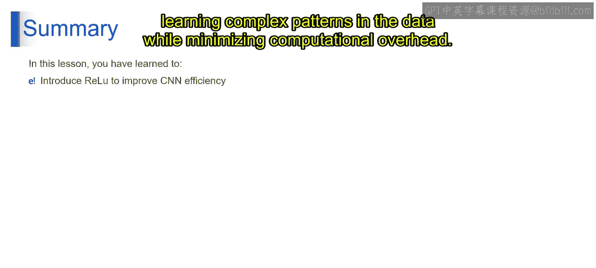

# 第一部分 66：ReLU层 🧠

在本节课中，我们将学习卷积神经网络中的一个关键组件——ReLU层。我们将了解它的定义、工作原理以及在神经网络中引入非线性、提升效率的重要性。

---

上一节我们介绍了卷积操作，本节中我们来看看ReLU层。ReLU是“修正线性单元”的缩写，它是一种激活函数，在神经网络中扮演着至关重要的角色。


## 什么是ReLU？

我们可以通过一个简单的例子来理解ReLU。想象你房间里的调光开关。当开关关闭时（相当于负输入），灯保持熄灭（输出为0）。当你打开开关，即使只开一点点（相当于正输入），灯会立刻亮起，其亮度与输入成正比（输出等于输入）。这个简单的类比反映了ReLU在神经网络中的运作方式。

在神经网络中，ReLU是一种激活函数，它通过直接输出正输入值，而将负输入值置为零，从而引入**非线性**。其数学定义如下：

**公式：** `f(x) = max(0, x)`

其中，`x` 代表输入到ReLU函数的值，`f(x)` 代表输出值。就像调光开关控制灯光亮度一样，ReLU通过引入非线性，帮助控制神经网络中的信息流动，使网络能够学习数据中复杂的模式和关系。它被广泛用于隐藏层，以增加灵活性并提升网络建模复杂函数的能力。

## ReLU层在图像处理中的作用

在图像处理的上下文中，经过卷积等滤波操作后，得到的图像可能同时包含正值和负值。ReLU层的作用就是移除这些负值，将其替换为零。

以下是ReLU层工作的核心步骤：

1.  **输入数据**：我们从一个包含正值和负值的网格（如图像特征图）开始。
2.  **应用激活函数**：将ReLU激活函数应用于这个网格。该函数是逐元素操作的，即独立处理网格中的每个值。
3.  **零化负值**：对于网格中的每个值：
    *   如果值是正数或零，则保持不变。
    *   如果值是负数，则ReLU将其替换为零。
4.  **输出数据**：应用ReLU后，我们得到一个修改后的网格，其中所有负值都变为零，正值保持不变。
5.  **引入非线性**：通过将负值设为零，ReLU在数据中引入了**非线性**。这对于神经网络学习数据中复杂的模式和关系至关重要。
6.  **向前传递**：修改后的、不含负值的网格随后被传递到神经网络的后续层（如池化层、卷积层或全连接层）进行进一步处理。

## ReLU工作流程示例

让我们通过一个具体的网格示例来可视化这个过程。

假设我们有一个2x2的网格，其值如下：

```
[ 0.33, -0.11 ]
[ 0.55, -0.25 ]
```

应用ReLU函数后，所有负值被替换为0：

```
[ 0.33, 0 ]
[ 0.55, 0 ]
```

可以看到，ReLU操作移除了负激活，确保只有正值或零值保留下来。

## ReLU的重要性

ReLU层在神经网络架构中扮演着至关重要的角色，主要体现在以下几点：

*   **引入非线性**：这是其核心功能，使神经网络能够拟合复杂的、非线性的数据关系。
*   **促进稀疏性**：通过将许多神经元的输出置零，ReLU使得网络内部表示变得稀疏，这有助于提升计算效率。
*   **缓解梯度消失**：与某些其他激活函数（如Sigmoid）相比，ReLU在正区间的梯度恒为1，有助于在深层网络中进行更有效的梯度反向传播。
*   **计算高效**：其数学形式（`max(0, x)`）非常简单，计算速度非常快。

---




本节课中我们一起学习了ReLU层。我们了解到，ReLU通过一个简单的`max(0, x)`函数，将神经网络中卷积层输出的负值置零、正值保留。这一操作不仅为网络引入了至关重要的非线性特性，使其能够学习复杂模式，还通过促进稀疏性显著提升了计算效率，是构建现代深度卷积神经网络的基石之一。