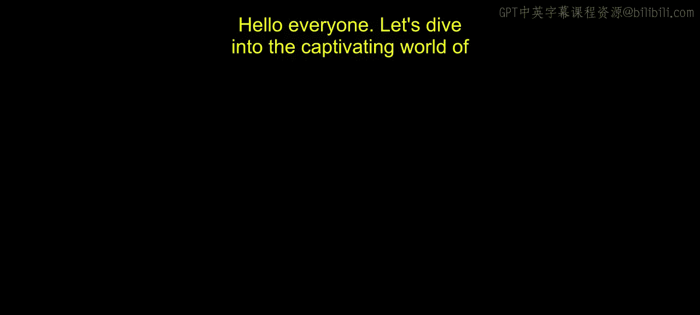
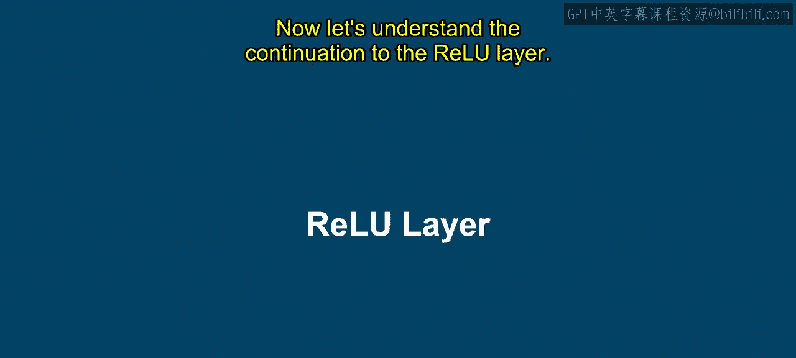
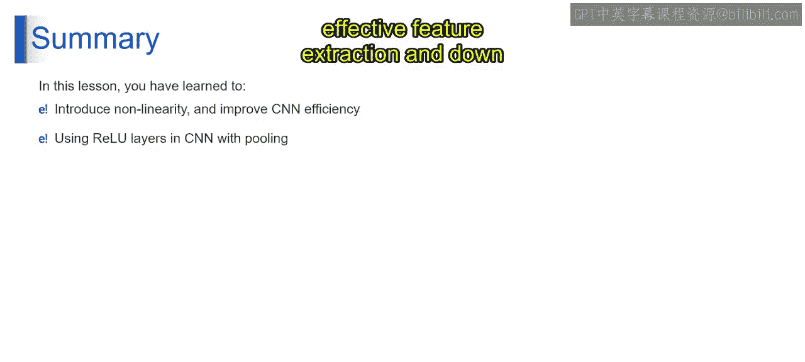

# 第一部分 67：池化操作详解 🧠

在本节课中，我们将学习卷积神经网络中的一个关键步骤——池化操作。我们将重点探讨最大池化的原理、具体操作过程及其在深度学习中的重要作用。

上一节我们介绍了ReLU激活函数，本节中我们来看看池化层，特别是最大池化，如何与ReLU层协同工作，以优化卷积神经网络的性能。

## 理解池化操作

想象你有一张图片，例如一张猫的照片。这张图片尺寸很大，包含许多细节。最大池化的作用类似于“缩小视野”并总结重要特征。

以下是最大池化的具体工作步骤：

首先，它将图片划分成小块。想象将图片分割成一个个小方格，就像一个网格。

对于每个小方格，你选择其中最大的数值。这个数值代表了该小区域内最重要的特征。

在查看了所有方格之后，你通过保留这些最大值来缩小图片。于是，你得到了一张更小但只包含最重要特征的图片。

## 最大池化的技术原理

从技术角度理解，在CNN中，最大池化是一种在卷积层之后应用的下采样操作。其主要目的是减少输入数据的空间维度，从而在保留最重要特征的同时降低计算复杂度。

以下是其具体工作流程：

我们从经过卷积和ReLU激活后的第一张特征图开始。

**第一步：划分窗口**
我们将整个输入图像划分为不重叠的矩形区域（也称为窗口、池化区域或网格）。例如，一个窗口可能包含2x2的像素方格。

**第二步：选取最大值**
对于每个窗口，最大池化操作仅保留该区域内最大的像素值。这个值代表了在该特定区域检测到的最显著特征。

例如，在一个包含数值 `[0.1, 0.33, 0.2, 0.05]` 的窗口中，最大值 `0.33` 将被保留。

**第三步：滑动窗口**
然后，窗口以指定的步长移动到下一个网格区域，重复第二步的选取最大值过程。

**第四步：覆盖全图**
此过程不断重复，直到图像的所有区域都被处理完毕。

## 池化过程示例

假设我们有一个特征图，最大池化窗口大小为2x2，步长为2。

1.  第一个窗口（左上角2x2区域）中的最高值是 `1`。我们保留 `1`。
2.  窗口向右移动两个步长。下一个2x2区域中的最高值是 `0.55`。我们保留 `0.55`。
3.  窗口向下移动两个步长。对应区域中的最高值是 `1`。我们保留 `1`。
4.  继续此过程，直到覆盖整个图像。

在某些情况下，如果图像尺寸不能被窗口大小整除，可能会通过填充等方式处理边界。最终，一个4x4像素的图像可能被池化为一个2x2像素的图像。

## 池化的优势与作用

通过反复应用具有适当窗口大小和步长的池化操作，图像尺寸被逐步缩小。在此过程中，空间维度得以减少。

**保留关键特征：** 尽管图像尺寸减小，但代表原始图像中最显著特征的较高像素值得以保留。这是因为每个窗口内的最大像素值有效地保留了最重要的信息，同时丢弃了不太相关的细节。

**处理大图像：** 当处理诸如1000x1000像素或更大尺寸的大型图像时，最大池化表现得非常出色。它通过逐步下采样图像同时保留基本特征，有助于管理处理大图像时相关的计算复杂性和内存需求。

**提升网络性能：** 这使得网络能够专注于输入中最相关的方面，同时降低过拟合的风险，并提高计算效率。

## 总结 📝

本节课中我们一起学习了池化操作，特别是最大池化。

我们了解到，对图像重复应用最大池化会产生一个保留了高像素值的下采样表示，这使其在处理深度学习任务中的大规模图像时具有优势。最大池化算子的引入，通过促进卷积神经网络中有效的特征提取和下采样，增强了CNN的效率和性能。

总而言之，最大池化是构建高效、强大卷积神经网络的关键组件之一。