# 第一部分 68：ReLU层的实现 🧠

在本节课中，我们将学习如何使用TensorFlow和Keras，在一个实际的图像分类任务中实现ReLU激活层。我们将使用CIFAR-10数据集来构建一个卷积神经网络，并观察ReLU层在模型中的作用。

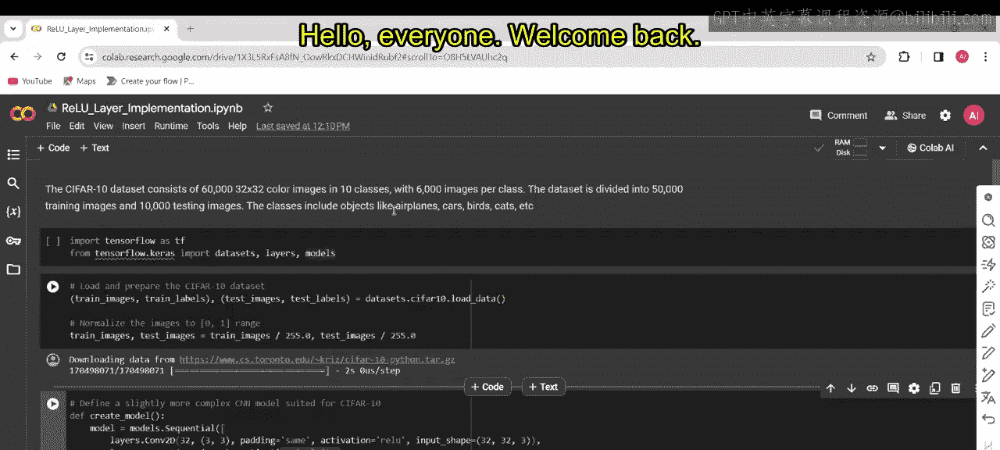

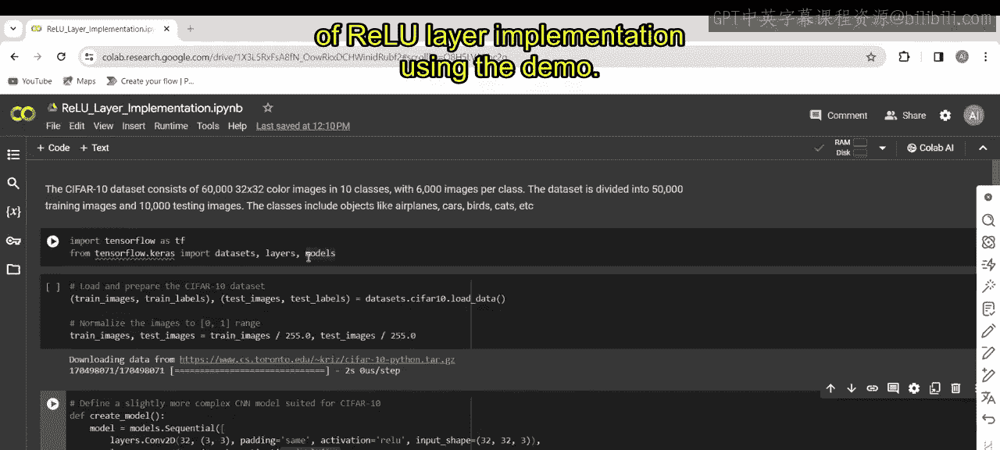

---

### 概述

我们将通过一个完整的代码示例，演示如何加载数据、构建包含ReLU层的CNN模型、训练模型并评估其性能。核心在于理解ReLU函数 `f(x) = max(0, x)` 在神经网络中如何引入非线性，帮助模型学习复杂模式。

---

### CIFAR-10数据集介绍

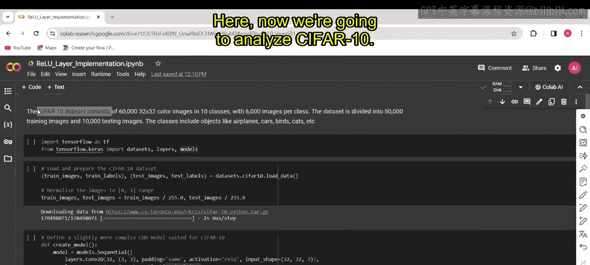

上一节我们介绍了激活函数的概念，本节中我们来看看如何在一个具体任务中应用ReLU。首先，我们需要了解所使用的数据。

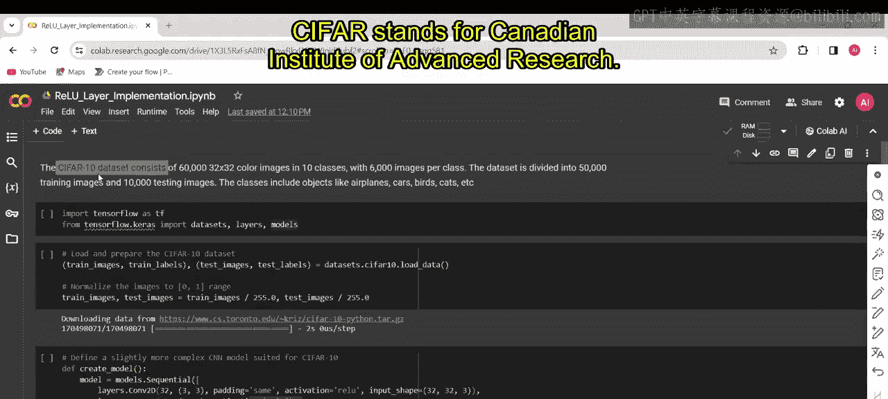

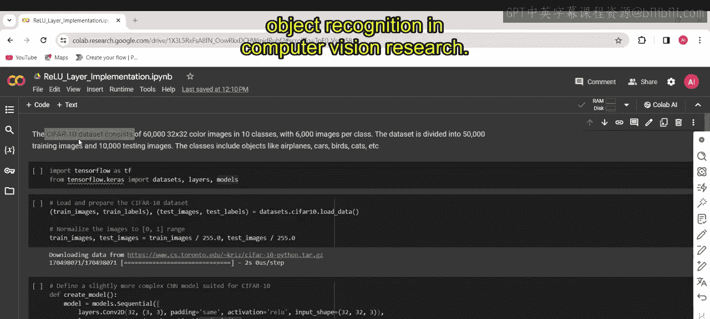

CIFAR-10（加拿大高级研究所10类数据集）是一个用于计算机视觉研究的经典数据集。它包含6万张32x32像素的彩色图像，分为10个类别，每个类别有6000张图像。该数据集常被用作图像分类任务的基准，涵盖飞机、汽车、鸟类、猫等多种常见物体。

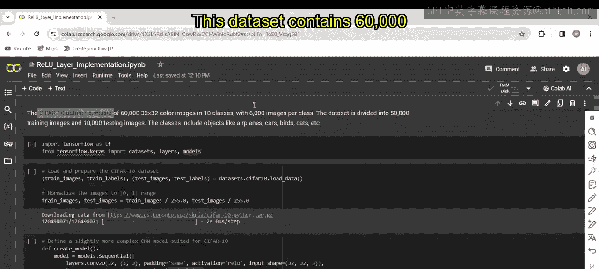

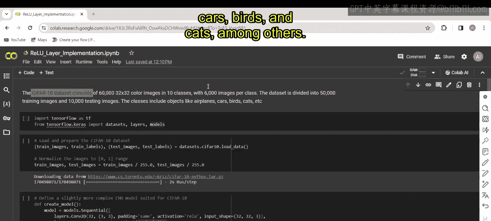

---

### 代码实现步骤

以下是构建和训练模型的完整步骤，我们将分块解析代码。

#### 1. 导入必要的库

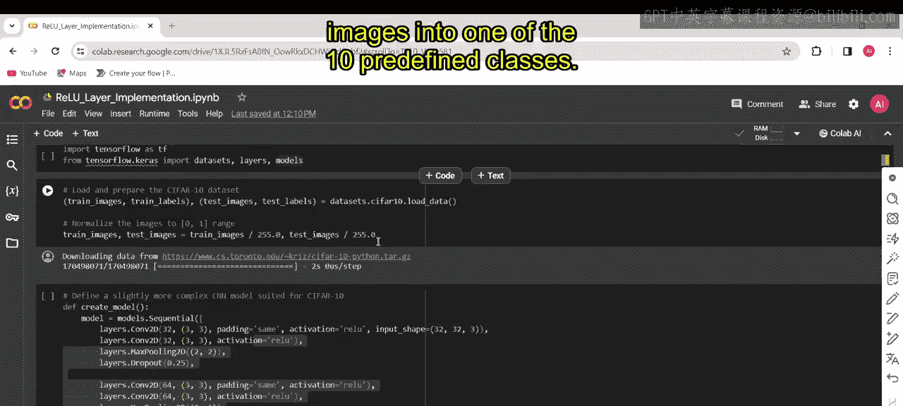

第一步是导入TensorFlow和Keras API，它们提供了构建神经网络所需的工具和模块。

```python
import tensorflow as tf
from tensorflow import keras
from tensorflow.keras import layers, datasets
```

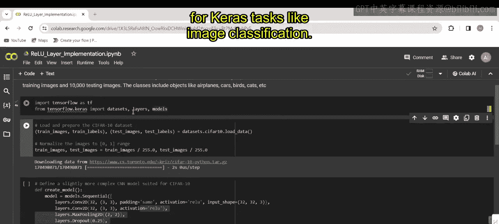

#### 2. 加载与预处理数据

接下来，我们加载CIFAR-10数据集，并将其分为训练集和测试集。同时，对图像像素值进行归一化处理，将其缩放到[0, 1]区间，这是一种常见的预处理步骤，有助于模型训练。

```python
# 第一部分 加载CIFAR-10数据
(train_images, train_labels), (test_images, test_labels) = datasets.cifar10.load_data()

# 第一部分 归一化像素值
train_images, test_images = train_images / 255.0, test_images / 255.0
```

#### 3. 构建CNN模型架构

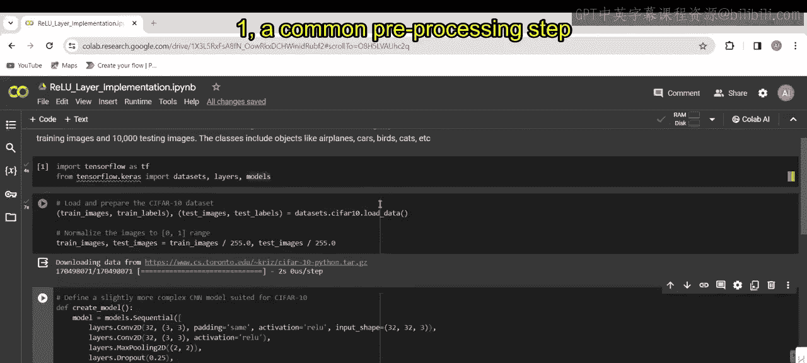

现在，我们构建一个适用于CIFAR-10分类的卷积神经网络。该架构包含多个卷积层、ReLU激活层、最大池化层以及Dropout正则化层。模型最后是全连接层，其中最终的密集层有10个神经元，对应数据集的10个类别。

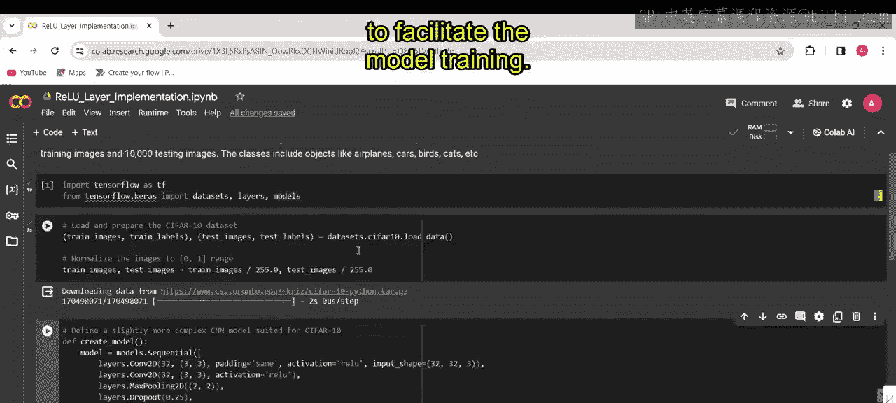

以下是模型架构的核心部分，展示了ReLU层的使用：

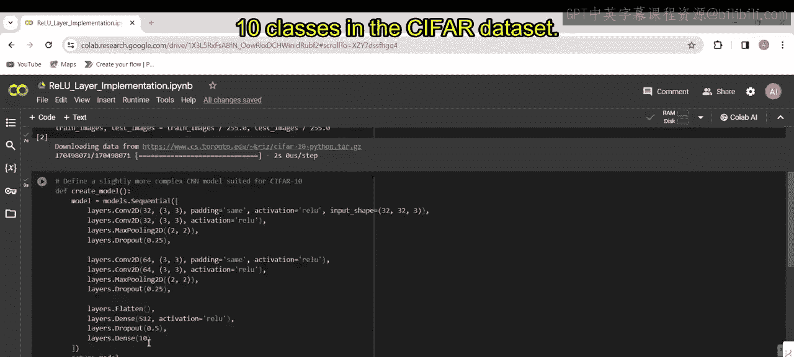

```python
model = keras.Sequential([
    # 第一个卷积块
    layers.Conv2D(32, (3, 3), activation='relu', input_shape=(32, 32, 3)),
    layers.MaxPooling2D((2, 2)),
    
    # 第二个卷积块
    layers.Conv2D(64, (3, 3), activation='relu'),
    layers.MaxPooling2D((2, 2)),
    
    # 第三个卷积块
    layers.Conv2D(64, (3, 3), activation='relu'),
    
    # 展平层与全连接层
    layers.Flatten(),
    layers.Dense(64, activation='relu'),
    layers.Dropout(0.5),  # Dropout正则化
    layers.Dense(10)      # 输出层，10个类别
])
```

#### 4. 编译与训练模型

模型构建完成后，我们需要编译它。这里使用Adam优化器、稀疏分类交叉熵损失函数，并以准确率作为评估指标。随后，在训练数据上对模型进行5个轮次的训练，并在测试集上进行验证。

```python
# 第一部分 编译模型
model.compile(optimizer='adam',
              loss=tf.keras.losses.SparseCategoricalCrossentropy(from_logits=True),
              metrics=['accuracy'])

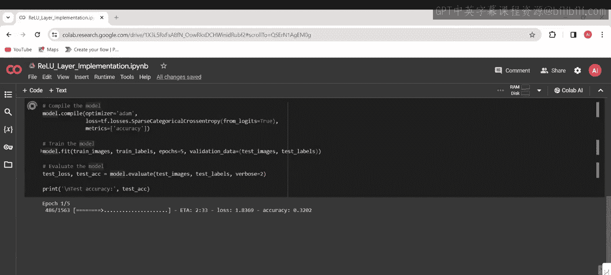

# 第一部分 训练模型
history = model.fit(train_images, train_labels, epochs=5,
                    validation_data=(test_images, test_labels))
```

#### 5. 评估模型性能

训练结束后，我们在独立的测试数据集上评估模型的最终性能，计算其分类准确率。

```python
# 第一部分 评估模型
test_loss, test_acc = model.evaluate(test_images, test_labels, verbose=2)
print(f'\n测试准确率: {test_acc}')
```

由于训练神经网络涉及大量的矩阵运算和参数优化，这个过程可能需要一些时间。模型需要在多个轮次中进行前向传播和反向传播来调整权重，评估阶段也需要对大量测试样本进行预测。

---

### 结果

运行上述代码后，模型在CIFAR-10测试集上达到了约0.74（即74%）的准确率。这个结果展示了我们构建的包含ReLU层的CNN模型能够有效地学习图像特征并进行分类。

---

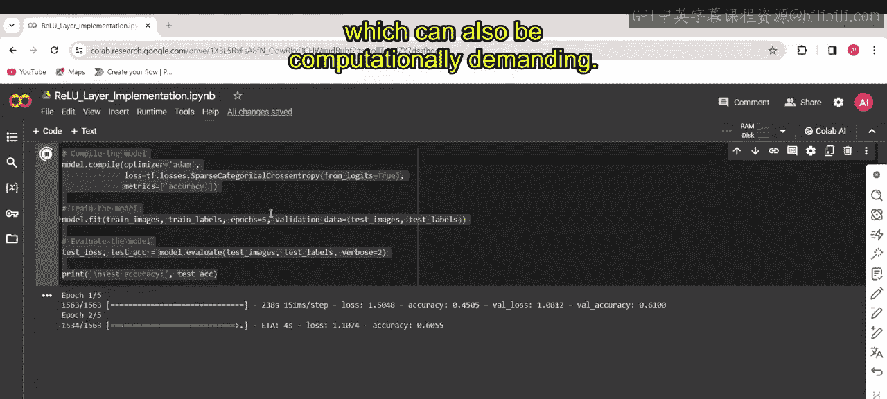

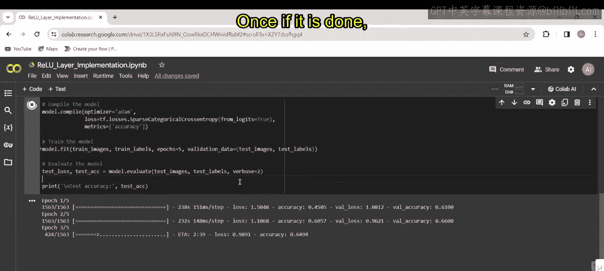

### 总结

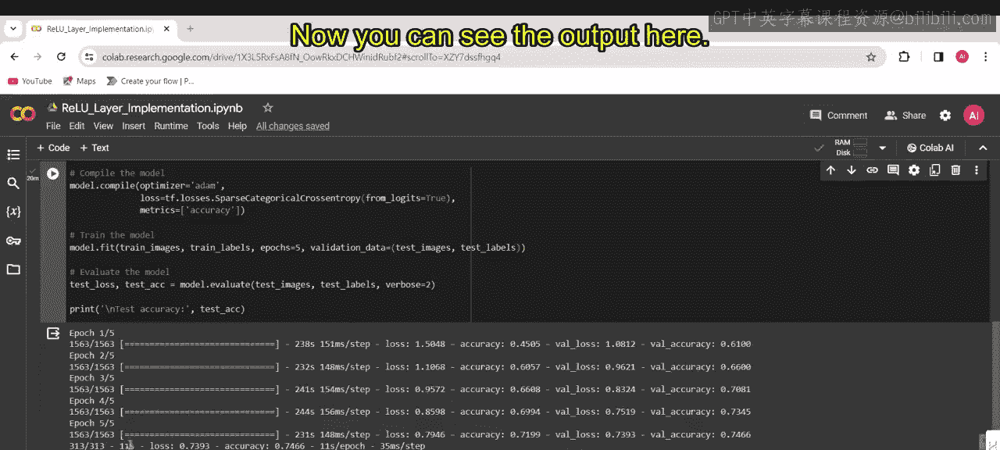

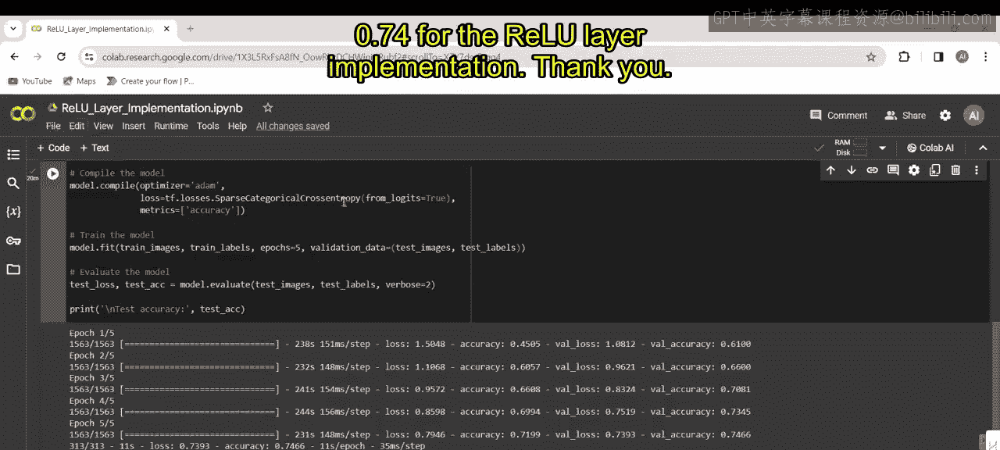

本节课中我们一起学习了ReLU激活层的实际应用。我们从介绍CIFAR-10数据集开始，逐步完成了数据加载、预处理、CNN模型构建（重点集成了ReLU激活函数）、模型编译与训练，以及最终的性能评估。通过这个实践案例，你应当理解了ReLU层如何在深度学习模型中引入非线性，从而帮助网络学习更复杂的模式。这个流程是构建大多数图像分类模型的基础。