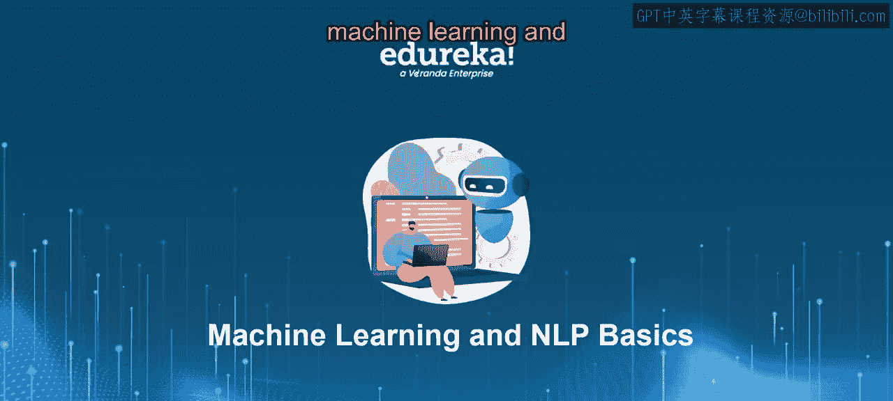
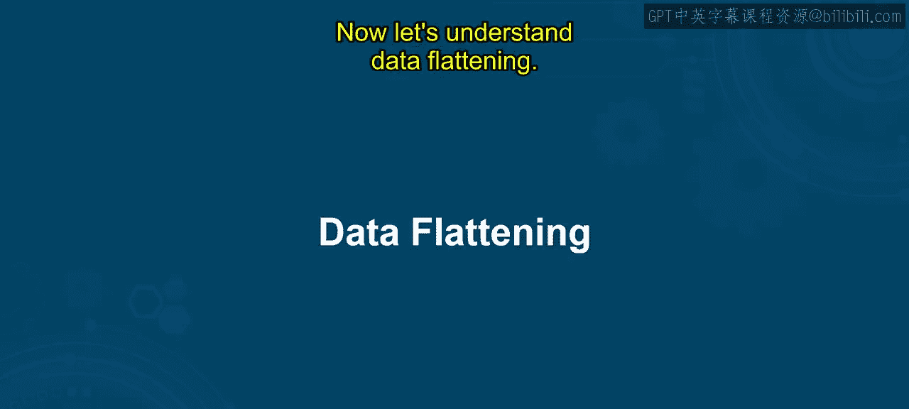
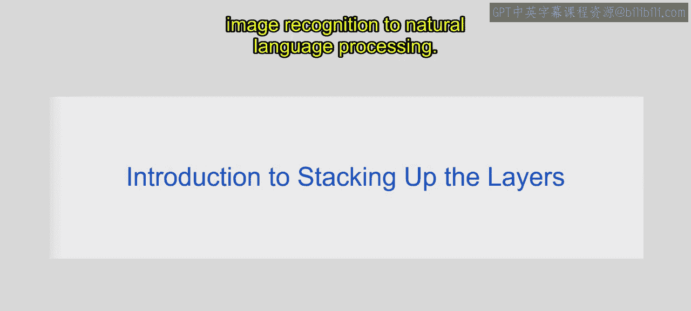
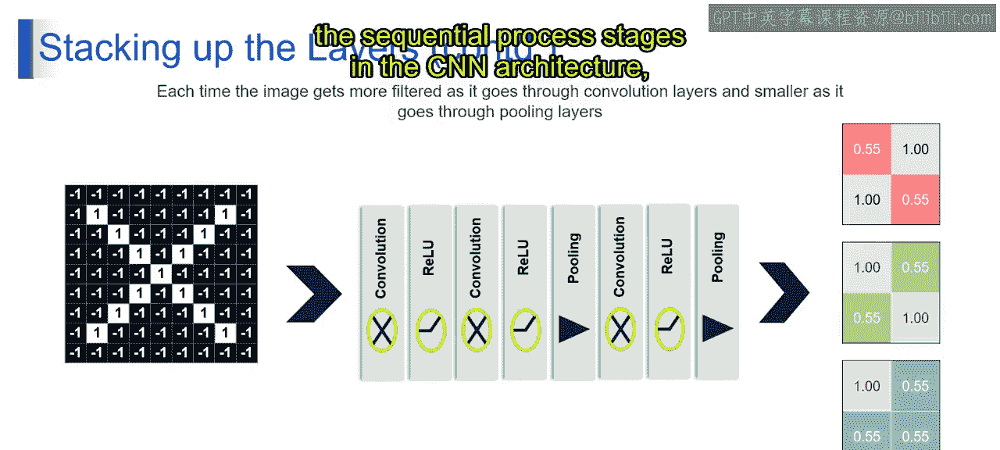

# 第一部分 69：数据展平

在本节课中，我们将一起学习机器学习和自然语言处理的基础概念。我们将重点探讨神经网络中的层堆叠与数据展平操作。通过本节内容，你将理解如何将多维数据转换为一维数组，并掌握数据展平在神经网络中的重要性。

## 层堆叠介绍

首先，我们来理解什么是层堆叠。

想象一下，你正在用积木搭建一座塔。每一块积木代表你神经网络中的一层。你从底层开始，然后在其上方添加更多积木，以建造一座更高、更完整的塔。








类似地，在神经网络中，你从输入数据开始，然后在其上逐层叠加，以创建一个更深的网络。具体来说，这里发生的是：你从基础层（在我们的例子中就是输入数据）开始，然后在其上相互叠加各层，以构建一个更深的网络。

现在，让我们深入技术层面的理解。

### 神经网络中的层堆叠

在神经网络中堆叠层，指的是将多个层相互叠加以形成深层架构的过程。这些层可以包括各种类型，例如：

*   **卷积层**
*   **池化层**
*   **全连接层**
*   **激活层**

每一层在从提供的输入数据中提取特征和学习表示方面都服务于特定目的。

在这个例子中，考虑一个用于图像分类的前馈神经网络。你从表示图像像素值的输入层开始。然后，你添加一个或多个隐藏层，其中每一层都对输入数据应用变换，逐步提取更高级的特征。最后，你有一个输出层，它产生预测的类别概率。

从技术上讲，堆叠层涉及将每一层的神经元排列成一个序列，其中一层的输出作为下一层的输入。这种顺序排列允许网络学习输入数据的分层表示，每一层捕获不同层次的抽象，就像用积木搭建一座塔一样。

神经网络中的层堆叠涉及将层一层一层地叠加起来，以创建更深的架构。每一层都增加了网络的整体复杂性和容量，使其能够学习数据中复杂的模式和关系。这意味着，层堆叠是神经网络设计的一个基本概念，通过顺序添加层来创建一个能够从输入数据中学习复杂表示的深层架构。这个过程使神经网络能够解决从图像识别到自然语言处理的各种任务。



上图展示了这个过程的具体形式。让我们使用图像，更深入地探讨卷积神经网络中每个处理阶段。

### 卷积神经网络处理阶段详解

以下是卷积神经网络中数据处理的几个关键阶段：

**1. 卷积**

卷积是CNN中的第一个处理阶段。它涉及将小的滤波器或内核应用于输入图像，以提取图像中的各种特征。在提供的图像中，黑白网格代表输入图像，其中黑色方块代表-1，白色方块代表+1。由网格中的数字表示的滤波器在输入图像上滑动，在每个位置计算点积。生成的输出网格描绘了通过滤波器与输入图像卷积生成的特征图。这些特征图捕获了输入数据的不同方面，例如边缘、纹理或形状。

**2. ReLU（线性整流单元）**

ReLU是一种在卷积层之后应用的激活函数。它通过将负值替换为零并保持正值不变，将非线性引入网络。在提供的图像中，来自卷积阶段的输出网格通过ReLU层，产生修改后的特征图，其中负值被设置为0，正值保持不变。ReLU激活有助于网络学习更复杂的模式，并提高其捕获数据中非线性关系的能力。

**3. 池化**

池化是一种下采样操作，可减少卷积层生成的特征图的维度。在提供的图像中，来自ReLU层的输出网格经过池化处理，这涉及将每个特征图划分为不重叠的区域，并使用池化操作（如最大池化、平均池化或求和池化）对它们进行汇总。生成的输出网格代表池化后的特征图，与原始特征图相比，其空间维度减小了。这有助于控制过拟合并提高计算效率。

总的来说，该图说明了CNN架构中从卷积到ReLU激活再到池化的顺序处理阶段。接下来的视频将进一步深入正在进行的讨论。





## 数据展平介绍

上一节我们介绍了神经网络中层的堆叠，特别是卷积和池化操作如何提取并压缩特征。然而，这些操作输出的通常是二维或三维的特征图。为了将这些特征输入到后续的全连接层进行分类或回归，我们需要将它们转换为一维数组。这个过程就是数据展平。

数据展平是将多维数组（例如矩阵或张量）转换为一维数组的过程。在神经网络中，这通常在卷积层和池化层之后、全连接层之前进行。

### 为什么需要展平？

全连接层要求输入数据是一维的。每个神经元都与前一层的所有神经元相连，因此需要一个扁平的输入向量。展平操作将多维特征图“拉平”成一个长向量，以便全连接层可以处理。

### 展平如何工作？

假设我们有一个池化层输出的特征图，其形状为 `(height, width, channels)`。展平操作会按顺序（通常是逐行、逐通道）将这个三维数组中的所有元素排列成一个一维向量。

**公式表示：**
如果输入特征图的形状是 `(H, W, C)`，其中 H 是高度，W 是宽度，C 是通道数，那么展平后的一维向量的长度 `L` 为：
`L = H * W * C`

**代码示例（使用伪代码）：**
```
// 假设有一个2x2x3的特征图（高2，宽2，通道3）
feature_map = [
    [ [1, 2, 3], [4, 5, 6] ], // 第一行像素的两个位置，每个位置有3个通道的值
    [ [7, 8, 9], [10, 11, 12] ] // 第二行像素的两个位置
]

// 展平操作
flattened_vector = []
for each row in feature_map:
    for each column in row:
        for each channel value in column:
            flattened_vector.append(channel_value)

// 结果：flattened_vector = [1, 2, 3, 4, 5, 6, 7, 8, 9, 10, 11, 12]
// 长度 L = 2 * 2 * 3 = 12
```

### 展平的意义

1.  **连接不同架构**：它是连接卷积/池化层（处理空间数据）和全连接层（进行最终决策）的桥梁。
2.  **简化数据**：将复杂的多维结构简化为线性序列，便于全连接层进行加权求和等计算。
3.  **信息保留**：虽然改变了数据的形状，但保留了所有提取出的特征信息。

在典型的CNN架构中，流程可以概括为：
`输入图像 -> 卷积层 -> ReLU激活 -> 池化层 -> [可能重复卷积/池化] -> 展平层 -> 全连接层 -> 输出层`

## 总结

在本节课中，我们一起学习了神经网络中的两个基础但至关重要的概念：**层堆叠**与**数据展平**。

我们首先了解了层堆叠，它如同用积木搭建高塔，通过将输入层、隐藏层（如卷积层、池化层）和输出层顺序连接，构建出能够学习数据分层抽象表示的深层网络架构。

接着，我们探讨了数据展平。在卷积神经网络中，经过卷积和池化处理后的数据是多维特征图。为了将其输入到全连接层进行最终的任务处理（如图像分类），必须将这些多维数据转换为一维向量。展平操作正是完成这一转换的关键步骤，它确保了信息在不同类型的网络层之间有效传递。


掌握层堆叠与数据展平，是理解现代深度学习模型，尤其是卷积神经网络如何工作的基石。