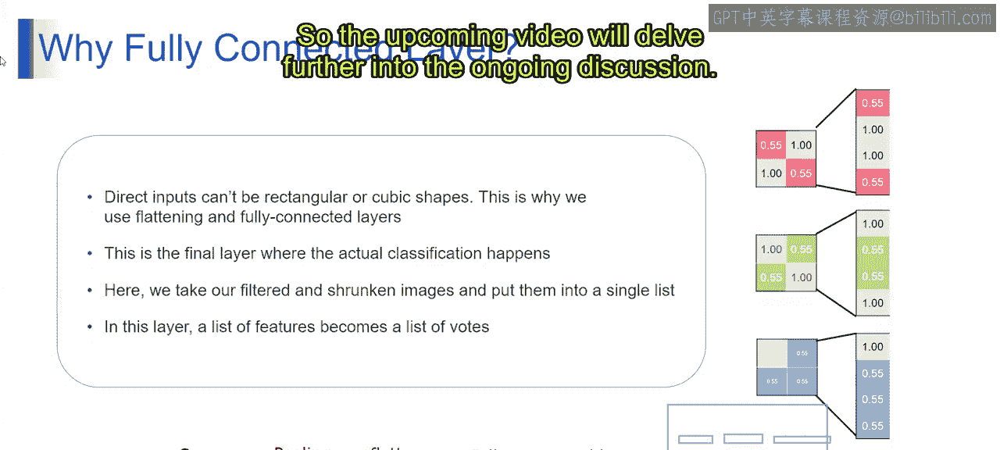

# 第一部分 72：全连接层 🧠

在本节课中，我们将一起学习机器学习和自然语言处理的基础概念。我们将重点探讨神经网络中的一个关键组成部分——全连接层。我们将了解它的作用、工作原理以及它在整个模型架构中的重要性。

---

## 为什么需要全连接层？

在深入理解全连接层之前，我们先来看看为什么需要它。想象一下，你正在举办一个派对，你想邀请来自不同社交圈的朋友，比如同事、同学和运动伙伴。你手头有来自每个圈子的独立好友名单。

为了确保每个人都被邀请，你需要创建一个总名单，将所有圈子的朋友都列在一起。这个总名单就代表了一个全连接的朋友网络，其中每个朋友都与其他所有朋友相连，无论他们原本属于哪个社交圈子。

---

## 什么是全连接层？

从技术定义上讲，**全连接层**是神经网络中的一种层，其中每个神经元都与前一层的所有神经元相连接。

换句话说，全连接层中的每个神经元都接收来自前一层所有神经元的输入，并产生一个输出，该输出会传递给后续层的所有神经元。

简单来说，假设这些是我的输入层，这些是我的输出层。现在，所有输入层的输入都将连接到所有输出层。

一个全连接层的特征在于，它有一个连接输入神经元和输出神经元的权重矩阵。全连接层中的每个神经元都有自己的一组权重，该层的输出计算为输入的加权和加上偏置，然后通过激活函数处理。

**公式表示**：
`输出 = 激活函数(权重 * 输入 + 偏置)`

---

## 全连接层如何工作？

上一节我们介绍了全连接层的定义，本节中我们来看看它是如何具体工作的。

卷积层和池化层（我们在上一个模块中已了解）通常以多维数组或特征图的形式处理输入数据。然而，全连接层需要一维向量格式的输入。

这意味着，展平层用于将卷积层和池化层的多维输出转换为线性向量。然后，全连接层可以接收这个展平后的向量作为输入。

全连接层通常是神经网络架构中的最后一层，尤其是在分类任务中。在输入数据通过卷积层和池化层后，展平后的特征向量被传递到全连接层。

以下是具体过程：
1.  通过卷积和池化层处理输入数据（如果适用）。
2.  经过特征提取和降维后，特征图被展平成一个一维列表。这个列表代表了从输入图像中处理和抽象出来的特征。
3.  在**全连接层**中，这个特征列表变成了一个“单词”列表。该层中的每个神经元都接收来自前一层每个神经元的输入，这代表了一套全面的特征。
4.  全连接层中的每个神经元通过学习到的权重和偏置，为特定的类别或结果“投票”，从而参与到决策过程中。
5.  全连接层的输出代表了网络的预测或分类决策，每个神经元的激活状态都贡献于最终的结果。

正因为如此，全连接层在神经网络中至关重要。

---

## 总结

本节课中，我们一起学习了全连接层。我们首先通过一个比喻理解了它的必要性，然后探讨了它的技术定义和工作原理。全连接层作为神经网络的“决策中心”，将前面各层提取和抽象的特征进行整合，最终输出分类或预测结果。它是连接特征提取与最终任务（如分类）的关键桥梁。

接下来的课程将继续深入这一主题。