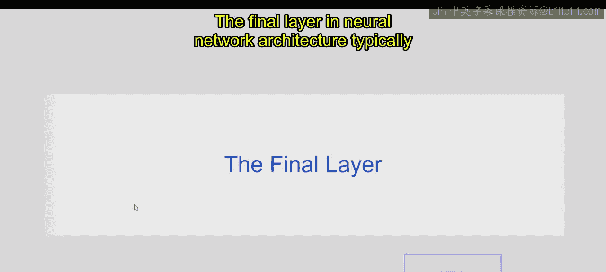
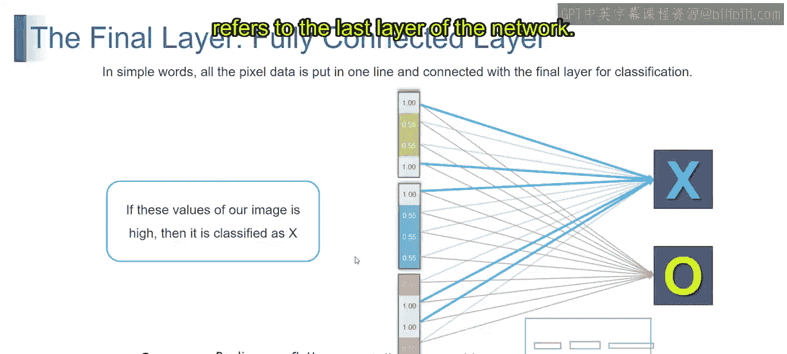
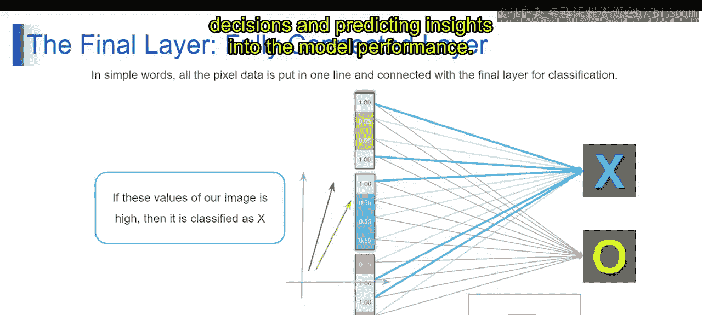
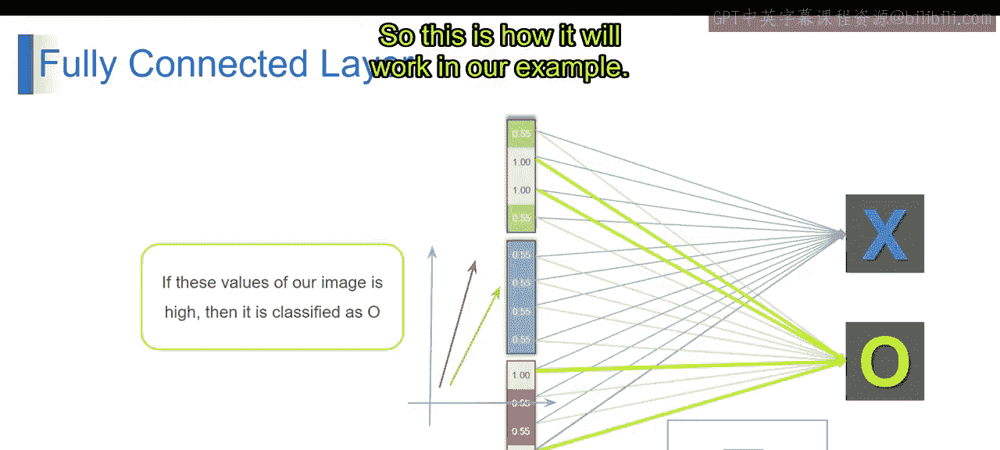
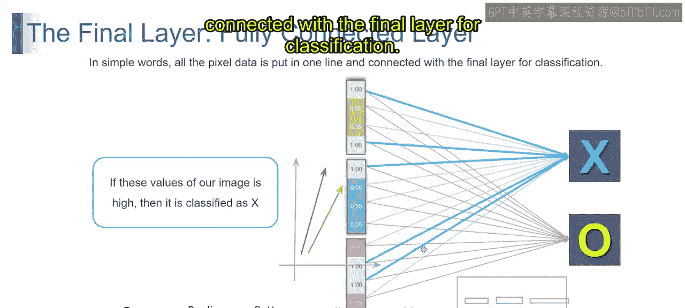
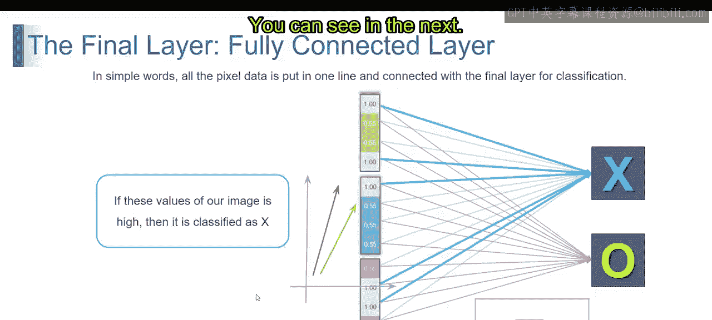
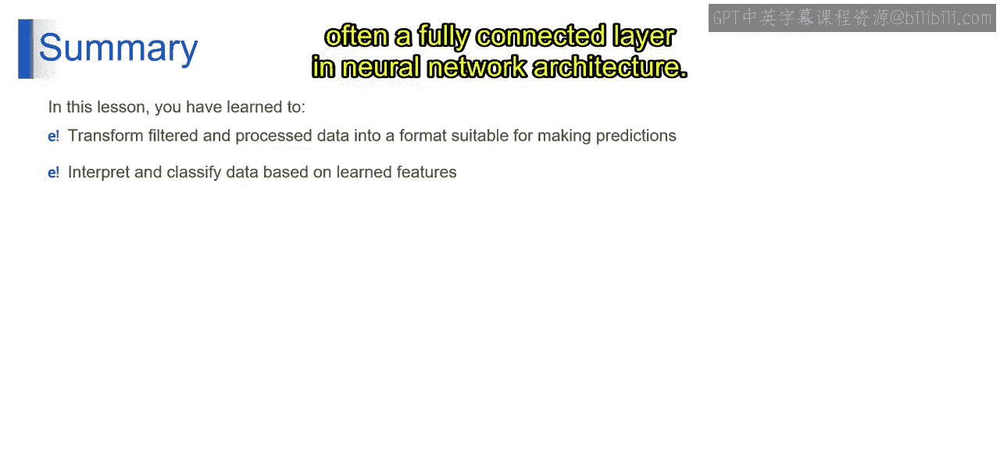

# 第一部分 73：最后一层

## 概述

在本节中，我们将探讨神经网络架构中的最后一层。我们将了解它的定义、关键组成部分以及在分类任务中的核心作用。通过理解最后一层，你将掌握神经网络如何将处理后的数据转化为最终的预测结果。

---

## 最后一层的定义与作用

上一节我们介绍了神经网络中数据的处理流程，本节中我们来看看整个流程的终点——最后一层。

神经网络架构中的最后一层，指的是网络的最后一层。它基于处理后的输入数据，产生最终的输出或预测。在分类任务中，最后一层通常由一个或多个神经元组成，每个神经元代表一个类别标签。

以下是最后一层的几个关键点：

*   **决策制定**：最后一层负责基于从输入数据中提取的特征，做出最终的决策或预测。
*   **激活函数**：在分类任务中，最后一层使用的激活函数取决于具体问题的需求。对于二分类任务，可能使用 **Sigmoid** 激活函数来预测0到1之间的概率。其公式为：
    `σ(x) = 1 / (1 + e^(-x))`
    对于多分类任务，通常使用 **Softmax** 激活函数来生成所有类别概率之和为1的输出。其公式为：
    `softmax(x_i) = e^(x_i) / Σ_j e^(x_j)`
*   **损失函数**：最后一层与一个损失函数相关联，该函数用于衡量预测输出与真实标签之间的差异。例如，交叉熵损失函数。在训练过程中，网络通过调整权重和偏置来最小化这个损失函数，从而提高预测的准确性。
*   **输出格式**：最后一层的输出格式取决于任务的性质。对于二分类任务，最后一层可能只包含一个神经元，用于预测一个概率分数。对于多分类任务，最后一层可能包含多个神经元，每个神经元为不同的类别生成一个概率分数。
*   **可解释性**：最后一层的输出可以以多种方式解释。在分类中，预测的类别标签或概率分数可以让我们了解模型的决策过程及其对预测结果的置信度。

总而言之，最后一层是神经网络架构的终点，它基于处理后的输入数据产生最终的输出或预测。它在分类任务中扮演着至关重要的角色，通过做出决策和预测，为我们提供了洞察模型性能的窗口。

---

## 最后一层的工作机制

正如我们所讨论的，最后一层（通常是一个全连接层）是神经网络在进行预测之前的最后阶段。简单来说，它接收来自前面所有层的数据（例如图像的所有像素值），并将它们排列成一条直线。

这种将数据“扁平化”的操作，是为了将处理后的特征连接到最后层进行分类。在我们的示例中，这个过程可以这样理解：所有像素数据被排成一行，并与最后一层相连以进行分类。

如果图像中对应“X”的像素值很高，网络就会将这些信息分类为“X”。你可以看到，它通过加粗的蓝线连接了值为1的像素，并输出“X”。

反之，如果图像中对应“O”的像素值很低（或模式不同），网络就会将输出分类为“O”。

这就是最后一层在分类任务中的基本工作机制。

---

## 总结

本节课中，我们一起学习了神经网络中最后一层的核心概念。你掌握了如何将经过过滤和处理的数据（例如扁平化的特征向量）转换为适合进行预测的格式。此外，你还深入了解了如何基于学习到的特征来解释和分类数据，特别是通过神经网络架构中的最后一层（通常是全连接层）来实现这一过程。