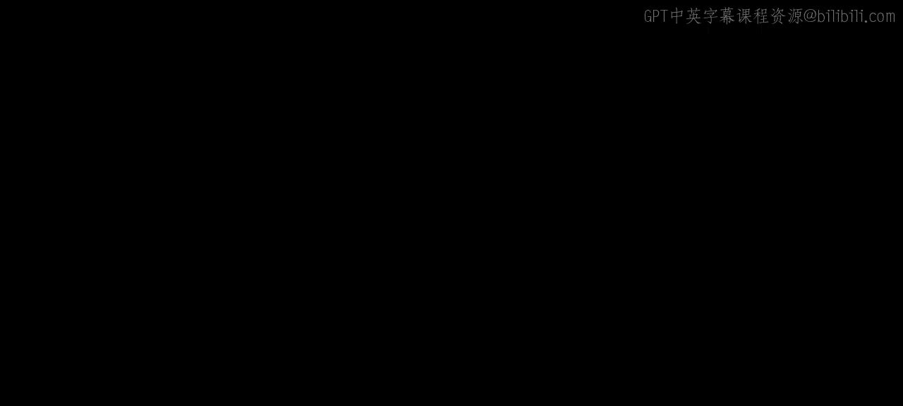
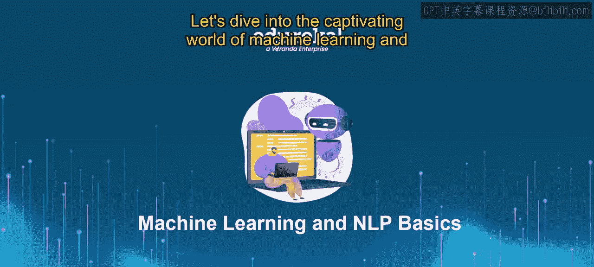
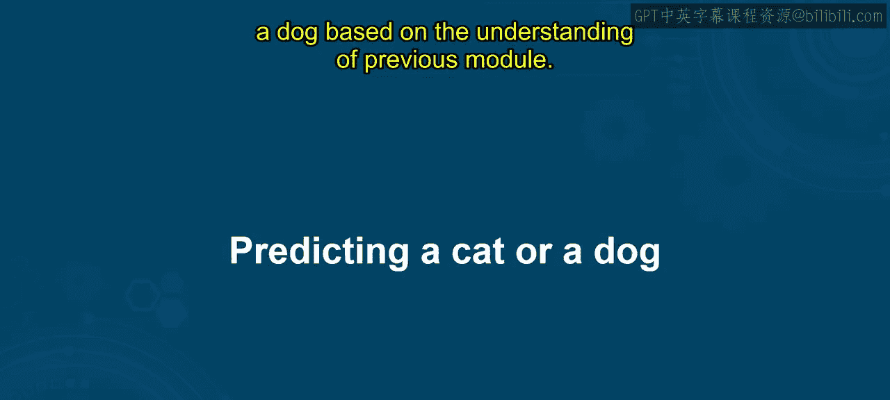
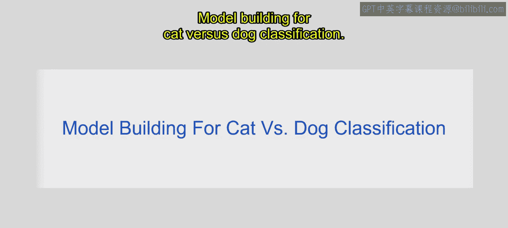
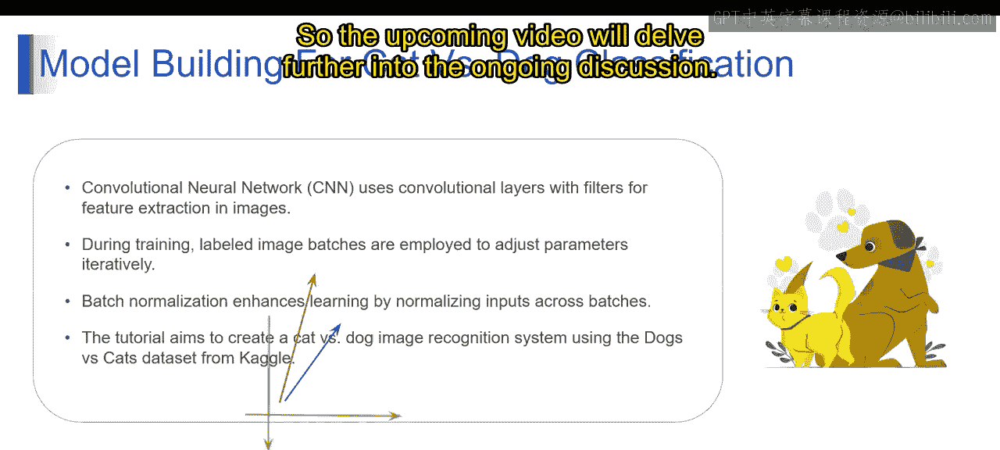

# 第一部分 74：预测猫或狗 🐱🐶

在本节课中，我们将学习如何构建一个机器学习模型，用于识别图像中是猫还是狗。这是一个典型的图像分类任务，我们将使用卷积神经网络（CNN）来完成。通过本课，你将能够理解构建一个专门用于猫狗图像分类的CNN模型的全过程。

## 概述

我们将从理论部分开始，解释构建猫狗分类模型的六个关键步骤，然后会涉及实践示例。整个过程包括数据收集与预处理、模型架构设计、训练、验证、测试评估以及最终部署。

---



## 模型构建步骤详解







上一节我们介绍了本课的目标，本节中我们来看看构建猫狗分类CNN模型的具体步骤。整个过程包含六个核心环节。

以下是构建模型的六个步骤：

1.  **数据收集与预处理**
2.  **模型架构设计**
3.  **训练**
4.  **验证与调优**
5.  **测试与评估**
6.  **部署**

接下来，我们将逐一详细解释每个步骤。

### 1. 数据收集与预处理

第一步是收集包含猫和狗图像的数据集。收集到数据后，需要进行预处理，以确保所有图像在尺寸、颜色和质量上保持一致。

预处理操作可能包括：
*   **调整尺寸**：将所有图像缩放到统一尺寸。
*   **归一化**：将像素值标准化到特定范围（如0到1之间）。
*   **数据增强**：通过旋转、翻转、缩放等技术增加数据多样性，提高模型泛化能力。

### 2. 模型架构设计

在完成数据准备后，下一步是设计CNN的架构。这涉及到决定卷积层、池化层和全连接层的数量与配置。

*   **卷积层**：其核心作用是使用过滤器从输入图像中提取重要特征。公式可以简化为：`特征图 = 卷积(输入图像, 过滤器) + 偏置`。
*   **池化层**：对特征图进行下采样，降低数据维度，同时保留关键信息。最大池化是常用方法。
*   **全连接层**：将前面提取到的特征整合起来，并最终输出分类结果（猫或狗）。

### 3. 训练

模型架构设计完成后，即可开始训练。我们使用预处理后的数据集来训练模型，通过优化算法不断调整模型参数，以最小化预测误差。

训练中常用的优化技术包括：
*   **随机梯度下降**：一种优化算法，用于通过计算小批量随机数据上的梯度来迭代更新模型参数，从而最小化损失函数。损失函数衡量的是预测值与真实值之间的差异。
*   **Adam优化器**：SGD的一种变体，它为每个参数计算自适应的学习率，结合了动量和RMSProp的优点，通常能实现更快的收敛和更好的泛化效果。

对于猫狗分类这样的多分类问题，常用的损失函数是**分类交叉熵**。

### 4. 验证与调优

模型训练完成后，需要使用一个独立的验证数据集来评估其性能。根据验证结果，我们需要调整模型的超参数。

需要调优的超参数可能包括：
*   学习率
*   批次大小
*   网络层配置（如过滤器数量、层数）

调优的目的是优化模型性能，并防止**过拟合**（即模型在训练集上表现很好，但在新数据上表现不佳）。

### 5. 测试与评估

模型经过训练和调优后，将在一个从未见过的测试数据集上进行最终测试，以评估其真正的泛化能力。

常用的评估指标有：
*   **准确率**：正确预测的样本比例。
*   **精确率**
*   **召回率**
*   **F1分数**

### 6. 部署

最后，训练好的模型可以部署到生产环境中，供实际应用。部署后，需要持续监控模型性能，并定期用新数据重新训练，以适应数据分布可能发生的变化。

---

## 核心概念：批归一化

在CNN训练过程中，**批归一化**是一项重要技术，用于提升模型的学习效果。它通过对每个批次的输入进行归一化处理，稳定层间激活值的分布。

批归一化的好处包括：
*   有助于防止梯度消失或爆炸问题。
*   可以加快模型的收敛速度。
*   通常能带来更好的模型性能。

其操作可以简要描述为：对每一批数据，先进行标准化（减去均值，除以标准差），然后进行缩放和平移。

```python
# 第一部分 批归一化的简化概念表示
normalized_batch = (batch - batch_mean) / batch_std
output = gamma * normalized_batch + beta # gamma和beta是可学习的参数
```

---

## 总结



本节课中，我们一起学习了构建一个猫狗图像分类CNN模型的完整流程。我们从**数据收集与预处理**开始，经历了**模型架构设计**、使用优化算法进行**训练**、通过验证集进行**调优**、在测试集上**评估**性能，最后讨论了**部署**与维护。我们还了解了**批归一化**这一能够稳定训练、提升性能的关键技术。通过掌握这些步骤和概念，你已经为动手实现一个图像分类模型奠定了坚实的理论基础。接下来的课程将在此基础上进行更深入的实践探讨。