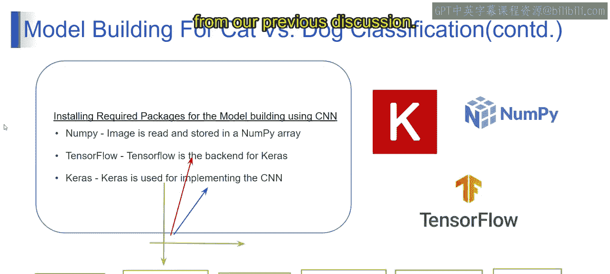
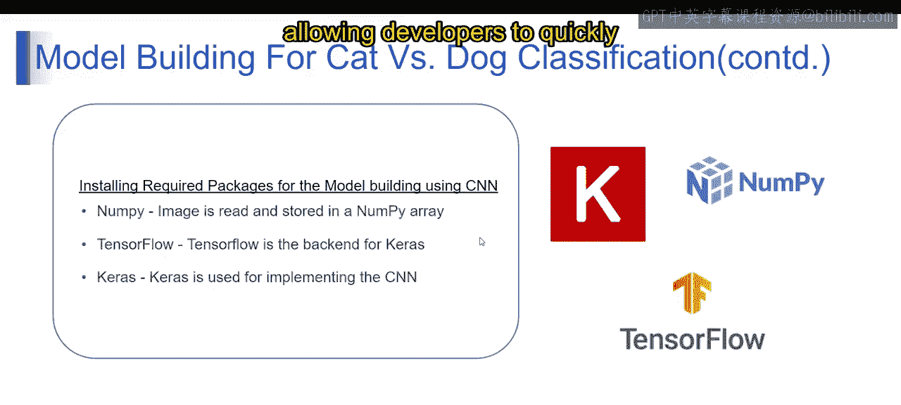
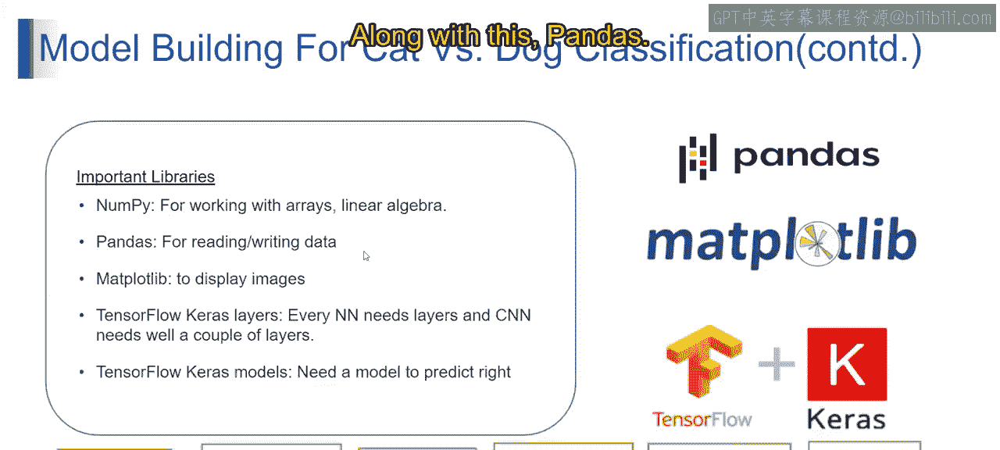
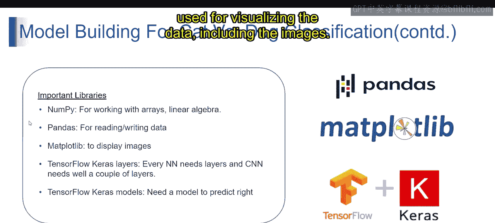
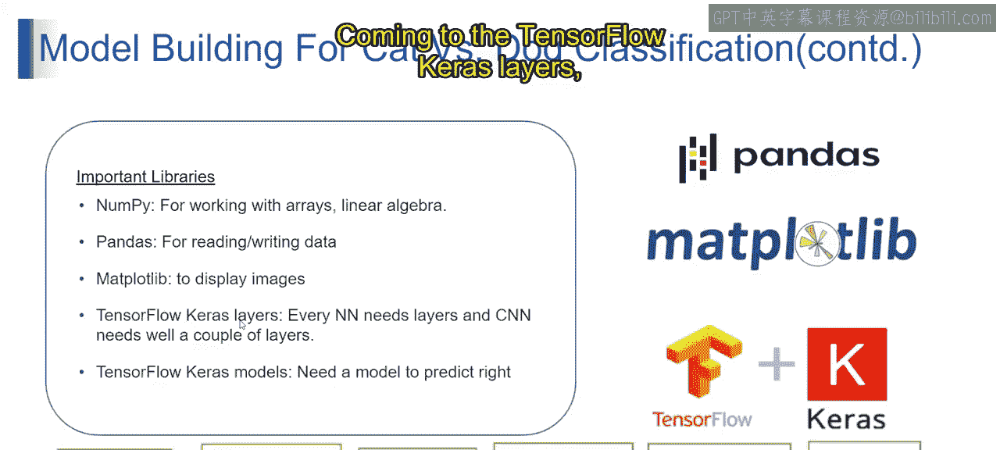
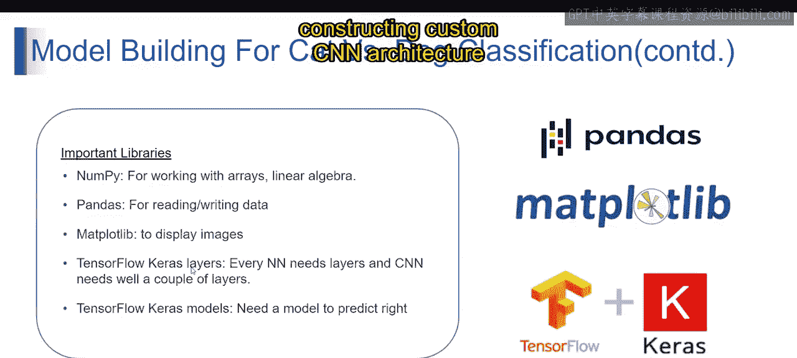
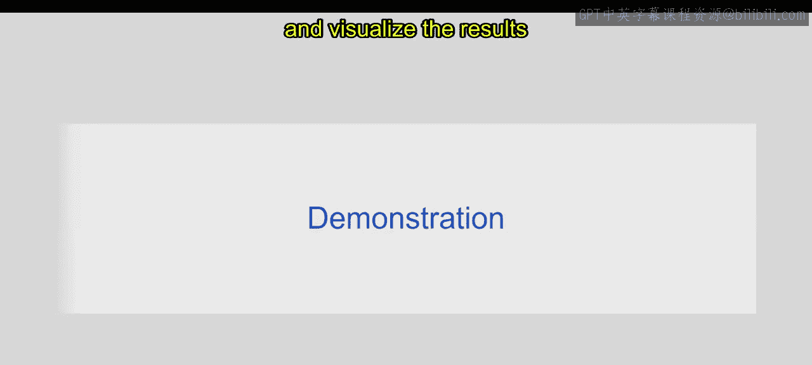
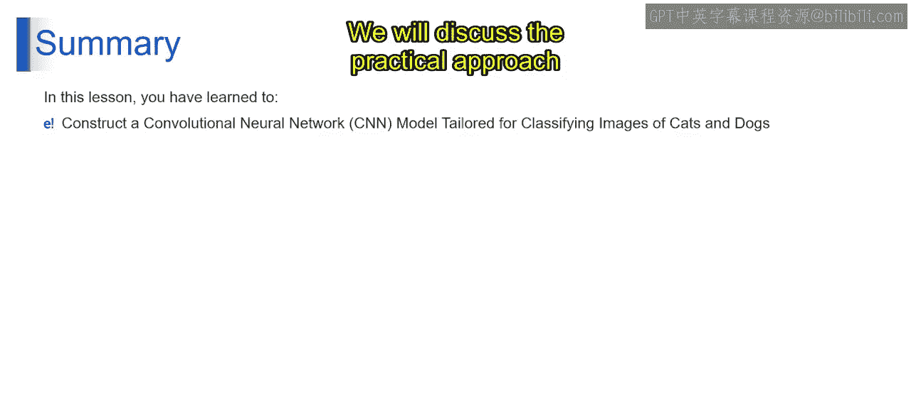

# 第一部分 75：猫狗分类模型构建

在本节课中，我们将学习如何构建一个用于图像分类的卷积神经网络模型，具体以猫狗分类为例。我们将介绍构建此类模型所需的核心库及其作用，并概述构建流程。

上一节我们讨论了CNN的基本概念，本节中我们来看看构建一个CNN模型需要哪些工具和步骤。

## 安装必要的库

构建用于图像分类的CNN模型，需要安装一系列Python库。这些库提供了数据处理、模型构建、训练和可视化的功能。

以下是构建CNN模型所需的核心库及其作用：

*   **NumPy**：这是处理数组和进行线性代数运算的基础库。在CNN中，NumPy用于读取图像并将其存储为数组，便于数据操作和预处理。
*   **TensorFlow**：这是一个强大的机器学习框架，作为Keras的后端。它提供了训练深度学习模型（包括CNN）所需的高效计算和优化功能。
*   **Keras**：这是一个用户友好且广泛使用的深度学习库，用于实现包括CNN在内的模型。它提供了简洁而强大的接口来构建神经网络，使开发者能够快速原型化和试验不同的架构。
*   **Pandas**：这个库用于以表格形式读取和写入数据。
*   **Matplotlib**：这是一个全面的绘图库，用于可视化数据，包括图像。
*   **TensorFlow Keras Layers**：这些是神经网络（包括CNN）的构建模块。卷积层、池化层和全连接层等对于构建CNN模型的架构至关重要。
*   **TensorFlow Keras Models**：它们提供了预定义的模型和架构，简化了构建和训练CNN的过程。这些模型可以作为基础，用于构建针对特定任务（如图像分类）定制的CNN架构。

安装NumPy、TensorFlow（包含Keras）、Pandas、Matplotlib以及TensorFlow Keras的Layers和Models模块，对于有效构建和训练用于图像分类等任务的CNN模型至关重要。在我们提到的猫狗分类示例中，我们需要完成所有这些步骤。这些库提供了处理数据、构建神经网络和可视化结果所需的必要工具和功能。

本节课中我们一起学习了构建卷积神经网络模型所需的库以及基本步骤，这些步骤专门用于利用NumPy、TensorFlow、Pandas、Matplotlib、TensorFlow Keras Layers和Models等核心库对图像进行分类。我们将在下一个视频中讨论具体的实践方法。