# 第一部分 76：猫狗分类实战演示 I

在本节课中，我们将学习如何运用TensorFlow 2.x构建卷积神经网络，完成猫狗图像分类的实战项目。我们将从数据准备开始，逐步搭建、训练并评估模型。

## 概述

上一节我们介绍了相关的理论基础，本节我们将通过一个实际项目来理解如何使用CNN进行图像分类。我们将使用Google Colab这一云端平台来执行代码，无需在本地安装复杂的开发环境。

Google Colab是由Google提供的基于云的平台，允许用户在协作环境中编写、执行和分享Python代码。它提供对GPU和TPU资源的访问以加速计算。用户可以直接在网页浏览器中创建和运行Jupyter笔记本，无需在本地安装Python或相关库。Colab与Google Drive集成，可实现无缝的文件管理和共享。由于其易用性和便利性，它被广泛用于数据分析、机器学习和教育目的。

现在，让我们开始理解我们的项目。如果你想加载这个文件，可以点击“文件”并从这里直接上传副本，选择“上传笔记本”即可从本地上传笔记本并运行。在“运行时”菜单中，你可以更改运行时类型，选择使用CPU、T4 GPU或TPU。这些是你可以使用的资源。现在让我们开始。

在本教程中，我们将使用“猫狗”数据集，这是一个流行的用于图像分类任务的计算机视觉数据集。我们将首先准备数据并安装TensorFlow 2.x来构建我们的卷积神经网络模型。然后，我们将开发模型以将图像分类为包含狗或猫。我们将绘制每个训练周期（epoch）的准确率变化，并在测试数据上评估模型。此外，我们将分析模型摘要，添加Dropout层以防止过拟合，并尝试增加隐藏层以观察其对准确率的影响，同时调整批次大小（batch size）和训练周期数以研究它们对模型性能的影响。

我们的数据集包含8005张训练图像和2023张测试图像，每张图像属于狗或猫类别。我们将利用TensorFlow 2.x的功能进行实现、模型改进以及保存和加载预训练模型。

## 数据准备与加载

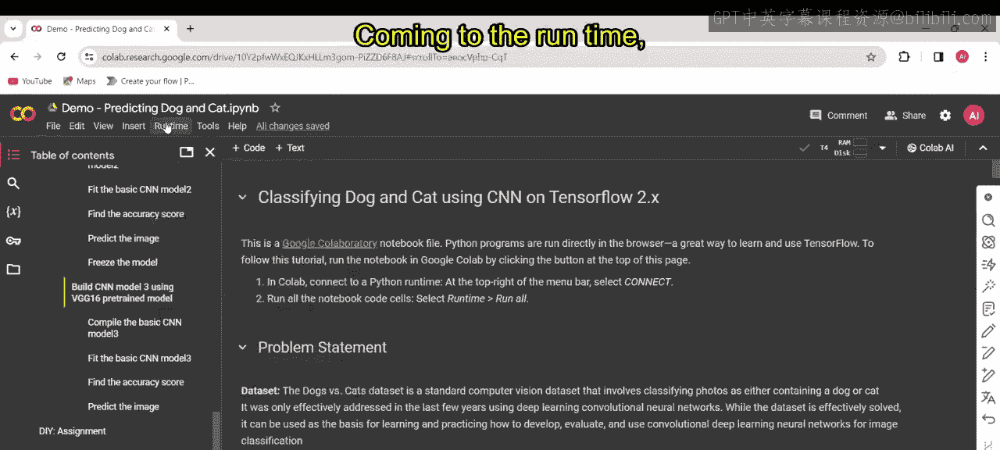

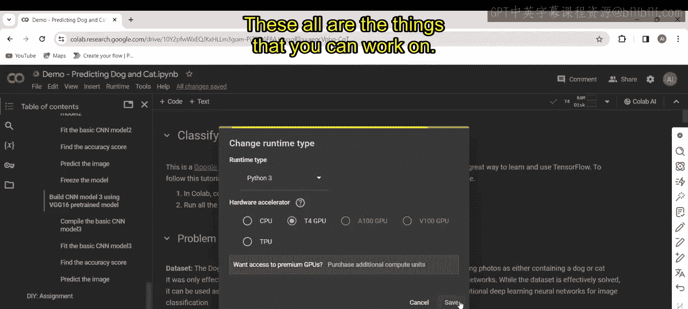

以下是数据准备与加载的步骤：

首先，这行代码从提供的URL下载训练数据集的zip文件。
```python
# 第一部分 示例：下载训练数据
!wget --no-check-certificate https://example.com/train.zip
```

第二行代码从提供的URL下载测试数据集的zip文件。这意味着这里包含了训练和测试数据。完成后，解压数据文件，使其内容可供进一步处理。
```python
# 第一部分 示例：解压数据
!unzip -q train.zip
!unzip -q test.zip
```

## 数据可视化

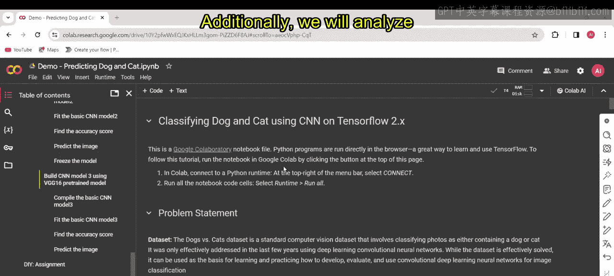

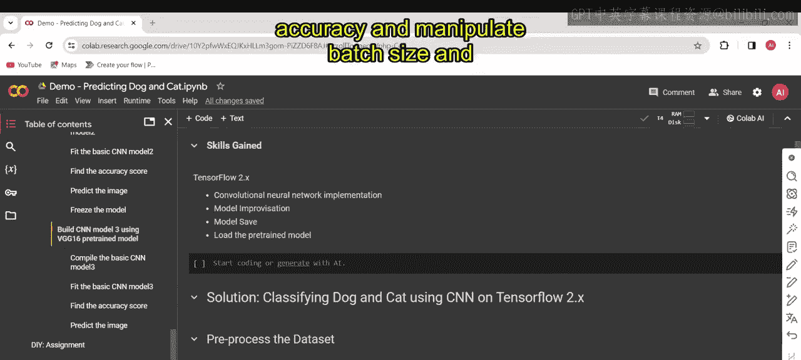

在数据可视化部分，我们使用以下代码：

`%matplotlib inline` 是Jupyter笔记本中的一个魔术命令，它导入Matplotlib和NumPy库并设置内联绘图。

`import matplotlib.pyplot as plt` 从Matplotlib库导入pyplot模块，用于绘图。

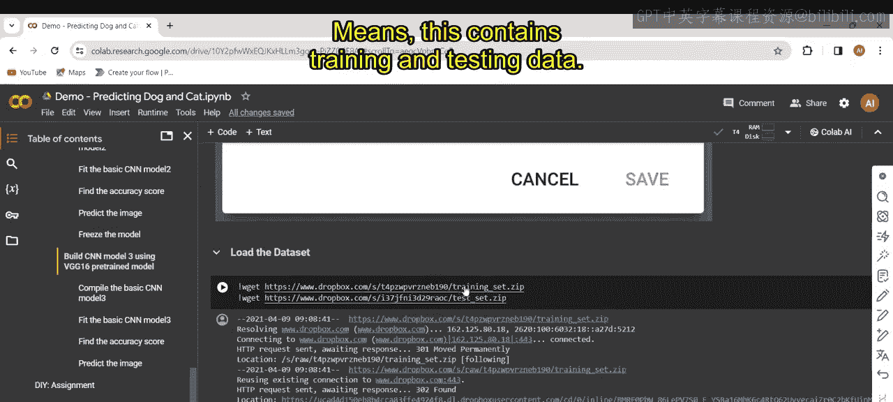

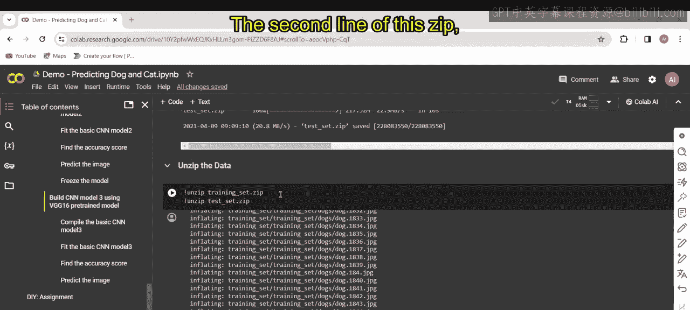

`import matplotlib.image as mpimg` 从Matplotlib库导入image模块，允许进行图像相关操作。

这里我们读取图像，这行代码从指定的文件路径读取并加载一张猫的图像，然后使用matplotlib的`imshow`函数显示加载的图像。`plt.show()` 这行代码显示绘制的图像。输出结果如下所示。同样地，你可以执行此代码并进行操作。你也需要以类似的方式加载数据并显示它。

## 导入必要的库

这里我们导入以下库，这些导入对于使用TensorFlow进行深度学习任务至关重要：

`import tensorflow as tf` 用于导入TensorFlow库。

`from tensorflow.keras import ...` 用于构建和训练神经网络。

此外，还导入了用于图像数据预处理和定义神经网络架构的模块，例如`Sequential`、`Conv2D`、`MaxPooling2D`、`Flatten`、`Dense`、`Dropout`。

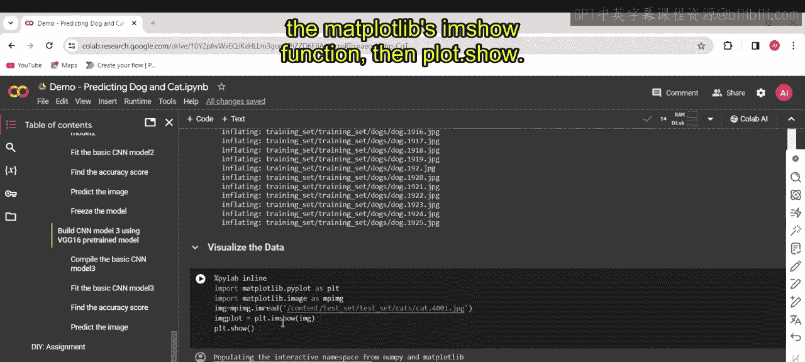

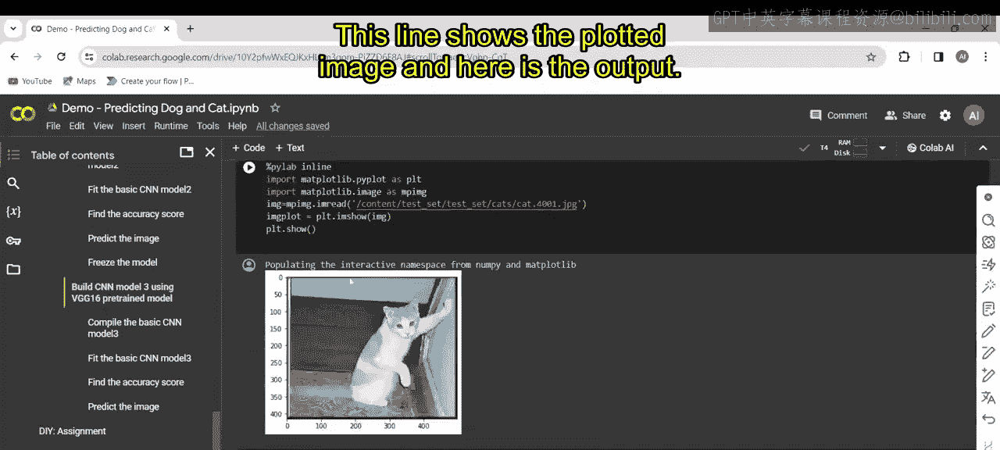

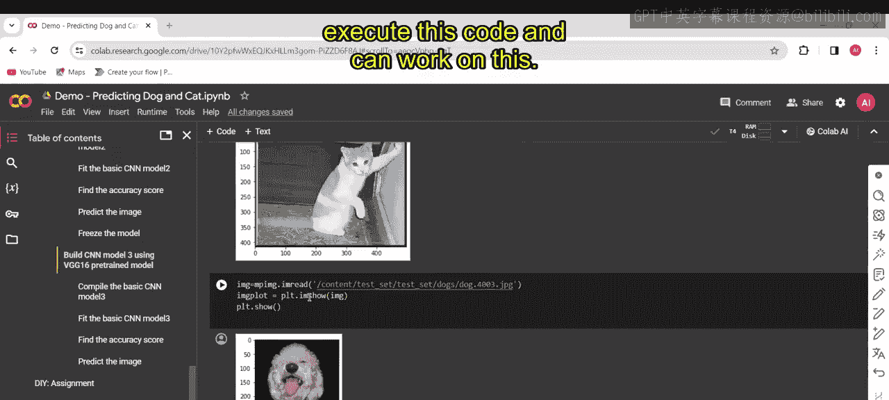

对于可视化，我们使用`matplotlib.pyplot`和`image`。这些是我们将使用的所有库。我们正在检查下载的版本，它是2.4.1。

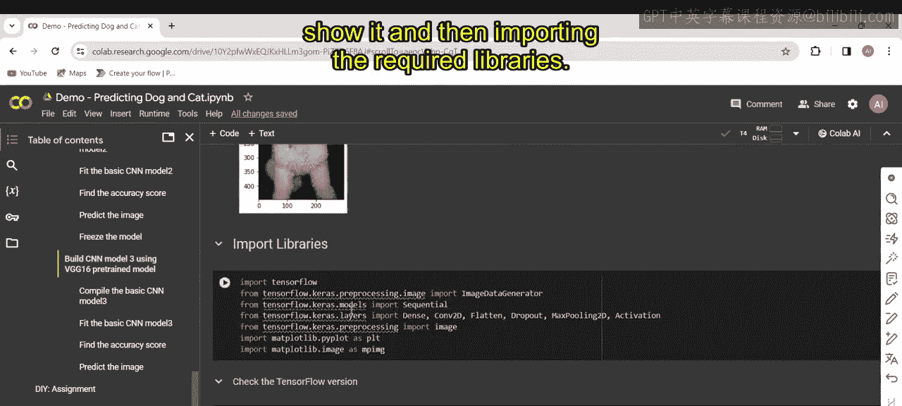

接下来的视频将进一步深入讨论正在进行的内容。

## 总结

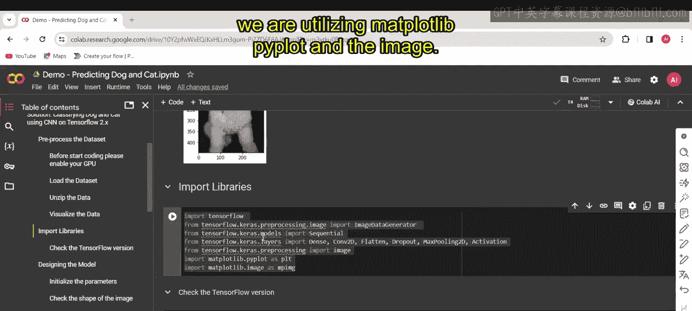

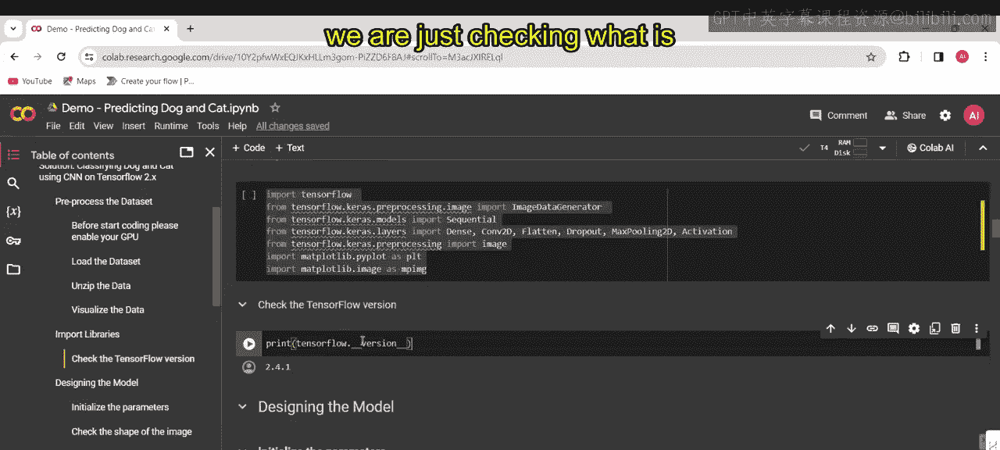

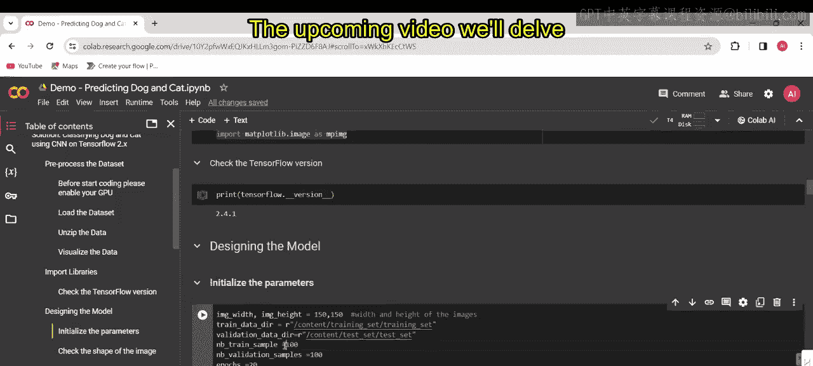

本节课我们一起学习了猫狗图像分类项目的实战开端。我们了解了Google Colab平台的优势，完成了数据集的下载、解压与初步可视化，并导入了构建CNN模型所需的TensorFlow及其他关键库。在下一节中，我们将开始构建和训练我们的卷积神经网络模型。