# 第一部分 77：猫狗分类演示II 🐱🐶

## 概述
在本节课程中，我们将继续探索猫狗图像分类任务。我们将从上一节讨论的代码基础出发，详细讲解如何定义模型参数、配置数据生成器、构建卷积神经网络模型，并最终启动模型的训练过程。本节内容将涵盖从数据预处理到模型训练的关键步骤。

---

## 从参数定义到数据生成器

上一节我们介绍了项目的基本设置，本节中我们来看看如何定义模型训练所需的参数并准备数据。

以下代码块定义了图像处理和模型训练所需的参数：
*   `image_width` 和 `image_height`：指定输入图像的尺寸。
*   `train_data_directory` 和 `validation_data_directory`：分别表示训练数据和验证数据目录的路径。
*   `N_training_sample` 和 `validation_sample`：分别表示训练集和验证集中的样本数量。
*   `epochs`：表示训练迭代的次数。
*   `batch_size`：决定每次迭代处理的样本数量。

接下来，这段代码根据图像数据格式设置输入形状。如果数据格式是“channels_first”，则输入形状设置为 `(3, image_width, image_height)`，其中3代表颜色通道数，即RGB。

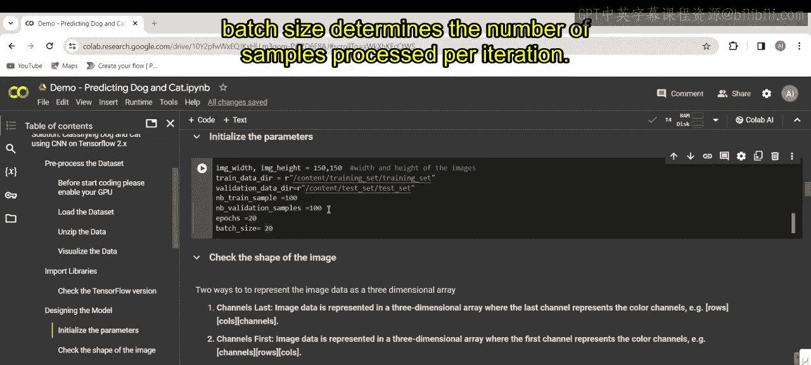

**公式：**
`input_shape = (3, image_width, image_height)`

否则，对于“channels_last”格式，输入形状为 `(image_width, image_height, 3)`。

**公式：**
`input_shape = (image_width, image_height, 3)`

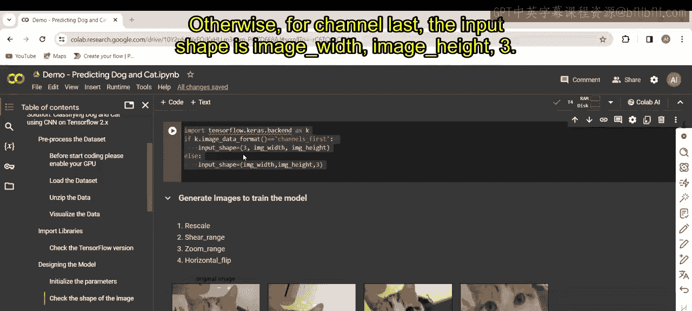

---

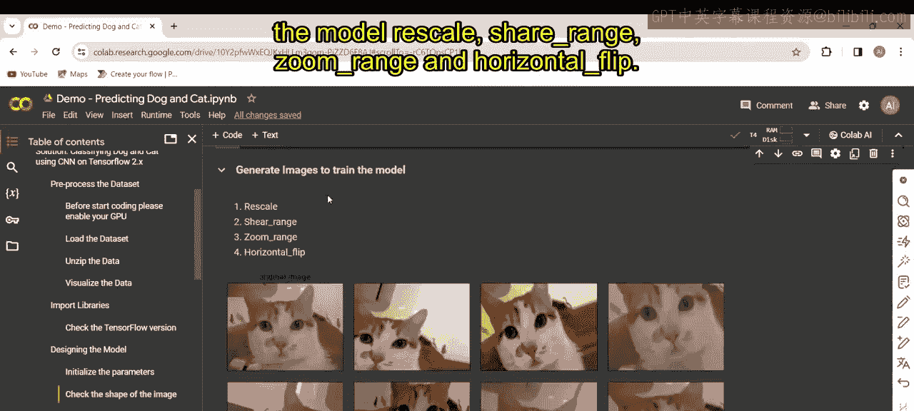

## 配置图像数据增强

现在，我们可以生成用于训练模型的图像，并进行缩放、剪切、缩放和水平翻转等操作。请注意其中的差异。

`ImageDataGenerator` 类允许在训练期间配置对输入图像的随机变换和归一化。这将防止过拟合并有助于生成泛化能力更强的模型。它确保不会将完全相同的图像重复两次输入训练模型。

以下是数据生成器的初始化步骤：
这个代码块为训练和测试初始化了图像数据生成器，并指定了诸如重新缩放、剪切、缩放和水平翻转等变换。

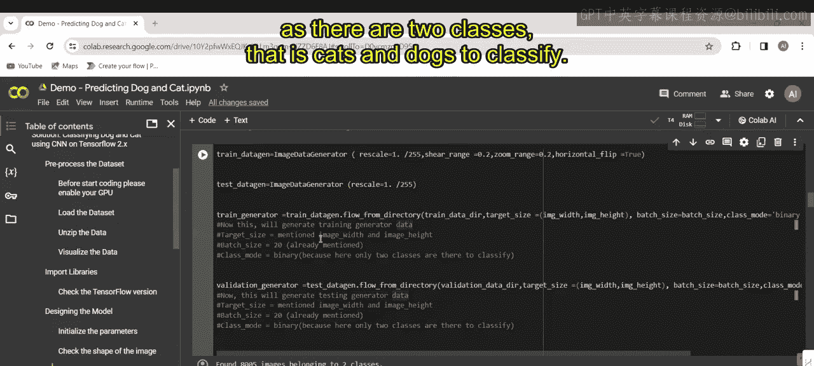

第二个代码块则为训练集和验证集分别生成数据迭代器（`train_generator` 和 `validation_generator`）。这两个生成器会从各自的目录（`train_data_directory` 和 `validation_data_directory`）加载图像，并将图像大小调整为指定的尺寸（`image_width` 和 `image_height`）。`batch_size` 设置为20，`class_mode` 设置为“binary”，因为这是一个猫和狗的二分类任务。

---

## 可视化训练数据

这个代码块用于可视化训练数据中的一个子集图像。它创建一个5行3列的子图网格，并遍历训练生成器（`train_generator`）的前15个批次。对于每个批次，它提取第一张图像（即 `x_batch[0]`，索引位置为0）并在一个子图中显示。循环在第一个批次后中断，以避免显示同一批次中的多张图像。最后，调整布局并显示绘图。

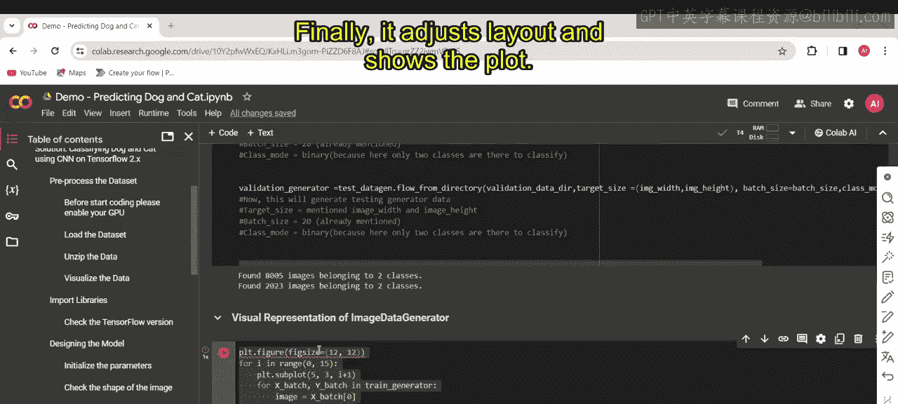
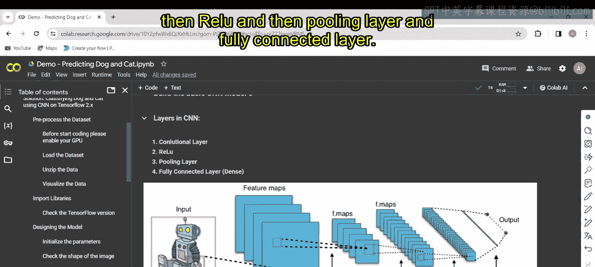
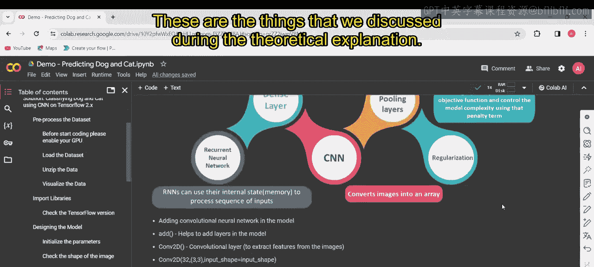

---

## 构建卷积神经网络模型

接下来，我们看看如何构建CNN模型。我们将使用卷积层、ReLU激活函数、池化层和全连接层，这些都是在理论讲解中讨论过的内容。你可以仔细阅读并理解所有步骤。向模型添加卷积神经网络是第一步，这有助于构建模型。

这个代码块使用TensorFlow的Sequential API定义了一个卷积神经网络模型。它包含以下层：
1.  一个卷积层，具有64个大小为3x3的滤波器，后接ReLU激活函数。
2.  一个最大池化层，用于提取特征并降低空间维度。
3.  一个展平层，将前一层的输出重塑为一维数组。
4.  一个具有64个神经元和ReLU激活函数的全连接层。
5.  最后是一个输出层，具有单个神经元和Sigmoid激活函数，用于二分类。

以下是模型结构的表示：

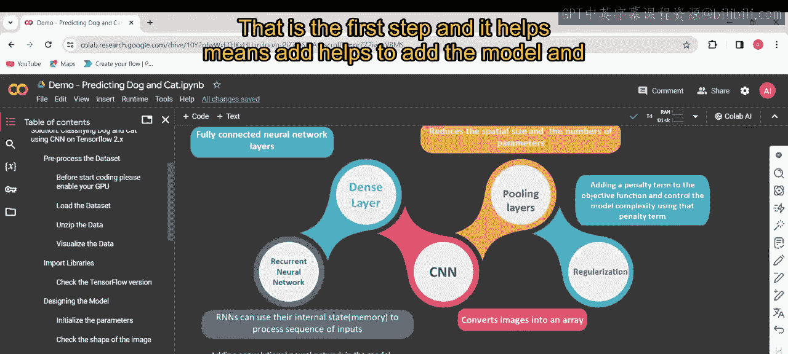
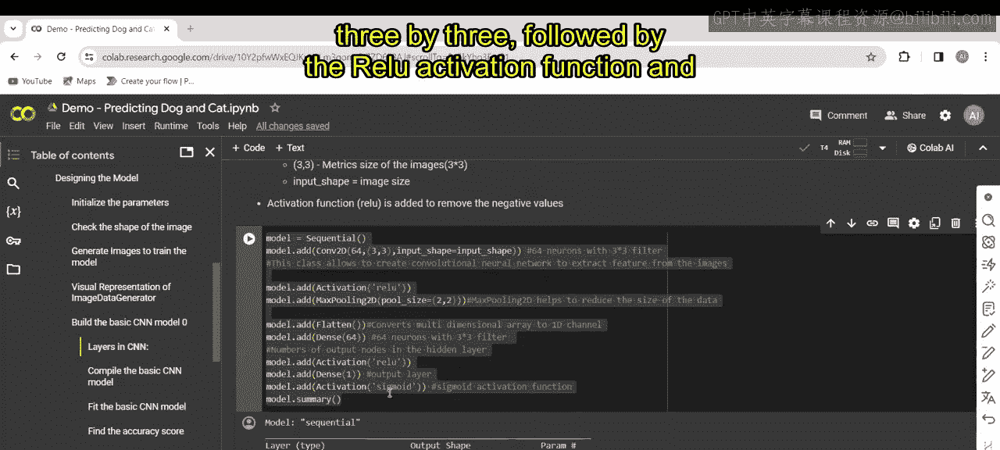

最后，`model.summary()` 提供了模型架构的摘要，包括层类型、输出形状和参数数量。

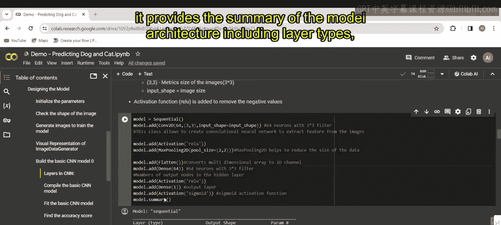

---

## 编译CNN模型

这段代码使用RMSprop优化器、二元交叉熵损失函数和准确率作为评估指标来编译之前定义的模型。`model.summary()` 然后打印出已编译模型的摘要，显示架构、层类型、输出形状、参数数量以及编译设置。

以下是此步骤的输出：

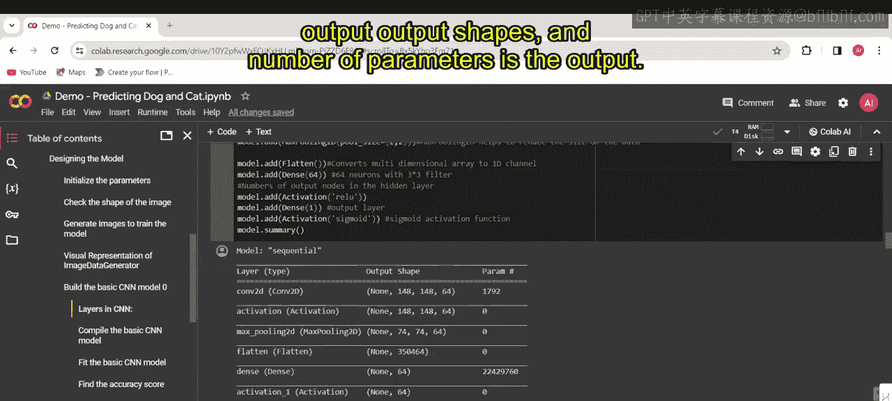
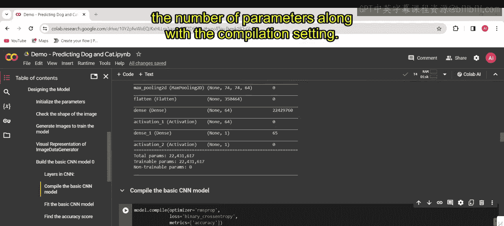
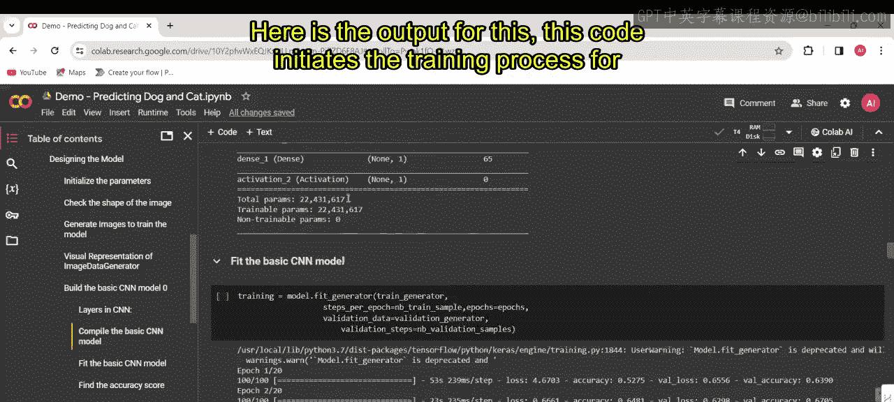

---

## 启动模型训练过程

这段代码使用 `fit_generator` 方法为已编译的模型启动训练过程。它使用 `train_generator` 逐批次生成的数据训练模型，指定每个周期的步数为 `N_training_sample`，总周期数为 `epochs`。由 `validation_generator` 生成的验证数据在训练期间用于验证，每个周期的验证步数由 `validation_steps` 指定，设置为 `N_validation_sample`。训练过程存储在 `training` 变量中，以供进一步分析或可视化。

这是训练过程的图示：

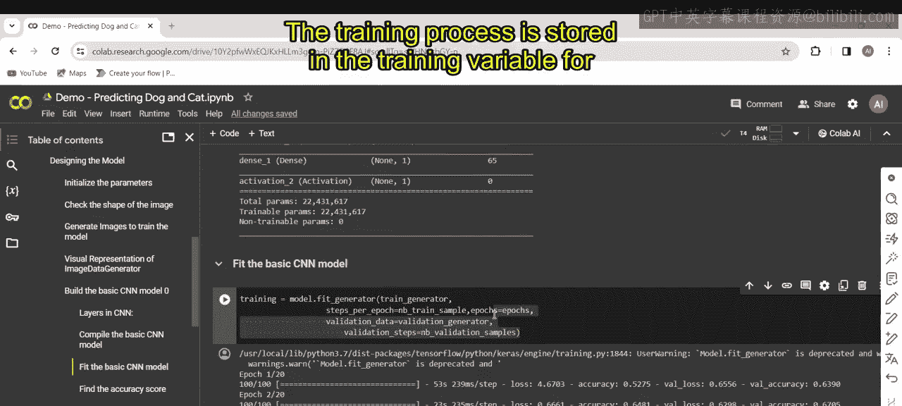
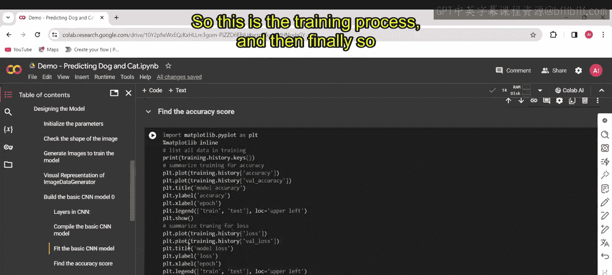
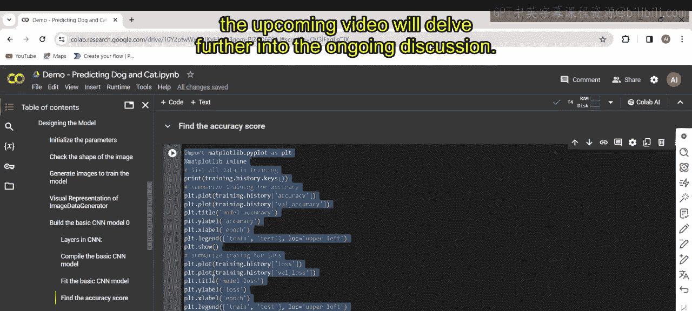

接下来的视频将继续深入探讨正在进行中的讨论。

---

## 总结
本节课中，我们一起学习了猫狗分类项目的核心实现步骤。我们从定义图像尺寸、批次大小等超参数开始，接着配置了`ImageDataGenerator`来进行数据增强以防止过拟合。然后，我们可视化了一部分训练数据以了解输入。之后，我们使用TensorFlow的Sequential API构建了一个包含卷积层、池化层和全连接层的CNN模型，并对其进行了编译。最后，我们启动了模型的训练过程，指定了训练和验证的步骤。通过这些步骤，我们完成了从数据准备到模型训练启动的完整流程。