# 第一部分 78：猫狗分类演示III 🐱🐶

在本节中，我们将继续探索猫狗图像分类项目。上一节我们介绍了模型训练过程，本节中我们来看看如何可视化训练历史、使用训练好的模型进行预测，以及如何保存模型和构建更高级的卷积神经网络。

## 可视化训练历史 📊

以下代码块用于可视化模型的训练历史，通过绘制每个训练周期（epoch）的准确率和损失指标来帮助我们分析模型性能。它使用 Matplotlib 进行绘图。

```python
# 第一部分 打印训练历史字典的键，以识别可用的指标
print(history.history.keys())

# 第一部分 绘制训练和验证集的准确率与损失曲线
plt.plot(history.history['accuracy'])
plt.plot(history.history['val_accuracy'])
plt.title('Model Accuracy')
plt.ylabel('Accuracy')
plt.xlabel('Epoch')
plt.legend(['Train', 'Validation'], loc='upper left')
plt.show()

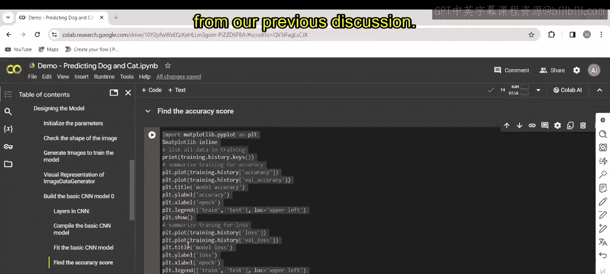

plt.plot(history.history['loss'])
plt.plot(history.history['val_loss'])
plt.title('Model Loss')
plt.ylabel('Loss')
plt.xlabel('Epoch')
plt.legend(['Train', 'Validation'], loc='upper left')
plt.show()
```

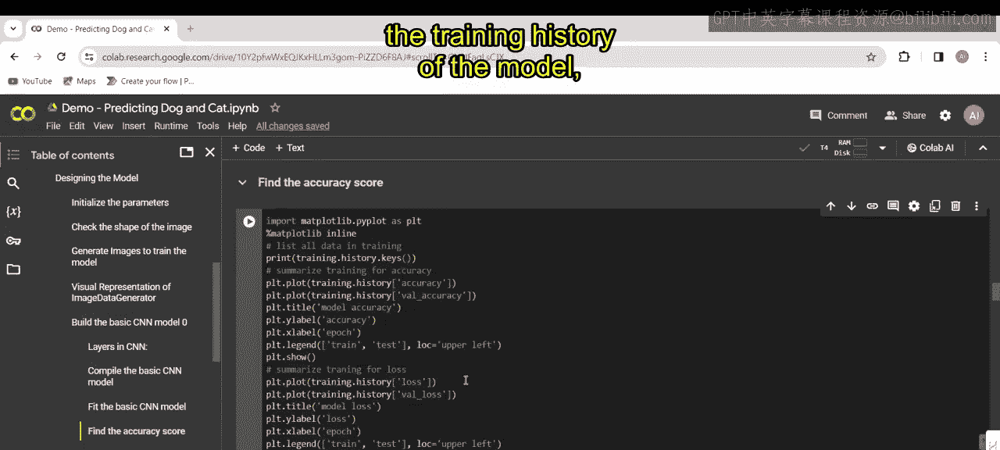

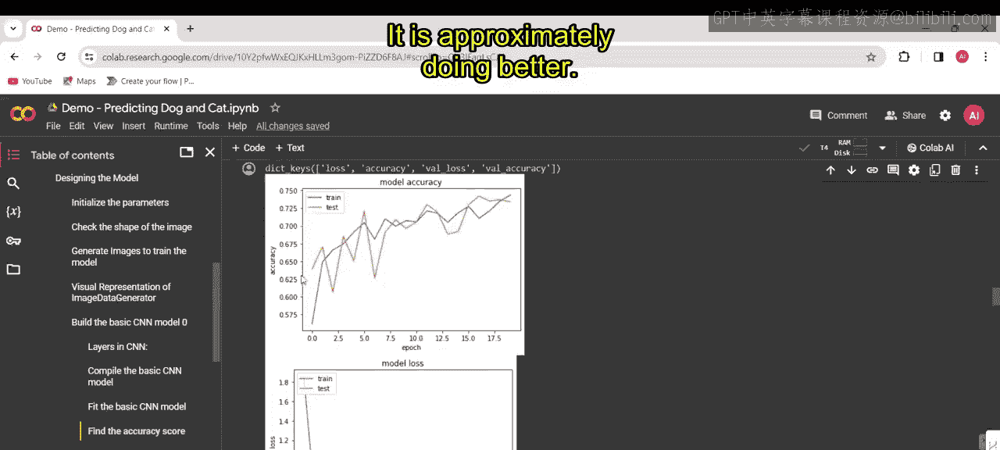

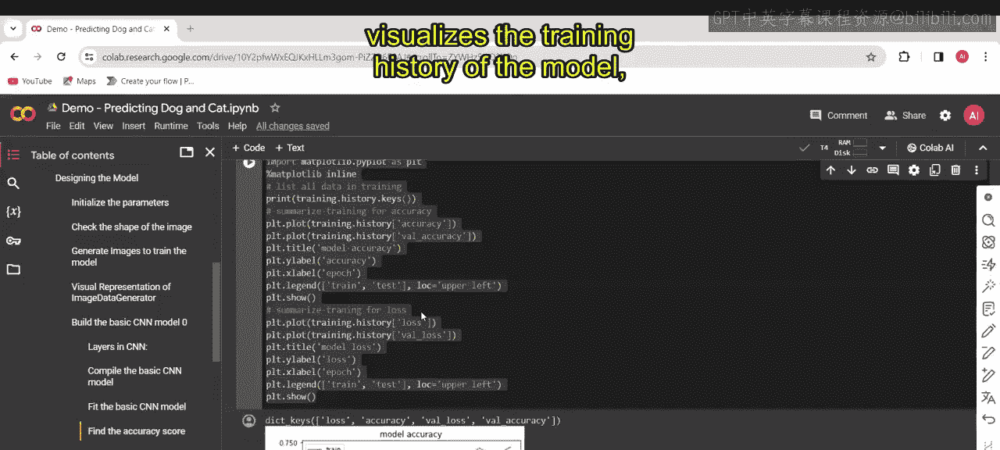

在生成的图表中，蓝色线条代表训练数据集，橙色线条代表测试（验证）数据集。图表显示模型在训练过程中表现良好。

## 使用模型进行预测 🔮

模型训练完成后，我们现在可以进行预测。

以下代码段加载图像、对其进行预处理，并使用训练好的模型进行预测。

```python
# 第一部分 从指定路径加载图像
img_path = 'path/to/your/image.jpg'
img = image.load_img(img_path, target_size=(150, 150))

# 第一部分 将图像转换为数组并扩展维度
img_array = image.img_to_array(img)
img_array = np.expand_dims(img_array, axis=0)
img_array /= 255.0  # 归一化

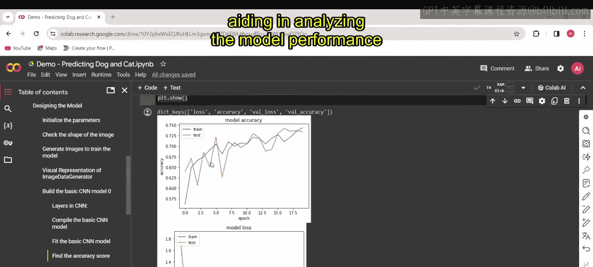

# 第一部分 使用模型进行预测
prediction = model.predict(img_array)
print(prediction)

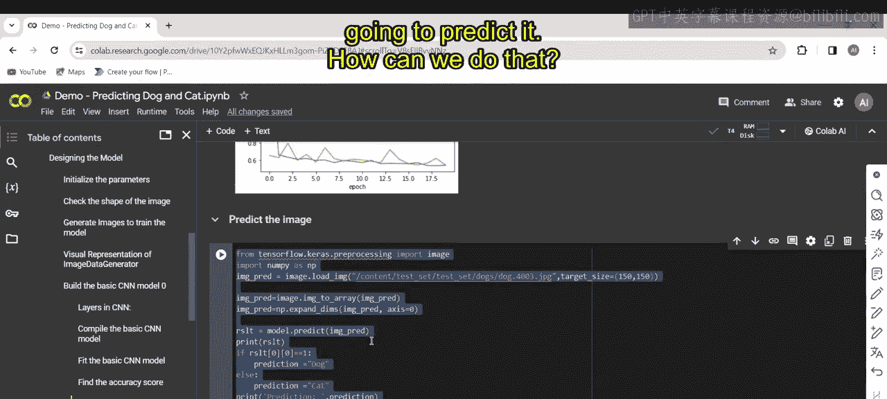

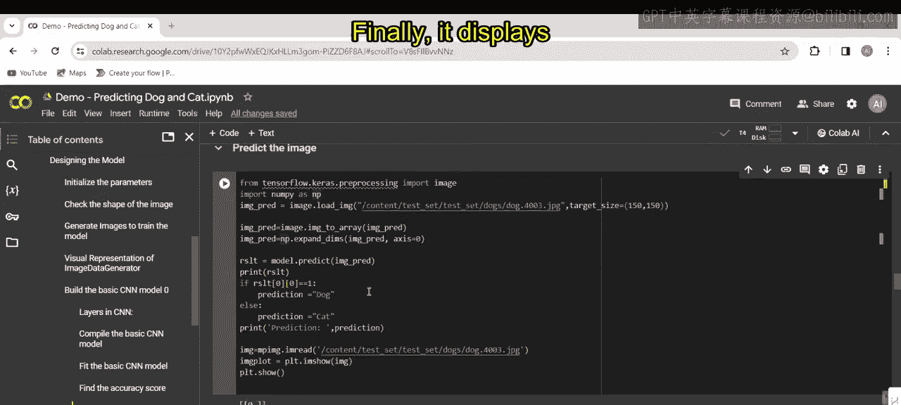

# 第一部分 根据预测结果输出类别
if prediction[0] > 0.5:
    print("这是一只狗。")
else:
    print("这是一只猫。")

# 第一部分 使用Matplotlib显示加载的图像
plt.imshow(img)
plt.axis('off')
plt.show()
```

我们也可以用另一张不同的图像（例如一张猫的图片）执行类似的任务。代码会加载猫的图像，预处理它，并使用训练好的模型预测其类别。预测结果会被打印出来，并根据结果输出图像代表的是猫还是狗，最后使用 Matplotlib 显示图像。

## 保存模型 💾

模型开始预测图像后，我们需要将其“冻结”或保存。

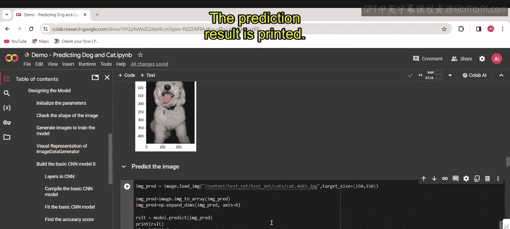

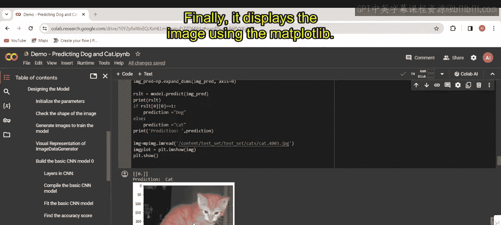

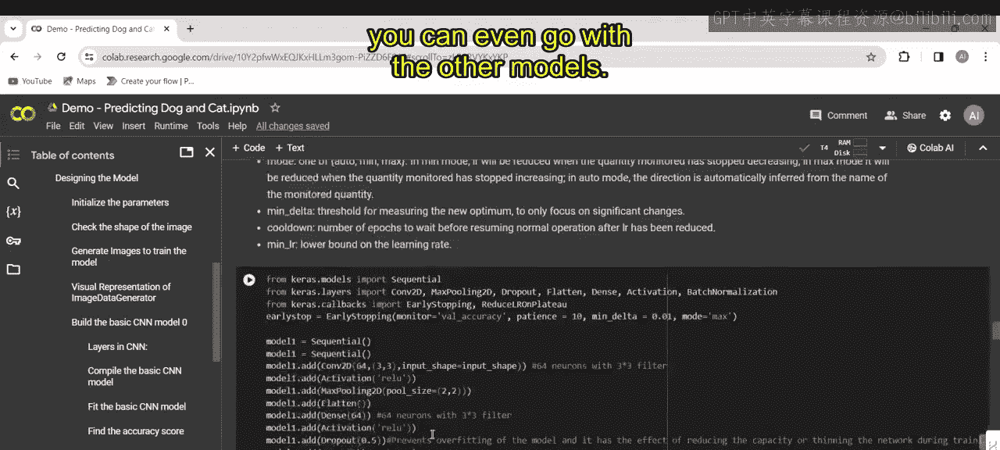

以下代码将 Keras 模型的架构保存到 JSON 文件（例如 `model2.json`），并将其权重保存到 HDF5 文件（例如 `first_try.h5`）。这些文件可以在以后用于重建模型架构并加载已学习的权重进行推理，而无需重新训练。

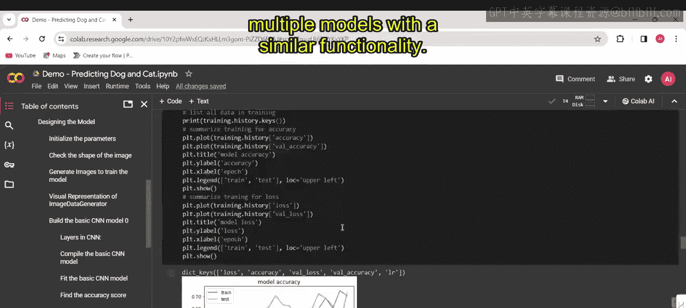

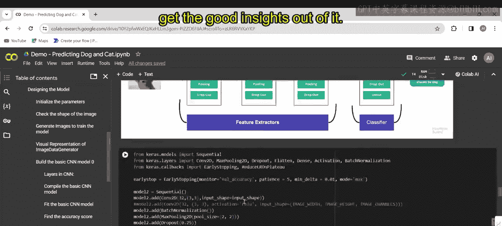

```python
# 第一部分 保存模型架构为JSON
model_json = model.to_json()
with open("model2.json", "w") as json_file:
    json_file.write(model_json)

# 第一部分 保存模型权重为HDF5
model.save_weights("first_try.h5")
print("模型已保存到磁盘。")
```

## 使用预训练VGG16构建CNN 🏗️

完成基础模型训练后，我们现在使用预训练的 VGG16 网络构建一个用于特征提取的 CNN 模型。

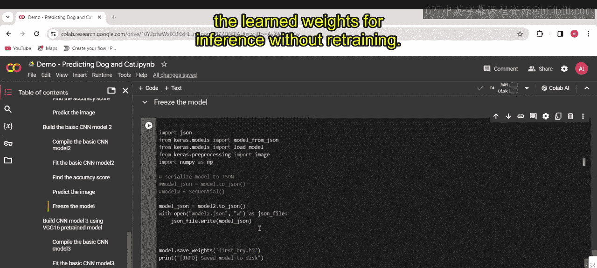

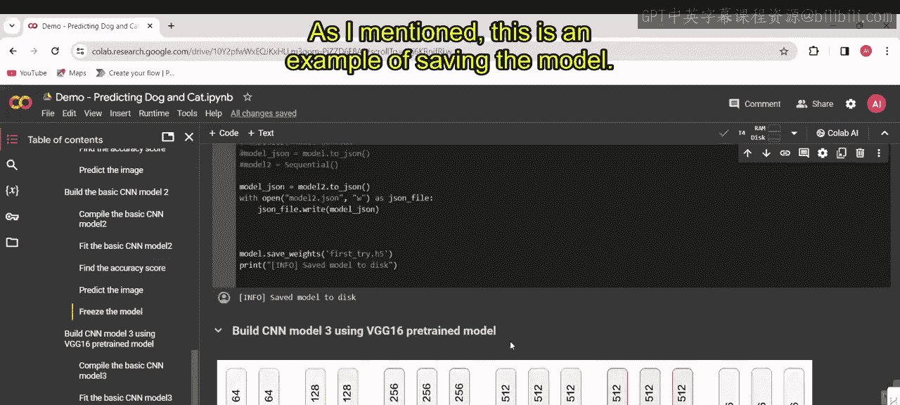

该代码冻结了 VGG16 的前15层，同时允许后续层进行训练。VGG16 最后一个池化层的输出被展平，并连接到一个具有512个单元的全连接层，随后是 Dropout 层和正则化。最后，添加一个具有单个神经元和 Sigmoid 激活函数的密集层，用于二元分类任务。

以下是模型构建的核心部分：

```python
from tensorflow.keras.applications import VGG16
from tensorflow.keras import layers, models

# 第一部分 加载预训练的VGG16模型，不包括顶部分类层
base_model = VGG16(weights='imagenet', include_top=False, input_shape=(150, 150, 3))

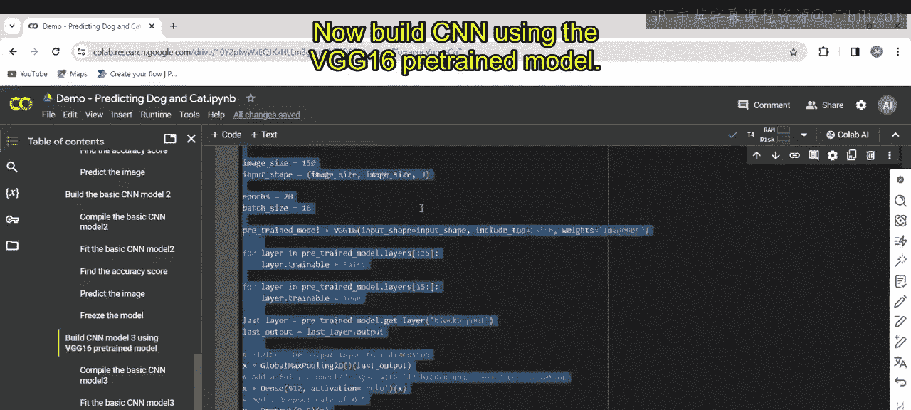

# 第一部分 冻结前15层
for layer in base_model.layers[:15]:
    layer.trainable = False

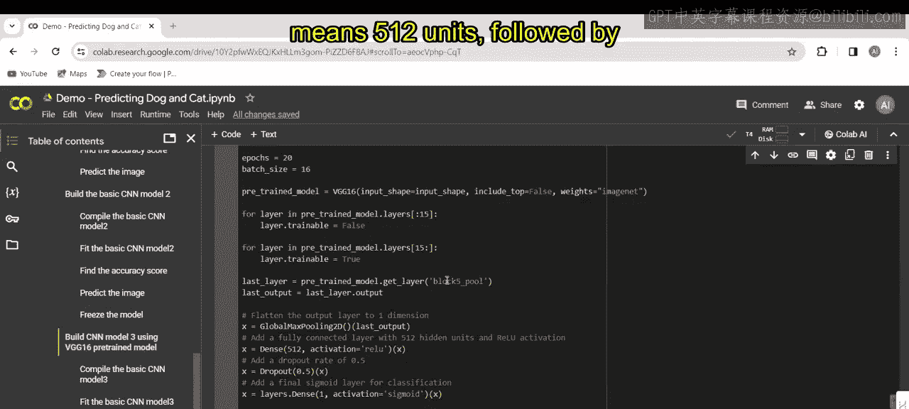

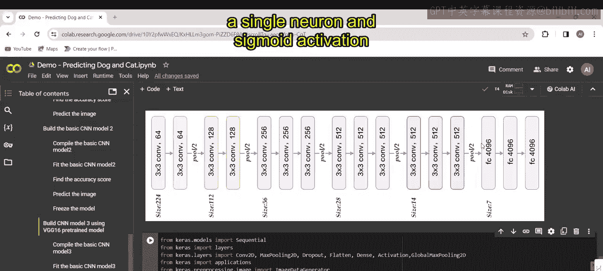

# 第一部分 在基础模型上添加自定义层
model = models.Sequential()
model.add(base_model)
model.add(layers.Flatten())
model.add(layers.Dense(512, activation='relu'))
model.add(layers.Dropout(0.5))
model.add(layers.Dense(1, activation='sigmoid'))  # 二元分类输出层
```

与之前类似，我们使用二元交叉熵损失函数、学习率为 `1e-4` 且动量为 `0.9` 的随机梯度下降优化器来编译构建的模型，并使用准确率作为评估指标。

最后，代码会打印模型的准确率，并预测图像是猫还是狗。

我建议大家仔细研究这些数据集和代码，以理解其具体工作原理。

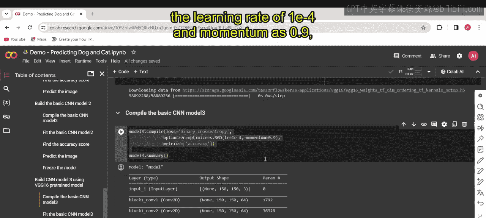

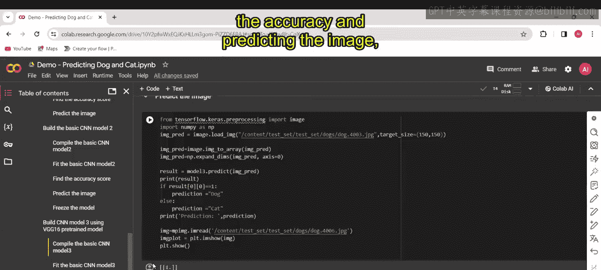

---

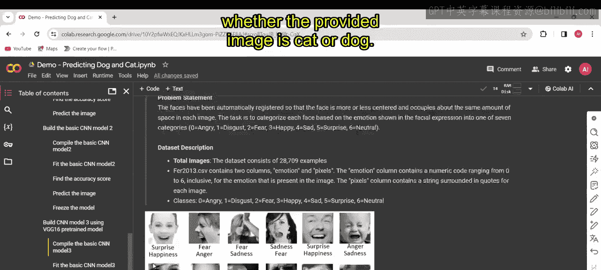

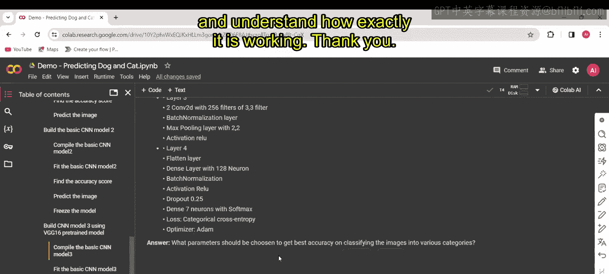

本节课中我们一起学习了如何可视化训练过程以评估模型性能、使用训练好的模型对新图像进行预测、保存模型以备后用，以及如何利用预训练的 VGG16 网络构建更强大的卷积神经网络。这些步骤是完成一个完整机器学习项目 pipeline 的重要组成部分。