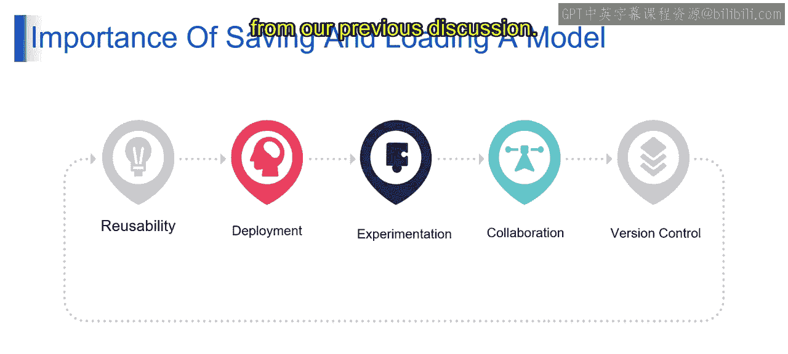
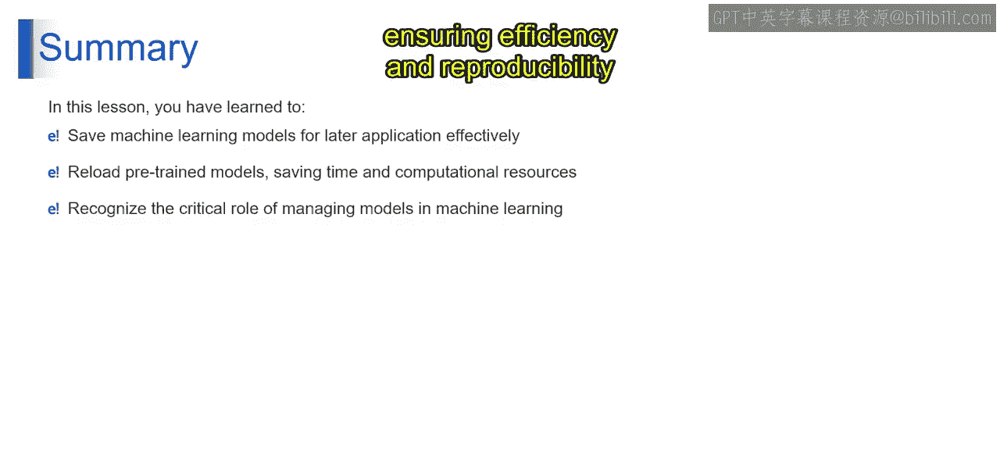

# 第一部分 79：保存和加载模型的重要性 🚀




在本节课中，我们将探讨在机器学习项目中保存和加载模型的重要性。理解这一过程对于高效地开发、部署和维护模型至关重要。

上一节我们讨论了模型训练的基本流程，本节中我们来看看如何将训练好的成果保存下来以备后用。

### 为什么需要保存和加载模型？

保存和加载模型的核心价值在于实现模型的持久化。这意味着我们可以将训练好的模型参数、架构和配置存储到磁盘上，并在需要时重新加载使用，无需从头开始训练。

以下是保存和加载模型的几个关键好处：

**1. 提高复用性**
保存和加载模型通过保留训练好的参数、架构和配置来实现复用性。这使得模型可以在不同的任务或数据集上重复使用，无需从头开始重新训练，从而节省时间和计算资源。

**2. 便于部署**
例如，假设你正在构建一个手写数字识别模型。在训练好CNN模型后，你可以将其保存下来，并部署到一个能够识别用户输入图片中数字的应用程序中。这意味着保存和加载模型有助于将模型无缝集成到实际应用程序或系统中。保存的模型可以轻松加载，用于生产环境中的预测，而无需重新训练。

**3. 支持实验**
假设你正在试验不同的CNN架构进行图像分类。在训练完每个模型后，你可以将它们保存下来，并比较它们的性能指标（如准确率和损失），以确定最高效的架构。这意味着保存和加载模型支持实验，允许研究者和从业者比较多个模型、架构和超参数。这实现了迭代式的模型开发和优化，以达到最佳性能。

**4. 促进协作**
保存和加载模型通过实现团队成员或协作者之间训练模型的共享和传递，促进了协作。这促进了知识共享，加速了项目进展，并增强了机器学习项目中的团队合作。

**5. 实现版本控制**
当对CNN模型的架构或超参数进行更改时，你可以保存模型的每个版本，并附上所做更改的描述。这允许你跟踪模型随时间的演变，并在需要时参考以前的版本。这意味着保存和加载模型通过提供一种系统化的方式来管理和跟踪模型的变更，支持版本控制。这确保了机器学习工作流程的可复现性、责任性和透明度。

### 技术实现简述

在代码层面，保存和加载模型通常非常简单。以下是一个概念性的示例：

```python
# 第一部分 保存模型
model.save('my_model.h5')

# 第一部分 在另一个程序或会话中加载模型
from tensorflow import keras
loaded_model = keras.models.load_model('my_model.h5')
```

### 总结




本节课中，我们一起学习了有效保存机器学习模型以备将来应用，以及重新加载预训练模型的方法，这有助于节省时间和计算资源。此外，你也深入了解了模型管理在机器学习工作流程中的关键作用，它确保了模型开发和部署的效率和可复现性。掌握模型的保存与加载，是构建可靠、可维护的AI应用的基础技能。