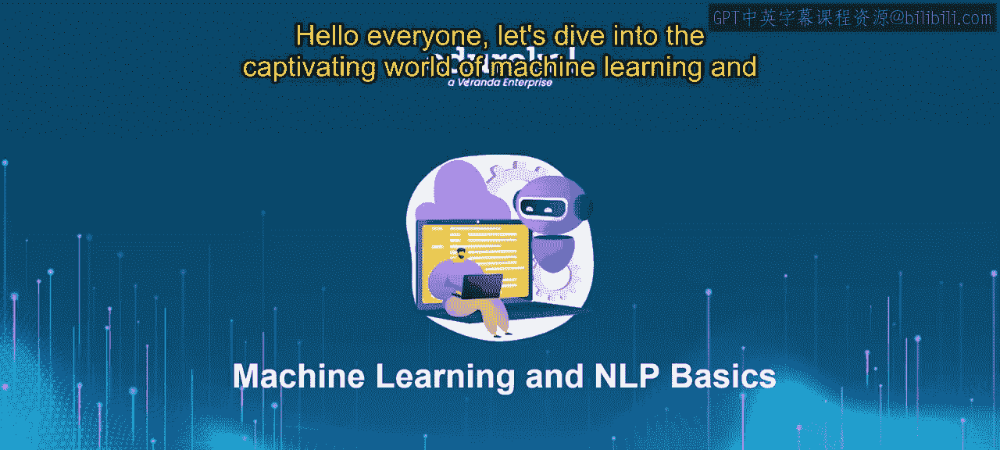
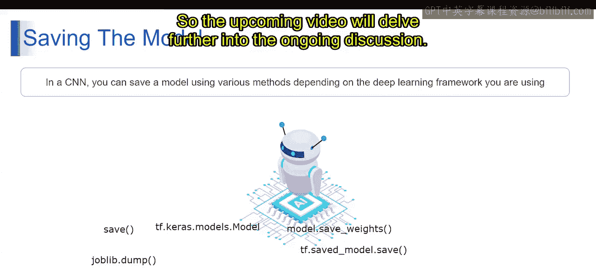

# 第一部分 80：保存和加载模型 🧠💾

在本节课中，我们将要学习机器学习工作流程中一个至关重要的环节：如何保存训练好的模型，并在需要时重新加载它。掌握这项技能可以避免重复训练，节省大量时间和计算资源。

上一节我们介绍了如何构建一个分类问题模型。本节中，我们来看看当模型训练完成后，如何将其保存下来以备将来使用。

## 什么是保存模型？ 📁

保存模型指的是将训练好的机器学习模型的参数、架构和配置存储到磁盘的过程。这允许模型在未来被重复使用或部署，而无需从头开始重新训练。


想象一下，你花费数小时教会一位朋友烘焙他们最喜欢的蛋糕。一旦他们掌握了食谱和技巧，他们决定将步骤写下来并存入食谱书中。之后，每当他们想再次烘焙同样的蛋糕时，只需查阅那本食谱书即可，无需每次都从头开始。




在机器学习中，保存模型的过程与此类似。它涉及将模型的参数和架构序列化为一种可以轻松存储和访问的文件格式，例如 **HDF5** 或 **JSON** 文件。这使得模型可以被重新加载并用于进行预测，而无需重新训练。

从技术上讲，保存模型需要使用我们所讨论的库，如 TensorFlow、Keras 或 scikit-learn，具体取决于所使用的机器学习框架。

## 保存模型的重要性与方式 ⚙️

正如写下食谱可以让你无需从头开始就能重现菜肴一样，保存机器学习模型使你能够重复使用它进行预测，而无需从头开始重新训练。这节省了大量时间和计算资源，使模型管理成为机器学习工作流程中必不可少的一部分。

现在，让我们具体了解在深度学习中如何实现。你可以使用多种方法保存模型，具体取决于你使用的深度学习框架。不同的框架提供了不同的功能和 API 来保存模型，从而在模型的存储和访问方式上提供了灵活性。

以下是不同框架中保存模型的常用方法：

*   **TensorFlow/Keras**：你可以使用 `tf.keras.Model` 类提供的 `save()` 方法。该方法将整个模型（包括其架构和权重）保存为 TensorFlow SavedModel 格式或 HDF5 格式。此外，你也可以使用 `model.save_weights()` 单独保存模型的权重组件。
*   **PyTorch**：你可以使用 `torch.save()` 函数。
*   **scikit-learn**：你可以使用 `joblib.dump()` 函数。该函数允许你使用 Python 的 pickle 格式将模型对象序列化到磁盘，使得存储和后续检索模型变得非常容易。

无论使用哪种深度学习框架，保存模型的主要目的都是保留其状态和架构，以便将来可以重复用于预测或进一步的训练。选择哪种保存方法取决于框架兼容性、易用性以及应用程序的特定需求等因素。

## 如何加载模型？ 🔄

加载模型是保存模型的逆过程。它指的是从存储的文件中读取模型的参数、架构和配置，并在内存中重建模型，使其能够立即用于进行预测或继续训练。

继续之前的比喻：当你的朋友想再次烘焙蛋糕时，他们会从食谱书中取出写好的食谱。他们按照记录的步骤和配料进行操作，就能制作出与之前完全相同的蛋糕，无需重新学习或实验。

在机器学习中，加载模型意味着从保存的文件（如 `.h5`、`.pkl` 或 SavedModel 目录）中读取数据，并使用框架提供的相应加载函数（如 `tf.keras.models.load_model()`、`torch.load()` 或 `joblib.load()`）在程序中重新实例化模型。加载后的模型将具备与保存时完全相同的权重和结构，可以立即用于对新数据进行预测。

## 核心代码示例 💻

以下是使用不同框架保存和加载模型的核心代码片段：

**TensorFlow/Keras:**
```python
# 第一部分 保存整个模型
model.save('my_model.h5')  # 保存为 HDF5 格式
# 第一部分 或
model.save('my_saved_model')  # 保存为 SavedModel 格式（目录）

# 第一部分 加载模型
loaded_model = tf.keras.models.load_model('my_model.h5')
```

**scikit-learn:**
```python
import joblib

# 第一部分 保存模型
joblib.dump(model, 'my_model.pkl')

# 第一部分 加载模型
loaded_model = joblib.load('my_model.pkl')
```

## 总结 📝

本节课中，我们一起学习了机器学习模型生命周期中的关键步骤：保存与加载。

*   我们首先明确了**保存模型**的含义，即把训练好的模型参数和结构持久化到磁盘文件。
*   接着，我们探讨了这一过程的重要性，它能避免冗余训练，是实现模型部署和复用的基础。
*   然后，我们介绍了在不同流行框架（如 TensorFlow/Keras 和 scikit-learn）中实现模型保存与加载的具体方法。
*   最后，我们通过简单的代码示例演示了核心的 `save` 和 `load` 操作。



理解并熟练运用模型的保存与加载，是构建高效、可维护的机器学习工作流不可或缺的技能。