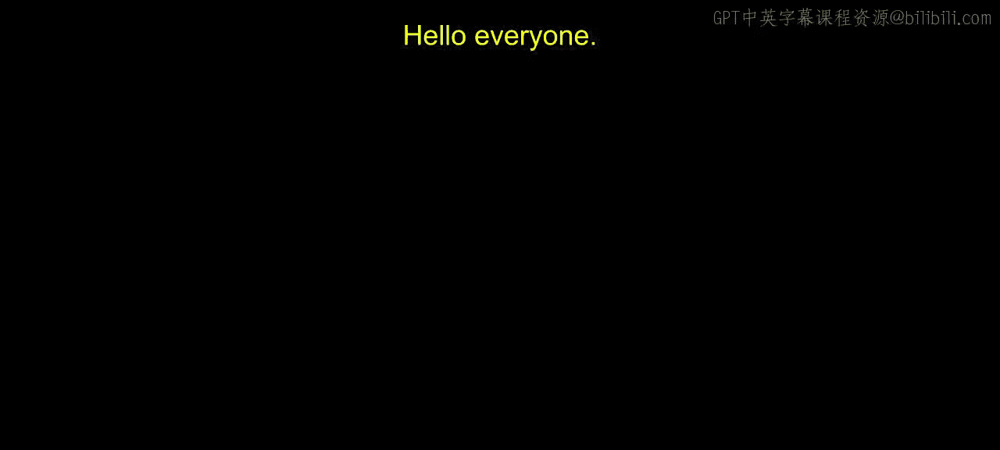
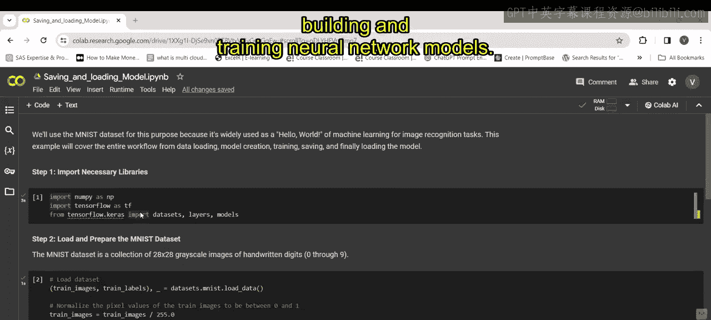
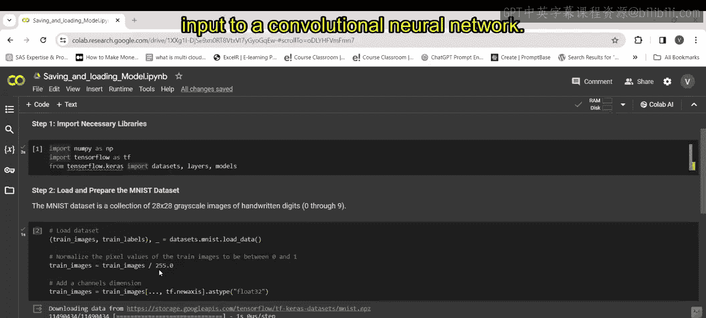
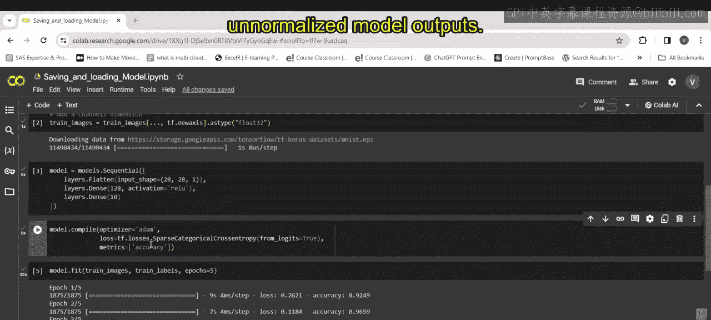
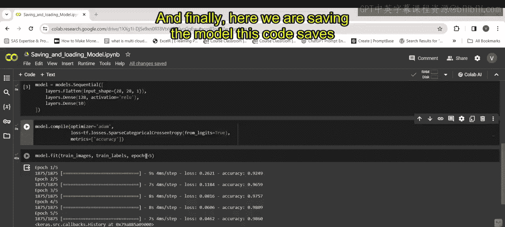
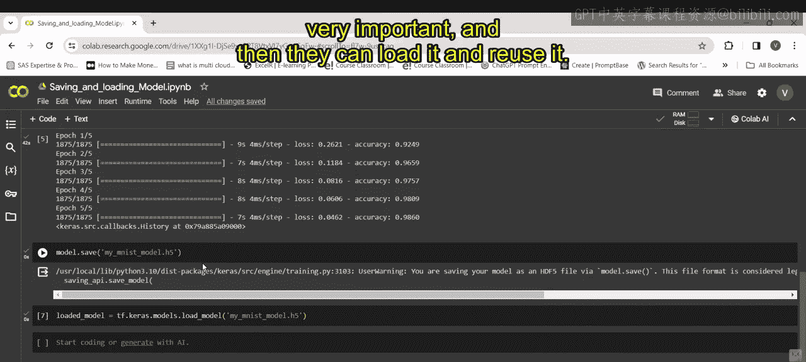

# 第一部分 81：保存和加载模型演示 💾



在本节课中，我们将学习机器学习工作流中的一个关键环节：如何保存和加载训练好的模型。我们将以MNIST手写数字识别任务为例，演示从数据准备、模型构建、训练到模型保存与加载的完整过程。

---

上一节我们介绍了模型开发的基本概念，本节中我们来看看如何将训练成果持久化，以便后续使用。

## 导入必要的库 📚

第一步是导入所需的Python库。以下是代码：

```python
import numpy as np
import tensorflow as tf
from tensorflow import keras
```

这段代码导入了三个核心库：`numpy`用于数值计算，`tensorflow`作为机器学习框架，`keras`作为构建和训练神经网络模型的高级API。

---

## 加载并准备MNIST数据 🖼️



接下来，我们需要加载数据集并进行预处理。以下是相关步骤：

这段代码加载了MNIST数据集，其中包含手写数字图像及其对应的标签。

```python
# 第一部分 加载MNIST数据集
(train_images, train_labels), (test_images, test_labels) = keras.datasets.mnist.load_data()

# 第一部分 归一化像素值到0-1范围
train_images = train_images / 255.0
test_images = test_images / 255.0

# 第一部分 为图像添加通道维度，并转换为float32类型
train_images = train_images[..., np.newaxis].astype(np.float32)
test_images = test_images[..., np.newaxis].astype(np.float32)
```

代码首先加载数据，然后将图像像素值从0-255归一化到0-1之间，以提高训练稳定性。接着，它为图像添加一个通道维度（因为卷积神经网络通常需要`[高度，宽度，通道]`的输入格式），并将数据类型转换为`float32`。

---

## 构建神经网络模型 🧠



数据准备就绪后，现在我们来定义一个神经网络模型。以下是模型结构：

这段代码使用Keras Sequential API定义了一个顺序模型。

```python
model = keras.Sequential([
    # 将二维图像展平成一维数组
    keras.layers.Flatten(input_shape=(28, 28, 1)),
    # 第一个全连接层，128个神经元，使用ReLU激活函数
    keras.layers.Dense(128, activation='relu'),
    # 输出层，10个神经元对应0-9十个数字类别
    keras.layers.Dense(10)
])
```

模型从`Flatten`层开始，将28x28的二维图像转换成一维数组。随后是一个具有128个神经元的`Dense`（全连接）层，使用`ReLU`激活函数引入非线性。最后是一个具有10个神经元的输出层，对应10个可能的数字类别。

---

## 编译模型 ⚙️

模型结构定义好后，需要配置其学习过程。以下是编译模型的代码：

这段代码编译了之前定义的模型，指定了优化器、损失函数和评估指标。

```python
model.compile(
    optimizer='adam',
    loss=tf.keras.losses.SparseCategoricalCrossentropy(from_logits=True),
    metrics=['accuracy']
)
```

*   **优化器**：使用`Adam`优化器。**公式**可以简化为自适应地调整每个参数的学习率，结合了动量和自适应学习率的优点，通常能高效收敛。
*   **损失函数**：使用`SparseCategoricalCrossentropy`，它适用于多分类任务，且标签是整数形式（如0,1,2...）。
*   **评估指标**：使用`accuracy`（准确率）来评估模型性能。

---

## 训练模型 🏋️

现在，我们可以用训练数据来训练模型了。以下是训练代码：

这段代码使用训练图像和标签对编译好的模型进行训练，共运行5个周期。

```python
model.fit(train_images, train_labels, epochs=5)
```

代码调用`model.fit`方法，传入训练数据和标签，并设置`epochs=5`，意味着整个训练数据集将被模型学习5遍。在训练过程中，模型会迭代调整其内部参数（权重和偏置），以最小化定义的损失函数。

---



## 保存模型 💾



模型训练完成后，我们需要将其保存到磁盘，以便将来使用。以下是保存模型的代码：

这段代码将训练好的模型保存为一个HDF5格式的文件。

```python
model.save('my_mnist_model.h5')
```

代码使用`model.save()`方法，将模型的**完整架构**和**训练后的权重**保存到名为`my_mnist_model.h5`的文件中。HDF5格式因其层次化结构、高效存储、跨平台兼容性以及在科学计算和机器学习社区的广泛支持而成为保存Keras模型的首选格式。

---

## 加载模型 📂

当我们需要再次使用这个模型进行预测或继续训练时，可以轻松地将其加载回来。以下是加载模型的代码：

这段代码从磁盘加载之前保存的模型文件。

```python
loaded_model = keras.models.load_model('my_mnist_model.h5')
```

代码使用`keras.models.load_model()`函数，指定之前保存的文件路径。加载后的`loaded_model`对象与原始模型完全相同，包含其架构和权重，可以立即用于进行预测（推理）或进一步的训练，而无需从头开始重新训练。

---



本节课中我们一起学习了机器学习模型的完整工作流，重点掌握了如何使用Keras保存和加载模型。我们了解了从导入库、处理数据、构建和编译模型，到训练、保存以及最终加载模型进行复用的每一步。保存模型是机器学习项目中的关键一步，它能确保你的工作成果得以保留和分享，并为模型部署奠定基础。