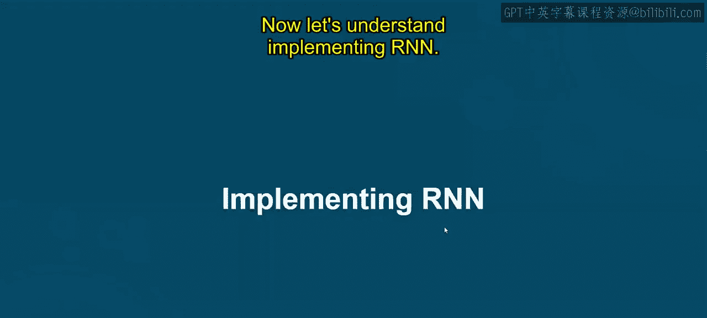
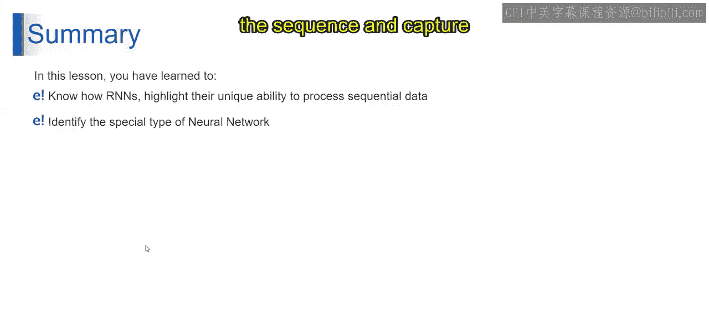

# 第一部分 82：实现RNN 🧠

在本节课中，我们将学习循环神经网络（RNN）的基本概念、结构及其工作原理。我们将通过简单的例子来理解RNN如何处理序列数据，并比较其与前馈神经网络的区别。


---




## 引言：什么是RNN？ 🤔

上一节我们介绍了机器学习的基础，本节中我们来看看一种专门处理序列数据的神经网络——循环神经网络（RNN）。

RNN是一种设计用于处理序列数据（如句子或时间序列数据）的神经网络。它在数据顺序至关重要的任务中表现出色，例如自然语言处理。

---

## RNN的应用实例 🔍

以下是RNN在现实世界中的两个常见应用示例。

### 示例一：电子邮件自动补全

想象你正在写一封电子邮件，并以单词“Dear”开头。当你输入“Dear”后，谷歌的自动补全功能会尝试猜测你接下来可能输入的内容。它可能会建议“sir”、“madam”或“friend”等词。这个预测是通过分析大量电子邮件数据集中“Dear”之后常见的单词序列来完成的。

### 示例二：谷歌搜索建议

当你在谷歌搜索框中开始输入时，例如输入“what is”，你会注意到谷歌开始根据你已输入的内容建议相关的搜索查询。它可能会建议“what is AWS bedrock”、“what is generative AI”等。谷歌搜索建议功能使用RNN模型，根据你已输入的单词序列来预测你可能要搜索的下一个词。RNN模型分析单词序列，并根据从海量搜索查询数据中学到的模式来预测最可能的补全内容。

---

## RNN与前馈神经网络的对比 ⚖️

上一节我们了解了RNN的应用，本节中我们来深入看看其核心结构，并与前馈神经网络进行对比。

前馈神经网络中，信息单向流动，从输入层到输出层。这就像一条传送带：你放入输入数据（原料），机器在隐藏层进行处理，最终得到输出（成品）。它没有记忆过去输入的能力。

**公式表示前馈网络的一层：**
`输出 = 激活函数(权重 * 输入 + 偏置)`

相比之下，RNN在网络中引入了循环，允许信息持久化。这就像一个记忆力很好的厨师，能记住烹饪过程中之前的步骤。这种记忆能力帮助RNN处理序列数据。

**RNN单元的基本公式（简化）：**
`隐藏状态_t = 激活函数(权重_hh * 隐藏状态_{t-1} + 权重_xh * 输入_t + 偏置)`
`输出_t = 权重_hy * 隐藏状态_t + 偏置`

简而言之：
*   **前馈神经网络**：输入进入，在隐藏层处理，输出产生。像一条单行道。
*   **循环神经网络**：输入进入，结合之前步骤的记忆（隐藏状态）进行处理，输出产生。像一个记住之前步骤的厨师。

RNN专为处理序列问题而设计，通过保留之前步骤的信息来理解上下文，这使得它在语言翻译、时间序列预测等任务中非常有效。

---

## RNN的信息流与记忆机制 🧠

理解了RNN的基本结构后，本节我们通过一个具体例子来看看信息是如何在其中流动的，以及它的“记忆”如何工作。

让我们分解RNN中的每个神经元如何利用其内部记忆来维护先前输入的信息。以这两个句子为例：
1.  “Let‘s eat grandpa.”（我们吃爷爷吧。）
2.  “Let’s eat, grandpa.”（我们吃饭吧，爷爷。）

想象RNN中的每个神经元就像大脑的一小部分，能记住它之前“看到”的内容。当RNN处理序列“Let‘s eat grandpa”时，它按顺序处理每个单词。在处理每个单词时，它会更新其内部记忆以包含该单词在当前序列上下文中的含义。当它处理到“grandpa”时，其记忆中的句子是关于“和爷爷一起吃”还是“吃爷爷”，取决于之前的上下文。

现在对比第二个句子“Let‘s eat, grandpa”。逗号的出现完全改变了句子的含义。当RNN处理每个单词时，它同样更新记忆。但当它遇到逗号时，它会理解这里有一个停顿，并记住“吃”这个动作是指向“grandpa”的（可能是字面意思）。因此，尽管两个句子共享大部分相同的单词，但RNN的内部记忆使其能够基于标点符号理解两者之间微妙但关键的含义差异。

从技术上讲，RNN中的每个神经元都维护着一个**隐藏状态**，该状态包含了它迄今为止所见输入序列的信息。这个隐藏状态充当了神经记忆，使其能够记住过去的输入，并将其结合到对当前输入的理解中。这种记忆特性使RNN能够捕捉序列数据中复杂的依赖关系，例如语言中标点符号的重要性。

**代码概念示意（非可运行代码）：**
```python
# 第一部分 伪代码，展示RNN按时间步处理序列的思想
hidden_state = initial_state
for word in sentence:
    # 结合当前输入和上一个隐藏状态计算新的隐藏状态
    hidden_state = update_rnn_cell(word, hidden_state)
    # 基于当前隐藏状态可以产生输出（如预测下一个词）
    output = generate_output(hidden_state)
```

---

## 总结 📚




本节课中，我们一起学习了循环神经网络（RNN）。RNN因其循环结构而在处理序列数据方面表现出色，使其能够保留过去输入的记忆。这种特殊类型的神经网络以其处理序列并捕捉数据中复杂依赖关系的能力而脱颖而出。