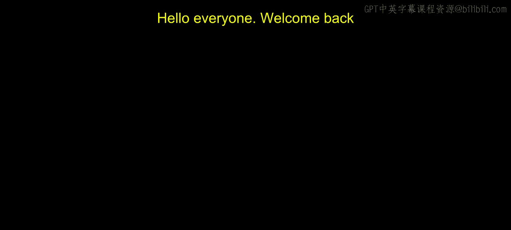
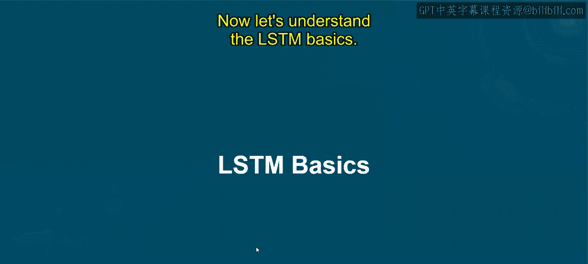
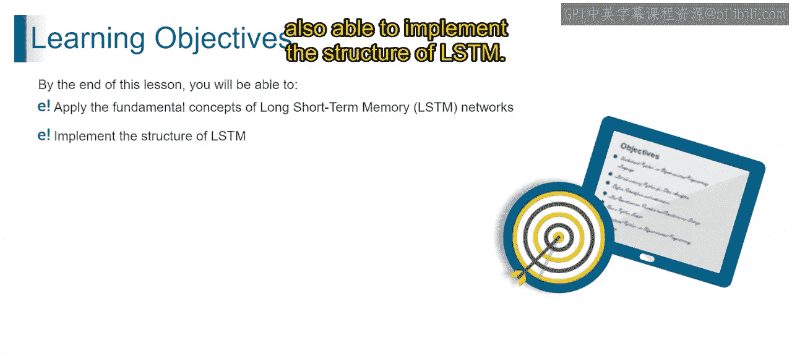
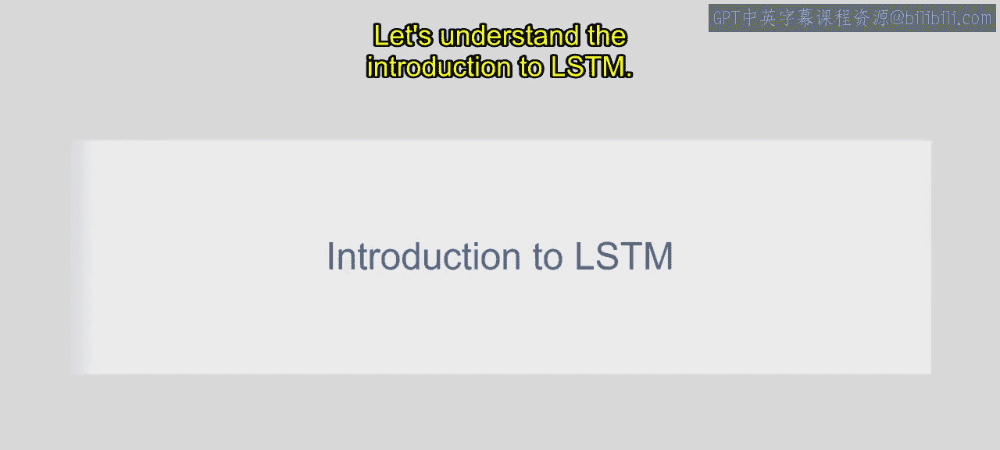
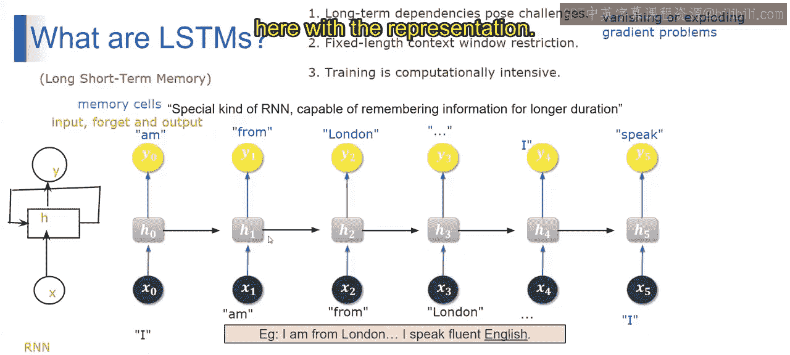

# 第一部分 83：LSTM基础 🧠

在本节课中，我们将要学习长短期记忆网络的基础知识。我们将介绍LSTM是什么，以及它的核心结构。通过本节内容，你将能够理解LSTM的基本概念，并掌握其结构原理。

---

## LSTM简介

LSTM的全称是“长短期记忆”。顾名思义，这种网络能够记住过去数据中的重要信息，并利用这些信息来预测序列中的下一个内容。

你可能会问，既然循环神经网络也能根据过去的句子预测下一个词，为什么还需要LSTM？这是因为传统的RNN存在一些特定的局限性。

以下是传统RNN面临的主要问题：

*   **难以捕捉长期依赖关系**：随着序列长度的增加，RNN难以在长距离上保留相关信息，这会导致在训练过程中出现梯度消失或梯度爆炸问题。
*   **固定的上下文窗口限制**：RNN具有固定长度的上下文窗口，意味着它在每个预测步骤只能考虑有限数量的先前时间步。当相关上下文超出模型记忆容量时，这会限制其捕捉依赖关系的能力。
*   **计算密集**：训练RNN，尤其是对于大型数据集和复杂架构，通常需要大量的计算资源和时间。其顺序性质也限制了训练过程中的并行化潜力，进一步加剧了计算负担。

那么，如何用LSTM来克服这些问题呢？让我们来了解一下。

LSTM是一种特殊的RNN架构，旨在克服传统RNN在捕捉序列数据中长期依赖关系方面的限制。它通过引入一种称为“记忆细胞”的特殊单元来实现这一点，该单元可以长时间存储信息。

想象一下，你正试图根据过去几天的天气模式来预测明天是否需要带伞。传统方法可能只看最近几天并做出简单预测。然而，LSTM就像一个更智能的系统，它不仅能记住近期的天气模式，还能记住长期趋势，比如你所在地区在这个季节已经连续几周下雨了。

这些记忆细胞配备了称为“门”的控制机制，包括输入门、遗忘门和输出门。这些门调节信息的流动，允许LSTM选择性地记住或忘记随时间变化的信息。

---

## LSTM结构解析

上一节我们介绍了LSTM的基本概念和必要性，本节中我们来看看LSTM的具体结构是如何工作的。

LSTM确实是一种特殊的循环神经网络，旨在更长时间地记住信息。让我们用一个简单的例子来分解它。

考虑输入一个单词序列：“I am from London. I speak fluent English.”。在这个具体情境下，传统的RNN如何工作？让我们通过图示来理解。

在传统的RNN中，每个时间步的隐藏状态 `h_t` 取决于当前输入 `x_t` 以及前一个时间步的隐藏状态 `h_{t-1}`。其核心公式可以表示为：

**`h_t = f(W * x_t + U * h_{t-1} + b)`**

其中，`f` 是激活函数（如tanh），`W` 和 `U` 是权重矩阵，`b` 是偏置项。

然而，在LSTM网络中，情况更为复杂。LSTM的隐藏状态不仅依赖于当前输入和前一隐藏状态，还依赖于一个**记忆细胞** `C_t`。这个记忆细胞能够存储和检索信息，并通过一系列门控机制来控制信息流。

以下是LSTM单元内部的核心组件及其作用：

*   **遗忘门**：决定从记忆细胞中丢弃哪些信息。它查看 `h_{t-1}` 和 `x_t`，并输出一个介于0（完全忘记）和1（完全保留）之间的值给记忆细胞。
    *   **公式**：`f_t = σ(W_f · [h_{t-1}, x_t] + b_f)`
*   **输入门**：决定将哪些新信息存储到记忆细胞中。它包含两部分：一个“输入门层”决定更新哪些值，一个tanh层创建新的候选值向量 `C̃_t`。
    *   **公式**：
        *   `i_t = σ(W_i · [h_{t-1}, x_t] + b_i)`
        *   `C̃_t = tanh(W_C · [h_{t-1}, x_t] + b_C)`
*   **记忆细胞更新**：结合遗忘门和输入门的信息来更新旧的记忆细胞状态 `C_{t-1}` 到新的状态 `C_t`。
    *   **公式**：`C_t = f_t * C_{t-1} + i_t * C̃_t`
*   **输出门**：基于更新后的记忆细胞，决定下一个隐藏状态 `h_t` 的输出是什么。隐藏状态也用作预测输出。
    *   **公式**：
        *   `o_t = σ(W_o · [h_{t-1}, x_t] + b_o)`
        *   `h_t = o_t * tanh(C_t)`

（注：公式中 `σ` 表示sigmoid激活函数，`·` 表示矩阵乘法，`*` 表示逐元素乘法，`[a, b]` 表示向量拼接。）

在我们的例子“I am from London...”中，当处理到单词“London”时，LSTM的记忆细胞可能会选择记住“London”是一个地点这个关键信息。之后，当处理到“speak”和“English”时，遗忘门可能会决定保留“from London”这个信息，而输入门则加入“语言”这个新上下文。最终，输出门利用所有这些信息来帮助预测或理解“fluent English”的含义，从而有效捕捉了“地点”与“语言”之间的长期依赖关系。

---

## 总结

本节课中，我们一起学习了长短期记忆网络的基础知识。我们首先了解了传统RNN在捕捉长期依赖关系时面临的挑战，如梯度消失和固定上下文窗口。接着，我们介绍了LSTM作为解决方案，它通过引入带有输入门、遗忘门和输出门的记忆细胞，能够选择性地记住或忘记信息，从而有效地处理长序列数据。最后，我们详细解析了LSTM单元的内部结构和工作原理。理解这些基础是进一步学习更复杂序列模型的关键。