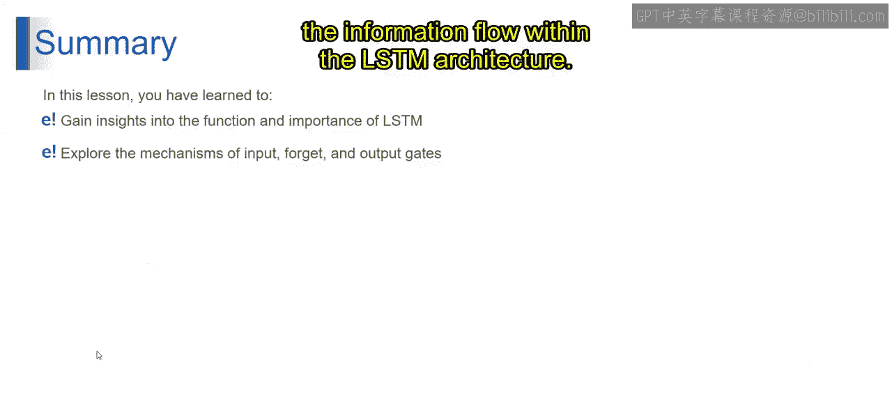

# 第一部分 84：LSTM结构详解 🧠

在本节课中，我们将深入探讨长短期记忆网络的结构。我们将从上一节讨论的循环神经网络出发，了解LSTM如何通过其独特的门控机制解决梯度消失问题，从而更有效地处理序列数据中的长期依赖关系。

---

上一节我们介绍了循环神经网络及其在处理序列数据时的基本工作原理。本节中，我们来看看LSTM的具体结构，它是RNN的一种特殊变体。

LSTM是一种特殊的RNN，它解决了梯度消失问题。我们看到，RNN通过在其记忆单元中保留信息来缓解梯度消失问题，这是它的优势。在隐藏单元中，RNN的细胞被LSTM细胞所取代。LSTM层被设计用来保存记忆细胞，然后提供隐藏状态。

现在，让我们简要地理解一下LSTM的结构。

如前所述，LSTM包含三个不同的门：遗忘门、输入门和输出门。我们来逐一理解。

首先介绍遗忘门。遗忘门就像一个过滤器，决定从先前的细胞状态中保留或丢弃哪些信息。它以先前的隐藏状态和当前输入作为输入，并产生一个值在0到1之间的向量。这个向量中的每个值代表了细胞状态中相应信息应该被遗忘的程度。遗忘用0表示，保留用1表示。

例如，如果遗忘门对某个分量的输出是0，这意味着LSTM应该从先前的细胞状态中遗忘与该分量相关的信息。反之，如果输出是1，则该信息应被保留并传递到下一步。这就是遗忘门的作用。

接下来是输入门。输入门控制有多少新信息应该被添加到细胞状态中。与遗忘门类似，它也以先前的隐藏状态和当前输入作为输入，并产生另一个值在0到1之间的向量。这些值决定了新信息应被添加到细胞状态的程度。接近0的值表示相应的信息不重要，不应被添加到细胞状态中；而接近1的值则表示该信息很重要，应该被保留。这就是输入门的工作方式。

然后是输出门。输出门决定细胞状态中的哪些信息应该作为下一个隐藏状态的输入被传递出去。与遗忘门和输入门类似，它也以先前的隐藏状态和当前输入作为输入，并产生一个值在0到1之间的向量。这些值控制着当前细胞状态应如何影响下一个隐藏状态。

例如，如果输出门对某个分量的输出是0，这意味着当前细胞状态中与该分量相关的信息将不会贡献给下一个隐藏状态。这三个门的工作方式非常相似。

以下是这些门的总结：遗忘门帮助LSTM决定从先前的细胞状态中遗忘什么；输入门控制有多少新信息应该被添加到细胞状态中；输出门决定细胞状态中的哪些信息应该被传递给下一个隐藏状态。这些门共同作用，使得LSTM能够随着时间推移选择性地记住和遗忘信息，从而在需要捕获序列数据中长期依赖关系的任务中表现高效。

这就是LSTM通常与遗忘门、输入门和输出门协同工作的方式。

---

本节课中，我们一起学习了LSTM，理解了它们在捕获长期依赖关系中的重要性。此外，我们还深入探讨了输入门、遗忘门和输出门这些在LSTM架构中控制信息流的核心机制。

谢谢。