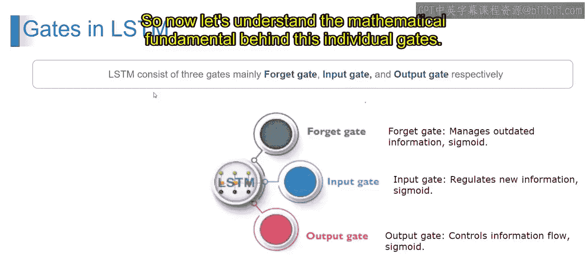

# 第一部分 85：LSTM中的门控机制 🚪

在本节课中，我们将学习长短期记忆网络中的核心组件——门控机制。我们将了解输入门、输出门和遗忘门的功能与作用原理。

---

在上一节中，我们认识到LSTM模块包含三个独特的门：遗忘门、输入门和输出门。本节中，我们将深入浅出地解释每一个门控机制。

为了便于理解，我们可以通过一个工厂管理的例子来类比这些门控机制。

想象你负责管理一家工厂，工厂的各个入口设有大门。这些大门控制着原材料进入工厂和成品离开工厂的流程。

以下是各个门控在工厂例子中的对应角色：

*   **输入门**：此门决定是否允许新原材料进入工厂，判断依据是原材料的重要性和与生产流程的相关性。例如，如果到达的是高质量原材料，输入门可能完全打开以接收它们；而低质量材料则可能导致大门保持关闭或仅部分开启。
*   **输出门**：此门决定哪些成品应该离开工厂进入分销渠道。例如，如果质量控制团队批准了一批产品，输出门将完全打开以允许它们运出；然而，如果检测到缺陷，大门将关闭以防止次品离开工厂。
*   **遗忘门**：此门负责管理从工厂中清除过时或无关的原材料。它确保工厂不会堆满可能阻碍生产流程的不必要物品。例如，如果某些材料不再需要用于生产，遗忘门将启动以丢弃它们，从而为更关键的材料腾出空间和资源。

---

现在，让我们从技术角度来理解这些门控。

在神经网络中，门控是控制信息在网络内部流动的机制。它们由数学运算构成，决定在每个处理步骤中应允许多少信息通过。

以下是各个门控在LSTM网络中的技术定义：

*   **输入门**：在LSTM网络中，输入门调节应有多少新信息被添加到细胞状态中。它使用Sigmoid激活函数来确定输入数据的相关性。其核心公式涉及Sigmoid函数：`i_t = σ(W_i · [h_{t-1}, x_t] + b_i)`，用于计算更新系数。
*   **输出门**：此门控制信息从细胞状态到输出以及下一个隐藏状态的流动。它同样采用Sigmoid激活函数来决定哪些信息与当前时间步的任务相关。其输出公式为：`o_t = σ(W_o · [h_{t-1}, x_t] + b_o)`。
*   **遗忘门**：遗忘门管理从细胞状态中移除过时或无关信息。它使用Sigmoid激活函数来确定先前细胞状态中的哪些信息应该被保留或丢弃。其公式为：`f_t = σ(W_f · [h_{t-1}, x_t] + b_f)`。

---

神经网络中的这些门控充当过滤器，调节信息流，使网络能够选择性地处理和保留相关信息，同时丢弃无关或过时的数据。

本节课中，我们一起学习了LSTM中的三大门控机制：输入门、输出门和遗忘门。我们通过工厂的类比理解了它们的直观作用，并从技术层面了解了它们通过Sigmoid函数等数学运算来控制信息流的基本原理。在接下来的视频中，我们将进一步阐述这些门控背后的数学基础。